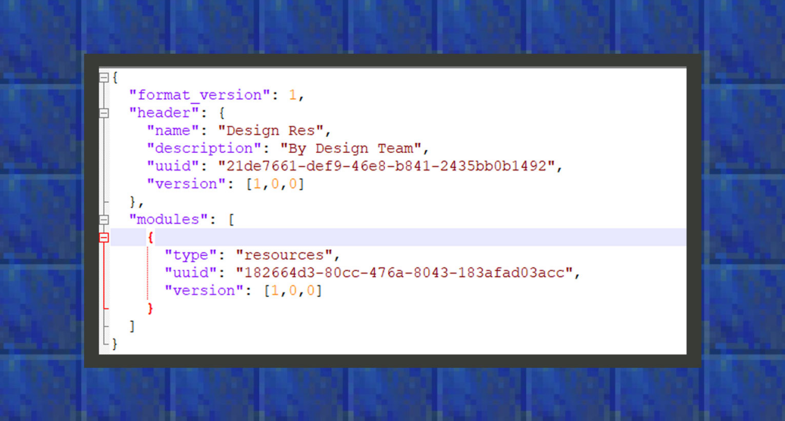

--- 
front: https://mc.res.netease.com/pc/zt/20201109161633/mc-dev/assets/img/3_1.ad6421a3.png 
hard: Getting Started 
time: 15 minutes 
--- 
# Your first Add-on 
#### Author: Realm 

Add-ons consist of Resource Packs (hereinafter referred to as resource packs) and Behavior Packs (hereinafter referred to as behavior packs). Resource packs are loaded in the client, and the resources covered include biological models, animations, particles, block textures, biological textures, item textures, block models, sound effects, etc. Behavior packs handle more server-side tasks, such as biological behavior, item functions, loot configuration, biological generation rules in the world, and biome dimension configuration. 

When making an add-on pack, developers should pay great attention to the naming of each folder in the project, because it needs to introduce the corresponding configuration file according to the specified folder. At the same time, there needs to be an entry file in the root directory of the resource pack and behavior pack, which is in json format to tell the game which add-on pack it is. Here we usually name it manifest.json. As long as such a file is created in the resource pack and behavior pack in the project, it is also an add-on pack even if there is no customized game content. 

#### Entry file manifest.json 

If developers use the international version of the Add-on template, they need to pay attention to Microsoft's upgrade of the format_version parameter in the manifest to 2. In the Chinese version 1.16.10, you can continue to use the compatibility format_version: 1 parameter. Name usually refers to the name of the add-on pack, or the name of the work. Description means a brief description. Here developers can simply write the team name and other content. 

UUID refers to Universally Unique Identifier, which is translated into Chinese as Universally Unique Identifier. The purpose of UUID is to allow all elements in each add-on pack to have unique identification information. In this way, everyone can create a UUID that does not conflict with others, and there is no need to consider conflicts when creating additional packages. Developers can generate UUIDs through the uuid generator page that is freely shared online. Resource packs and behavior packs require at least four UUIDs in total, so usually four UUIDs should be generated at one time. 

 

```json 
{ 

"format_version": 1, 

"header": { 

"name": "Design Res", 

"description": "By Design Team", 

"uuid": "21de7661-def9-46e8-b841-2435bb0b1492", 

"version": [ 

0, 

0, 

0 

]


}, 

"modules": [ 

{ 

"type": "resources", //When type is changed to data, it becomes the manifest of the behavior pack 

"uuid": "182664d3-80cc-476a-8043-183afad03acc", 

"version": [ 

0, 

0, 

0 

] 

} 

] 

} 
``` 

The above figure is a simple writing format of a resource pack manifest. Unlike the resource pack, in the manifest file of the behavior pack, the resourece field in type needs to be changed to the data field. 

