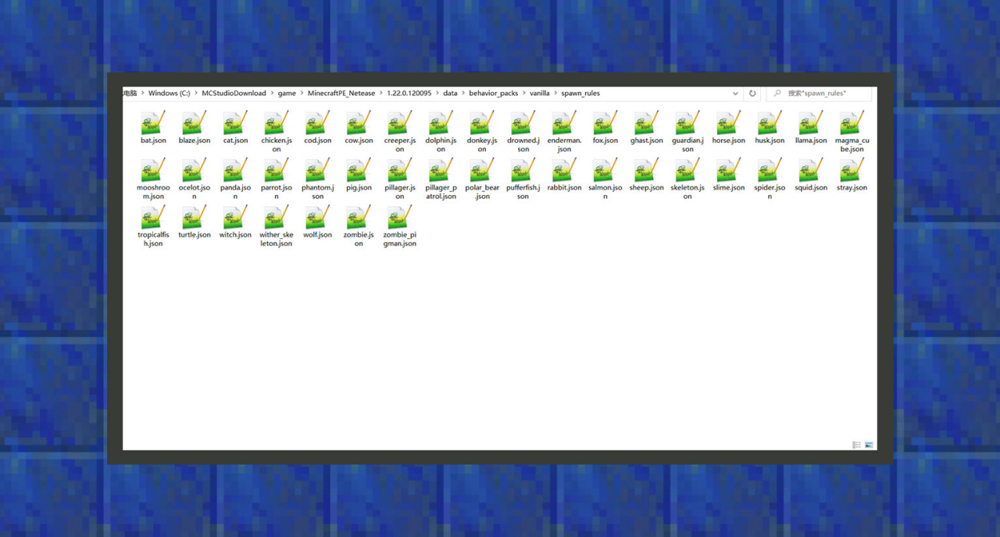

--- 
front: https://mc.res.netease.com/pc/zt/20201109161633/mc-dev/assets/img/4_1.590e60eb.png 
hard: Getting Started 
time: 20 minutes 
--- 
# Getting to Know Behavior Packs 
#### Author: Realm 

The content in the behavior pack runs on the server. 

The server can be understood as a public environment, which provides various services to all player clients in the server. For example, different creatures will appear in different biomes, different types of creatures have different behaviors, and they will drop different loot. These are all behaviors implemented by the server. 
In my world, the server can be simply understood as a game archive. When the player plays alone, the server runs locally, and its latency is the lowest, which has the least impact on the player. In online lobby games, the server is the room owner. Other players entering the room will be affected by the terminal configuration and network latency of the host player, so the game experience may be less stable than in single-player games. In online games, the server is a remote host, and all players who connect to this world do not need to bear the operating and computing pressure brought by the server. This is the difference between the three. Therefore, when designing behavior packs, developers should abide by the first principle, that is, when players play locally, they must have a smooth game experience. Otherwise, developers will put such additional packs into online games and online games, which will bring an unsmooth game experience. 

### Behavior Pack Project File Structure 

#### entities [Organism Behavior Folder] 

In the original game package, all the original creatures' behavior files are stored here, which is the best place for developers to understand creature behavior. At the same time, we can modify the behavior of the original creatures here, such as allowing chickens to teleport like Endermen, or Endermen to lay eggs every once in a while like chickens. When we combine new original creatures, their behavior files will also be placed here. 

 

#### loot_tables[drops folder] 

In the original behavior pack, all the original treasure chest loot, creature loot, fishing loot, etc. are stored here. By editing the behavior, we can point the loot table of creatures and custom blocks to any configuration file stored here to achieve the effect of custom drops. 

 

#### trading[village trading table folder] 

In the original behavior pack, all the trading tables of old and new villagers in the original game are stored here. The old villager trading table is in the trading directory, and the new villager trading table is in economy_trades in the trading directory. Generally speaking, when we want to modify the trading table of the original villagers, we first modify the trading content of the new villagers. In addition, we can also put new trading table files here so that other creatures with trading behaviors can read these trading tables. 

 

#### spawn_rules[Organism generation rules folder] 

In the original behavior pack, all the survival rules of the original creatures are stored here. If you want to rewrite the generation rules of the original creatures, you can modify them directly here. When you are modifying the generation rules of custom creatures, your new creature generation rules should also be placed here. 

#### recipes[recipe folder] 

In the vanilla behavior pack, all vanilla recipes are stored here. In the Chinese version of 1.16.10, developers should change the folder name in the module folder to netease_recipes to use this feature without opening the experimental gameplay. 

 

#### items[item folder] 

In the vanilla behavior pack, most vanilla food behavior files are stored here. In the Chinese version of 1.16.10, developers should change the folder name in the module folder to netease_items_beh to use the custom item feature without opening the experimental gameplay. 

 

#### blocks[Blocks folder] 

The original behavior pack currently does not contain any native block behaviors. Developers need to use subsequent tutorials and the documents in the developer technology center and the minecraft wiki as references for learning. In the 1.16.10 Chinese version, developers should change the folder name in the module folder to netease_blocks to use custom block functions without opening experimental gameplay. 

#### features[Features folder] 

In the original behavior pack, most of the features in the original biome are stored here. Including ore distribution features, vegetation distribution features, etc. In the 1.16.10 Chinese version, developers should change the folder name in the module folder to netease_features to use custom feature functions without opening experimental gameplay. 

 

#### feature_rules[Feature rules folder] 

In the vanilla behavior pack, this is where most vanilla biome feature rules are stored. Feature rules determine the conditions under which features appear. In the 1.16.10 Chinese version, developers should change the folder name in the module folder to netease_feature_rules to use custom feature rule functions without experimental gameplay. 

 

#### Biomes[Biome folder] 

In the vanilla behavior pack, this is where all vanilla biome settings are stored. In the 1.16.10 Chinese version, developers should change the folder name in the module folder to netease_biomes to use custom biome functions without experimental gameplay. 

