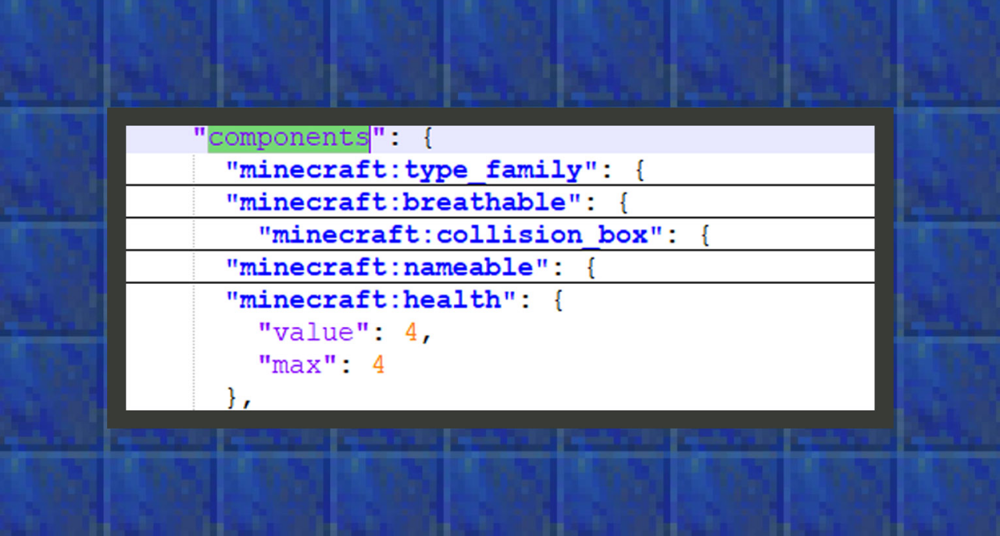
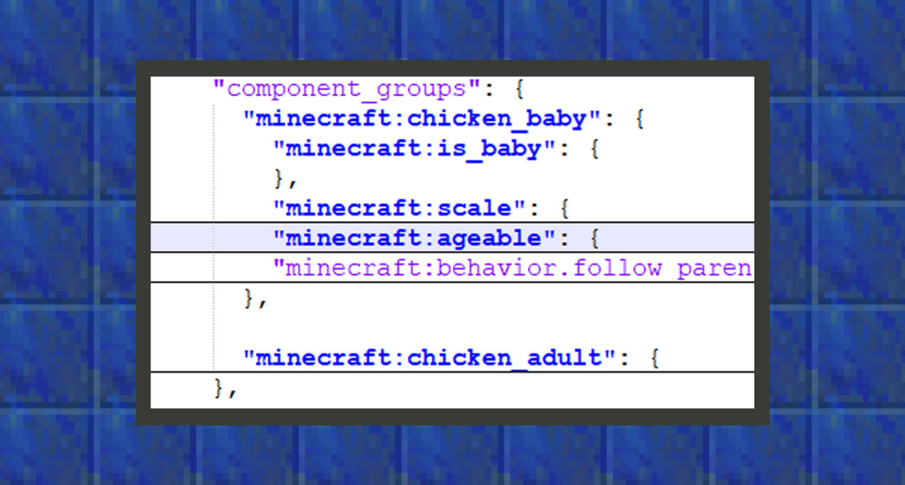

--- 
front: https://mc.res.netease.com/pc/zt/20201109161633/mc-dev/assets/img/5_1.e886f00f.png 
hard: Advanced 
time: 20 minutes 
--- 
# Three structures that define biological behavior 
#### Author: Realm 

When developers first open the biological behavior file, they are often confused by the three structures of component_groups, components, and events. These three structures are the basic structures that make up the biological behavior in the behavior pack. This chapter will lead developers to sort out the different functions of these structures one by one. 

#### components [Component Behavior] 

Components are a collection of properties that build the Bedrock Edition of Minecraft entities. 

It is provided by Mojang and Microsoft for developers to use, and developers are not allowed to create new components. When developers want to add behavior to entities, they can make the entity behavior more complex and diverse by adding components to the component behavior object.

For example, if we want a mob to crawl, we can do this by adding "minecraft:can_climb": {}. All component formats are based on "minecraft:<component name>": {<component settings>}, and different components have different settings. 

 

``` 
{ 
"format_version":"1.16.0", 
"minecraft:entity":{ 
"description":{ 
}, 
"component_groups":{ 
}, 
"components":{ 
"minecraft:health":{ 
"value":4, 
"max":4 
} 
}, 
"events":{ 
} 
} 
} 
``` 

The above picture shows some of the behaviors of the original chicken creature, in which the minecraft:health component affects the health of the entity. In the picture, the health and maximum health of the chicken are set to 4 points, that is, two hearts. 


#### component_groups [Component Group] 

Component groups group multiple components together, just like a folder, so multiple component groups can contain multiple components, and they can be added and removed in events to create a combination of custom creature behaviors. 

Components placed in component groups are not automatically added to creature entities, and they will not do anything until events are added to creature behaviors. Only when an event is triggered will the corresponding event turn the component into a working state, and it will begin to affect the behavior of the creature. 



```
{
    "format_version":"1.16.0",
    "minecraft:entity":{
        "description":{},
        "component_groups":{
            "minecraft:chicken_baby":{
                "minecraft:is_baby":{},
                "minecraft:scale":{
                    "value":0.5
                },
                "minecraft:ageable":{
                    "duration":1200,
                    "feed_items":[
                        "wheat_seeds",
                        "beetroot_seeds",
                        "melon_seeds",
                        "pumpkin_seeds"
                    ],
                    "grow_up":{
                        "event":"minecraft:ageable_grow_up",
                        "target":"self"
                    }
                }, "minecraft:behavior.follow_parent":{ 
"priority":5, 
"speed_multiplier":1.1 
} 
} 
}, 
"components":{}, 
"events":{} 
} 
} 
``` 

The above picture shows some component groups of the original chicken. The official naming format for component groups is "minecraft: <namespace>:chicken_baby<name>". Developers can freely define namespaces and names, such as "design:custom_abc". In chicken_baby, Microsoft puts the minecraft:is_baby component here to declare whether a chicken is a baby chicken through events. 

#### events【event】 


Events are a special syntax for adding or removing groups of components, and by making these changes we can create dynamic behavior for entities. 

 

In the image above, the vanilla chicken uses the minecraft:ageable_grow_up event to remove the chicken_baby group and add the new chicken_adult group to turn a baby chicken into an adult chicken. 

```
{
    "format_version":"1.16.0",
    "minecraft:entity":{
        "description":{

        },
        "component_groups":{

        },
        "components":{

        },
        "events":{
            "from_egg":{
                "add":{
                    "component_groups":[
                        "minecraft:chicken_baby"
                    ]
                }
            },
            "minecraft:entity_spawned":{
                "randomize":[
                    {
                        "weight":95,
                        "remove":{

                        },
                        "add":{
                            "component_groups":[
                                "minecraft:chicken_adult"
                            ]
                        }
                    },
                    {
                        "weight":5,
                        "remove":{                        },
                        "add":{
                            "component_groups":[
                                "minecraft:chicken_baby"
                            ]
                        }

} 
] 
}, 
"minecraft:entity_born":{ 
"remove":{ 

}, 
"add":{ 
"component_groups":[ 
"minecraft:chicken_baby" 
] 
} 
}, 
"minecraft:ageable_grow_up":{ 
"remove":{ 
"component_groups":[ 
"minecraft:chicken_baby" 
] 
}, 
"add":{ 
"component_groups":[ 
"minecraft:chicken_adult" 
] 
} 
} 
} 
} 
} 
``` 

#### How to trigger events 

There are many components in the vanilla that trigger events. These components may have been added to component behaviors at the beginning, and then triggered events under different conditions to achieve complex and diverse creature behaviors. And all entities will have some common events, which are triggered by the game engine control, such as minecraft:entity_spawned, which will be triggered when the creature is first generated. Of course, after developers learn MODSDK, they can also trigger creature events through the creature event interface.