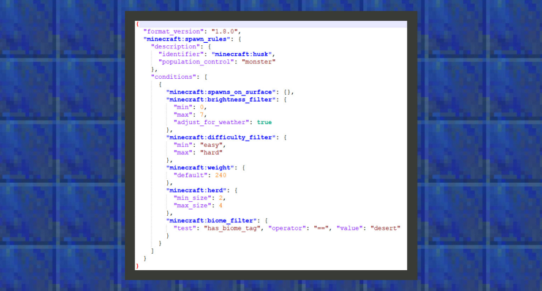

--- 
front: https://mc.res.netease.com/pc/zt/20201109161633/mc-dev/assets/img/6_1.3ddaf093.png 
hard: Advanced 
time: 15 minutes 
--- 
# Basic entity generation rules 
#### Author: Realm 

Entity generation rules are used to control the logic of any entity generation in the world. 

Currently commonly used for the generation of organisms, organisms are an extension of the concept of entities. We can say that chickens, cows, and pigs are entities and organisms, but minecarts and ships are entities but not organisms. Therefore, entities such as ships and minecarts should not be generated in nature, while organisms such as chickens, cows, and pigs need to be generated in the world. 
In this chapter, we will teach you how to simply change the original organism generation rules. 

#### Modify the spawning rules of husks 

In the original spawning rules, husks, a hostile mob, only appear in deserts. We hope that it can spawn in every place where hostile mobs appear, not just deserts. Please see the analysis below: 

 

``` 
{ 
"format_version": "1.8.0", 
"minecraft:spawn_rules": { 
"description": { 
"identifier": "minecraft:husk", 
"population_control": "monster" 
}, 
"conditions": [ 
{ 
"minecraft:spawns_on_surface": {}, 
"minecraft:brightness_filter": { 
"min": 0, 
"max": 7, 
"adjust_for_weather": true 
}, 
"minecraft:difficulty_filter": {
          "min": "easy",
          "max": "hard"
        },
        "minecraft:weight": {
          "default": 240
        },

"minecraft:herd": { 
"min_size": 2, 
"max_size": 4 
}, 
"minecraft:biome_filter": { 
"test": "has_biome_tag", "operator": "==", "value": "desert" 
} 
} 
] 
} 
} 
``` 

①The format_version of the current creature generation rules remains at version 1.8.0. 

②identifier refers to the name of the creature, and population_control refers to the number of creatures controlled by the game engine. The fields that can be written here are animal, underwater_animal, monster, and ambient. Therefore, in the Bedrock Edition, there are 4 dimensions that cannot directly determine the number of creatures. For example, almost all animals will appear when the brightness is 7~15, and most aggressive creatures will appear when the brightness is 0~7. Therefore, the number of animals controls the number of creatures seen by players during the day, and monsters control the number of creatures seen by players at night. If the number of animals and monsters are allowed to appear at the same time, there may be a risk of reduced gaming experience due to excessive number of biological entities generated in the world. Developers are advised to use it with discretion. 

③ Biological generation is mainly controlled by biome filters. Under biome_filter, one or more filter conditions with biome tags (has_biome_tag) are received. In the source file of the husk, you can see that the parameter of value is desert. Therefore, after changing desert to monster, the pattern of husk appearance can be the same as that of zombies.