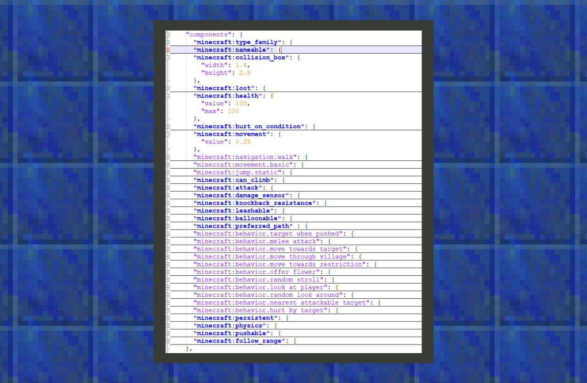

--- 
front: https://mc.res.netease.com/pc/zt/20201109161633/mc-dev/assets/img/7_1.59202254.png 
hard: Advanced 
time: 10 minutes 
--- 
# Simple tutorial ①: Modify the basic properties of the iron golem 
#### Author: Realm 

As mentioned in the chapter "Getting to know the behavior pack", the original iron golem behavior file can be found in the game root directory /data/behavior_packs/vanilla/entities. Developers can also download the original Add-on template, which usually contains a behavior_packs folder, which corresponds to the behavior folder found in the game root directory mentioned above. 




```
{
  "format_version": "1.13.0",
  "minecraft:entity": {
    "description": {
    },

    "component_groups": {},

    "components": {
      "minecraft:collision_box": {
        "width": 1.4,
        "height": 2.9
      },
      "minecraft:health": {
        "value": 100,
        "max": 100
      },
      "minecraft:movement": {
        "value": 0.25
      }
    },

    "events": {
    }
  }
}
```


①: minecraft: collision_box is a component that controls a creature's collision box. The collision box determines how far away other creatures are from this type of creature to cause a push collision, and within what range they can damage this type of creature. The width determines the width of the collision box, and the height determines its height. 

②: minecraft: health is a component that manages the health of a creature. The value parameter represents the health of the creature, and the max represents the maximum health of the creature. 

③: minecraft: movement is a component that controls the speed of the creature. The value parameter represents the speed. The speed conversion formula of the Bedrock Edition of Minecraft is: movement [speed value] * speed_multiplier [speed bonus of some behaviors] * friction [friction of the block, the default is 0.6] * 20 tick [game time].