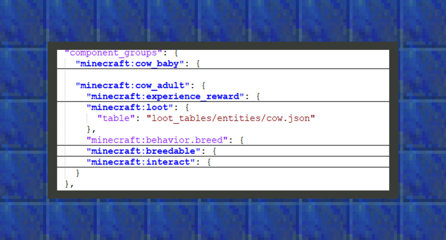
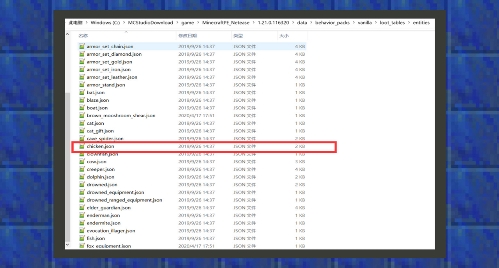

--- 
front: https://mc.res.netease.com/pc/zt/20201109161633/mc-dev/assets/img/8_1.325675fb.png 
hard: Getting Started 
time: 10 minutes 
--- 
# Simple tutorial ②: Change the cow's drops to chicken's drops 

#### Author: Realm 

As we know from the chapter "Getting to Know the Behavior Pack", the original cow's behavior file can be found in the game root directory /data/behavior_packs/vanilla/entities. Developers can also download the original Add-on template, which usually contains a behavior_packs folder, which corresponds to the behavior folder found in the game root directory mentioned above. 

 

``` 
{ 
"format_version": "1.16.0", 
"minecraft:entity": { 
"description": { 
}, 
"component_groups": { 
"minecraft:cow_adult": { 
"minecraft:loot": { 
"table": "loot_tables/entities/cow.json" 
} 
} 
}, 

"components": { 
}, 

"events": {} 
} 
} 
``` 

 

①：minecraft:loot is a component that manages the mob drop table. The table parameter points to a table file path in the loot_tables folder. Open the loot_tables folder according to the path prompt, and then open the entities folder, where you can see all the entity drop files, including the chicken drop files. Change loot_tables/entities/cow.json to loot_tables/entities/chicken.json to change the cow's drops to chicken's drops.