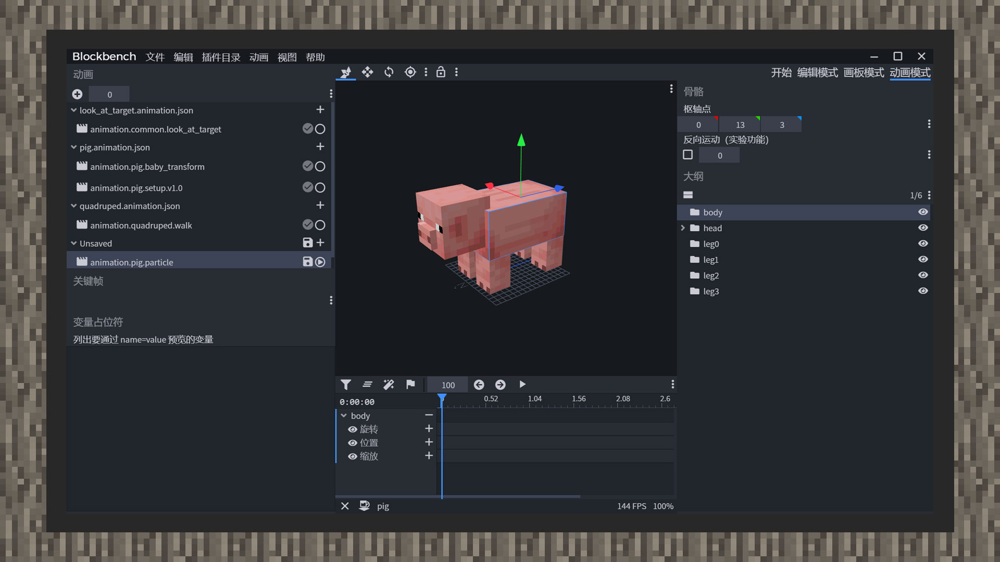
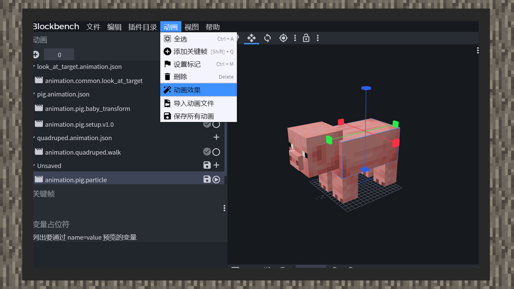
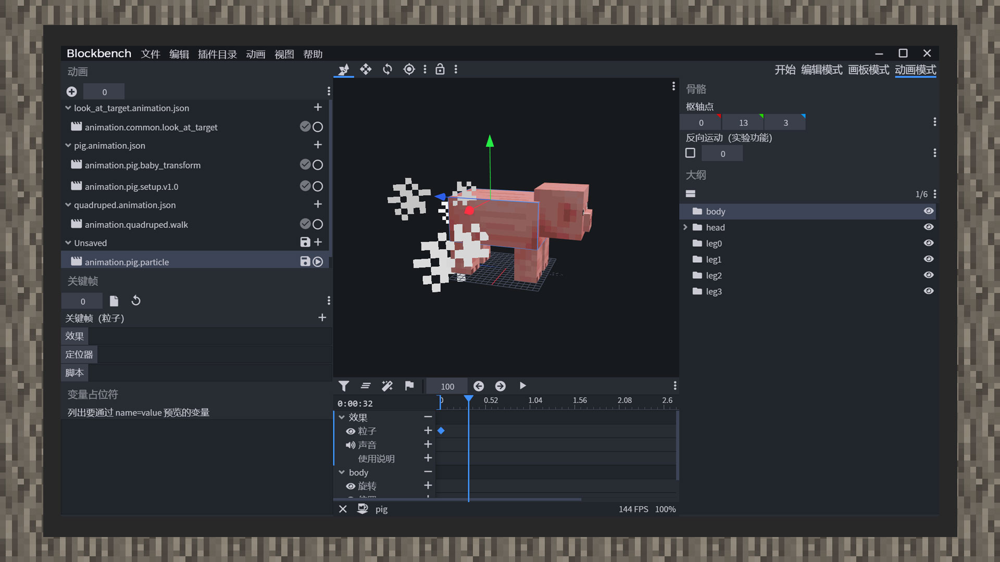

--- 
front: https://mc.res.netease.com/pc/zt/20201109161633/mc-dev/assets/img/6_1.6892d54c.jpg 
hard: Advanced 
time: 20 minutes 
--- 
# Bind animated particles and animation-controlled particles 
#### Author: Realm 

Particles can produce very colorful effects, which can improve the visual experience of creatures by several levels. In the game, the ink spray of cuttlefish and the flames of blazes when charging and firing flaming bombs are all classified as particle effects. Developers can reference particles in the creature definition file and play particles through animation and animation controller. Particles can also be bound to the geometric model of the creature, and relative calculations are performed based on the skeletal position and rotation angle of the creature, which is a more advanced use of particles. In this chapter, developers will be taught how to make particles follow the biological entity to achieve a simple effect. 

 

The original particles can be found in the RP/particles folder. In the current Chinese version 1.21 (1.16.10), there are a total of 113 predefined original particles. Developers can implement their own new particles by studying the structural settings. 

 

1) Open Blockbench and import the original pig model and texture. 

2) Click animation mode and create a new animation. 

 

3) Click animation, animation effect, and open the animation special effects panel. 

 

4) Insert a frame in the effect column, and select Import file above the keyframe text on the left, and select the required particles. At the same time, fill in the particle short name pre-indexed in the creature definition file. 

5) Drag the mouse to preview the particles.

```
{
    "format_version":"1.8.0",
    "animations":{
        "animation.pig.particle":{
            "particle_effects":{

"0.0":{ 
"effect":"smoke" 
} 
} 
} 
} 
} 
``` 

6) Save the animation file. You can see that a particle_effects object has been added to the animation format. The content is the time difference and its corresponding value. The value contains the short name of the particle effect. After defining the newly created animation in the creature definition file, if the animation is configured correctly, the particles in the game will play normally. 

7) In Blockbench, only one particle effect can be added to one frame. If you need to play several particle effects at the same time, you need to change the particle effect object to a particle effect array and then manually fill in each particle object. 

like:

```
{
    "format_version":"1.8.0",
    "animations":{
        "animation.pig.particle":{
            "particle_effects":{
                "0.0":[
                    {
                        "effect":"smoke"
                    },
                    {
                        "effect":"flame"
                    }
                ]
            }
        }
    }
}
```

```
{
    "format_version":"1.10.0",
    "animation_controllers":{
        "controller.animation.blaze.flame":{
            "initial_state":"default",
            "states":{
                "default":{
                    "transitions":[
                        {
                            "flaming":"query.is_charged"
                        }
                    ]

}, 
"flaming":{ 
"particle_effects":[ 
{ 
"effect":"charged_flames" 
} 
], 
"transitions":[ 
{ 
"default":"!query.is_charged" 
} 
] 
} 
} 
}, 
"controller.animation.blaze.move":{ 
"initial_state":"default", 
"states":{ 
"default":{ 
"animations":[ 
"move", 
"look_at_target" 
] 
} 
} 
} 
} 
} 
``` 

Compared to binding animation particles, animation controller particles may be simpler. Create a new particle effect collection in each state, namely "particle_effects", which can also add multiple particle effects at the same time. 

Unlike bound animation particles, when the animation controller switches to a state with particle effects, the particles will play immediately. If you want to delay the playing of particles, you can only manually modify the emission time of the particles. Animation particles can play particle effects only once the animation reaches a certain time.