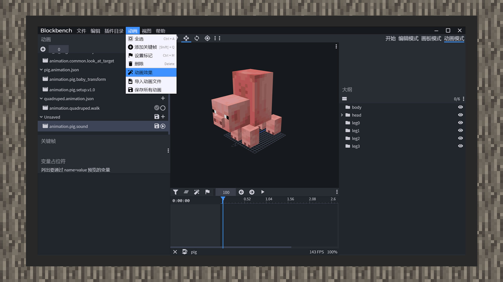
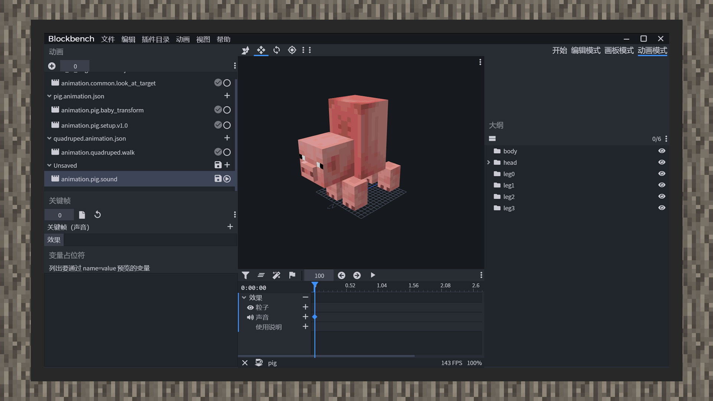

--- 
front: https://mc.res.netease.com/pc/zt/20201109161633/mc-dev/assets/img/7_2.d721173b.jpg 
hard: Advanced 
time: 20 minutes 
--- 
# Bind animation sound effects and animation controller sound effects 
#### Author: Realm 

Sound effects are a way to enhance the immersion and realism of the game. In the game, in addition to background music and ambient music, each creature also has its own unique sound. For example, sheep eating grass and bees buzzing. If a creature has its own sound effect for each behavior, it will make players feel that the creature is more vivid. Therefore, this chapter will teach developers how to add sound effects to creatures through animation and animation controllers. 

 

The original sound effects can be found in RP/sounds. Since the original sound effects of MC use the commercial sound effect engine FMOD, it is not possible to audition the sound effects under normal circumstances. However, developers can find the resource name and resource path of the sound effects in the sound_definitions.json file in the same directory. Through certain comparisons, suitable sound effects can be extracted as materials for practicing binding biological sound effects. 

 

1) Open Blockbench and import the original pig model and texture. 

2) Click animation mode and create a new animation. 

3) Click animation, animation effect, and open the animation special effects panel. 

4) Insert a frame in the effect column, and enter the sound effect name defined in the biological definition file under the keyframe text on the left. 

 

5) Enter the game and test the sound effect playback.

6) Save the animation file. You can see that a new sound_effects object is added to the animation format. The content is the time difference and its corresponding value. The value contains the name of the sound effect. After defining the newly created animation in the creature definition file, if the animation is configured correctly, the sound effect in the game will play normally. 

``` 
{ 
"format_version":"1.8.0", 
"animations":{ 
"animation.pig.particle":{ 
"sound_effects":{ 
"0.0":{ 
"effect": "smoke"

} 
} 
} 
} 
} 
``` 

7) In Blockbench, only one sound effect can be added to a frame. If you need to play several sound effects at the same time, you need to change the sound effect object to a sound effect array and then manually fill in each sound effect object. 

For example: 

``` 
{ 
"format_version":"1.8.0", 
"animations":{ 
"animation.pig.particle":{ 
"sound_effects":{ 
"0.0":[ 
{ 
"effect":"jiliguala" 
}, 
{ 
"effect":"yiyiyaya" 
} 
] 
} 
} 
} 
} 
``` 

Compared with binding animation sound effects, animation controller sound effects may be simpler. Create a new sound effect collection in each state, namely "sound_effects", which can also add multiple sound effects at the same time. 

``` 
{ 
"format_version":"1.10.0", 
"animation_controllers":{ 
"controller.animation.blaze.flame":{ 
"initial_state":"default", 
"states":{ 
"default":{ 
"transitions":[ 
{ 
"flaming":"query.is_charged" 
} 
]

}, 
"flaming":{ 
"sound_effects":[ 
{ 
"effect":"balabala" 
} 
], 
"particle_effects":[ 
{ 
"effect":"charged_flames" 
} 
], 
"transitions":[ 
{ 
"default":"!query.is_charged" 
} 
] 
} 
} 
} 
} 
} 
``` 

Unlike binding animation sound effects, when the animation controller switches to a state with sound effects, the sound effect will play immediately and will not be replayed after it ends. If the sound effect is bound to an animation and the animation is set to loop, the sound effect will be repeated at the specified time interval until the animation ends.