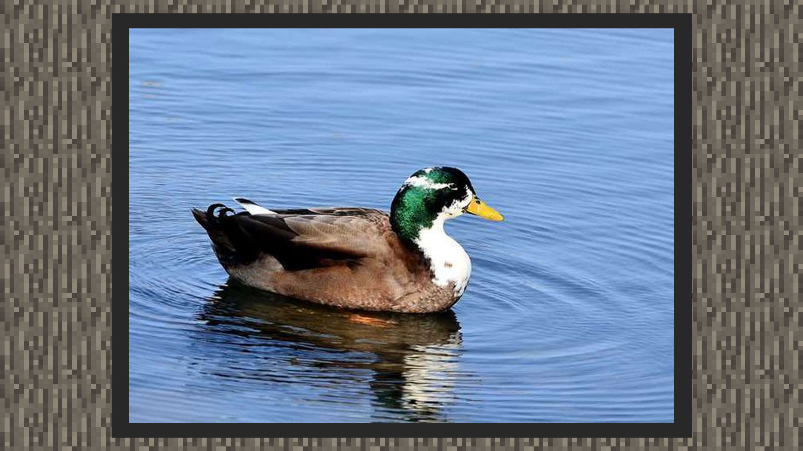
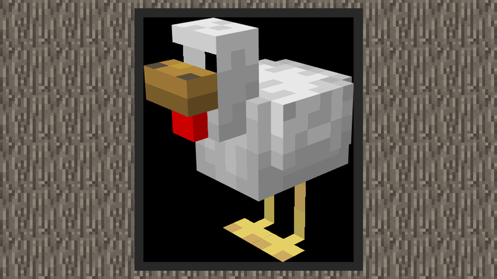
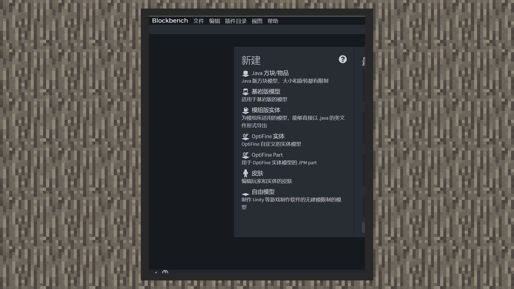
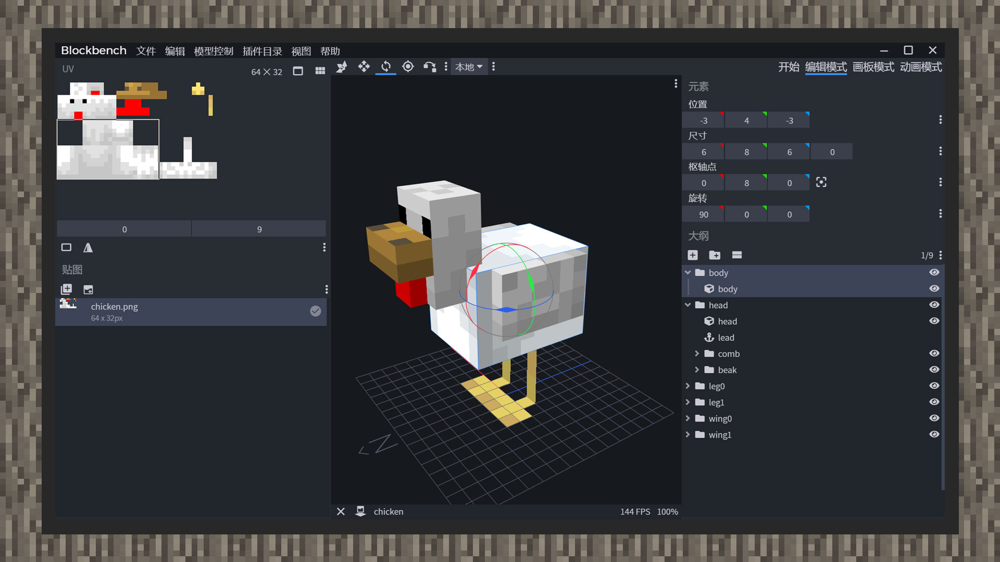

--- 
front: https://mc.res.netease.com/pc/zt/20201109161633/mc-dev/assets/img/10_2.aa637b4c.jpg 
hard: Advanced 
time: 20 minutes 
--- 
# Use Blockbench to modify the chicken model 
#### Author: Realm 

 

 

Import the chicken model in Blockbench, and you can see that it is divided into 6 bones in total. 

1) body: body 

2) head: head 

3) leg0: right foot 

4) leg1: left foot 

5) wing0: right wing 

6) wing1: left wing 

Such bone grouping is very consistent with our needs for new creatures, teals. Comparing with the real mallard teals, you only need to extract the features of the duck head, duck beak, and feathers, and make personal stylized modifications to complete a teal model. 

 

1) Open blockbench and select the Bedrock Edition model. 

2) Click File, select Open Model, find the chicken model file (usually in data/resource_packs/vanilla/models/entity/chicken.geo.json in the client file), select geometry.chicken, and then click Import. 

3) Click the body bone, press the shortcut key R and use the mouse to rotate 90 degrees along the X axis, or enter 90 on the X axis in the rotation unit in the element panel to correct the model. 

4) Raise the chicken's neck. Since a mallard duck has a long neck, we raise the neck height from 6 to 9. At the same time, the duck does not have the red neck of the chicken, so remove the red block and then move the beak bone (i.e., beak) to a position close to the raised eye. 

5) The duck has a longer tail than the chicken, so we put two new blocks in the body bone to simulate the tail. Move the large tail to the position of x = -3, y = 12, and z = -2, and enlarge the block to a length of 6, a height of 2, and a width of 5. Use the second block as the small tail, and place it at x = -2, y = 12, and z = 0. Scale it to 4 blocks long, 1 block high, and 4 blocks wide. 

 

 

6) Finally, our duck will look like this. Don't worry. The reason why the texture looks weird now is that the pixels on the original texture cannot correspond to the newly added square area and become transparent areas. In the next chapter, we will show you how to draw the texture.