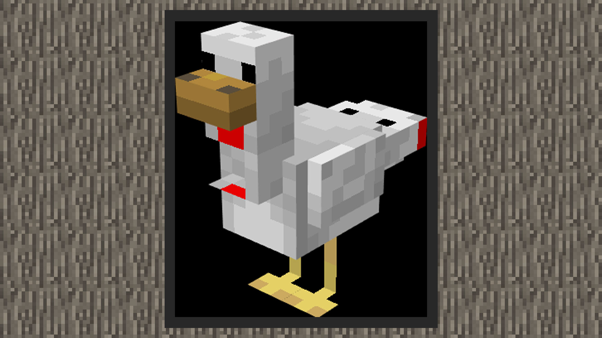

--- 
front: https://mc.res.netease.com/pc/zt/20201109161633/mc-dev/assets/img/11_5.2f677828.jpg 
hard: Advanced 
time: 25 minutes 
--- 
# Use BlockBench to paint a texture for the duck 
#### Author: Boundary 
 

After modifying the chicken model, we list blockbench as the drawing board mode in the upper right corner, the pointer becomes a brush, and click the square area to color. 

 

1) First delete the original texture, click Create Texture, change the texture name to green_duck, check the template, and then keep clicking OK. 

 

 

2) First adjust the color of the beak. The beak of the teal is brighter, so you can choose a brighter (higher saturation) yellow, and choose a slightly lighter khaki for the shadow. 

 

2) The most conspicuous thing about the green teal is its green crown. Use a brush to paint it dark green. There is also a white red scarf on the neck. Paint it white in the next layer. 

4) Then paint the chest, back and big tail brown, and the small tail and other body white. 

5) Make the front, top, side and a small part of the back of the foot block transparent, using the eraser in the artboard mode. Paint the other parts yellow. 

6) Add some shadows, and a teal model that inherits the chicken skeleton is ready. 

 

7) In the last step, select File->Export and choose to export the Bedrock Edition model. You will use it later when customizing the teal.