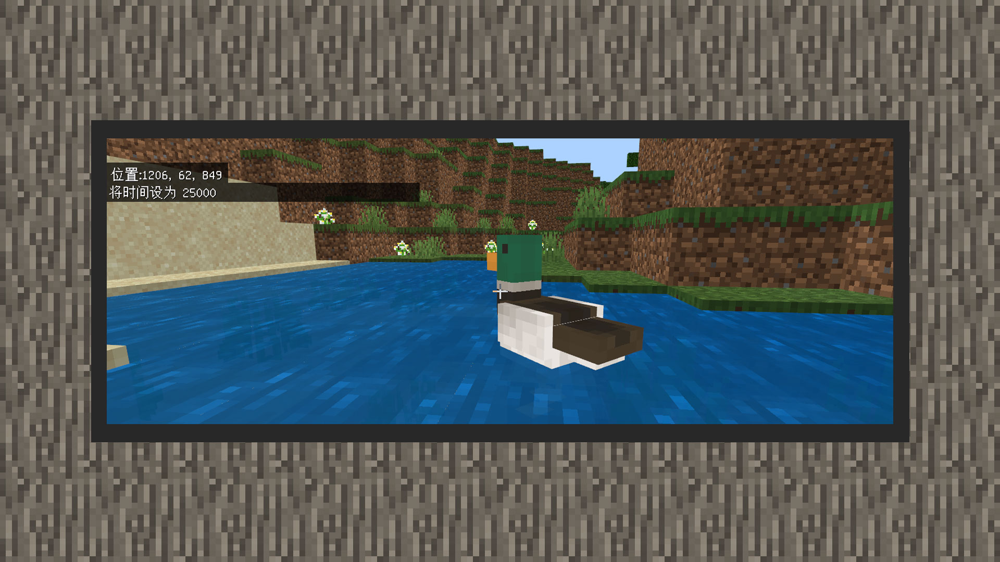

--- 
front: https://mc.res.netease.com/pc/zt/20201109161633/mc-dev/assets/img/14_1.199826f4.jpg 
hard: Advanced 
time: 25 minutes 
--- 
# Make the teal move 
#### Author: Realm 

After the texture pack completed all the work on the teal, the developer returned to the behavior pack. Here, we can use the original chicken behavior to remove some redundant content and add some new behaviors to simulate the behavior state of the teal. 

```
{
  "format_version": "1.16.0",
  "minecraft:entity": {
    "description": {
      "identifier": "design:green_head_duck",
      "is_spawnable": true,
      "is_summonable": true,
      "is_experimental": false,
      "runtime_identifier": "design:green_head_duck"
    }
    },
    "component_groups": {
    },
}
    "components": {
      "minecraft:type_family": {
        "family": [ "duck", "mob" ]
      },
      "minecraft:breathable": {
        "total_supply": 15,
        "suffocate_time": 0
      },
      "minecraft:collision_box": {
        "width": 0.6,
        "height": 0.8
      },
      "minecraft:nameable": {
      },
      "minecraft:health": {
        "value": 4,
        "max": 4
      },
      "minecraft:hurt_on_condition": {

        "damage_conditions": [
          {
            "filters": { "test": "in_lava", "subject": "self", "operator": "==", "value": true },
            "cause": "lava",
            "damage_per_tick": 4
          }
        ]
      },
      "minecraft:movement": {
        "value": 0.25
      },
      "minecraft:damage_sensor": {
        "triggers": {
          "cause": "fall",
          "deals_damage": false
        }
      },
      "minecraft:behavior.rise_to_liquid_level": {
        "priority": 0,
        "liquid_y_offset": -0.5,
        "rise_delta": 0.01,
        "sink_delta": 0.01
      },      "minecraft:leashable": {
        "soft_distance": 4.0,
        "hard_distance": 6.0,
        "max_distance": 10.0
      },
      "minecraft:balloonable": {
        "mass": 0.5
      },
      "minecraft:navigation.walk": {
        "can_path_over_water": true,
        "can_sink": false,
        "avoid_damage_blocks": true
      },
      "minecraft:movement.basic": {
      },
      "minecraft:jump.static": {
      },
      "minecraft:can_climb": {
      },
      "minecraft:despawn": {
        "despawn_from_distance": {}
      },
      "minecraft:behavior.panic": {
        "priority": 1,
        "speed_multiplier": 1.5
      },
      "minecraft:behavior.tempt": {

        "priority": 4,
        "speed_multiplier": 1.0,
        "items": [
          "wheat_seeds",
          "beetroot_seeds",
          "melon_seeds",
          "pumpkin_seeds"
        ]
      },
      "minecraft:behavior.random_stroll": {
        "priority": 6,
        "speed_multiplier": 1.0
      },
      "minecraft:behavior.look_at_player": {
        "priority": 7,
        "look_distance": 6.0,
        "probability": 0.02
      },
      "minecraft:behavior.random_look_around": {
        "priority": 8
      },
      "minecraft:physics": {
      },
      "minecraft:pushable": { "is_pushable": true, 
"is_pushable_by_piston": true 
} 
}, 

"events": { 
} 
} 
} 
``` 

1) Set the format_version format to the latest 1.16.0. As a creature with a creature egg, we set is_summonable (can be generated by instructions) to true, is_spawnable (can be used with creature eggs) to true, and is_experimental (whether it is a creature that can only be seen when the experimental gameplay is turned on) to false. At the same time, point runtime_identifier to yourself. 

2) Clear all combinations in the behavior group, and add the "minecraft:behavior.rise_to_liquid_level" behavior to the original chicken behavior. This is a new behavior from the strider. It can make the creature rise and fall on the water, just like a duck on the water. 

3) In the internal properties of the behavior, priority is set to 0, that is, the highest level behavior is used first. liquid_y_offset is set to -0.5. rise_delta is the rise increment, sink_delta is the sink increment, to simulate the ups and downs of the duck. Both are set to 0.01. This is how a cute mallard duck is made. 

