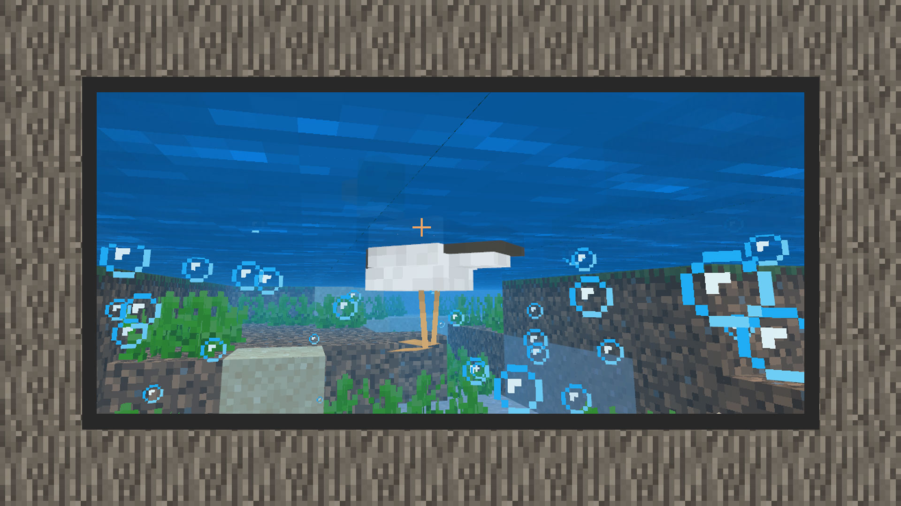

--- 
front: https://mc.res.netease.com/pc/zt/20201109161633/mc-dev/assets/img/15_1.379b8dfc.jpg 
hard: Advanced 
time: 15 minutes 
--- 
# Exercise 1: Bubble particles when the duck floats on the water 

#### Author: Realm 

``` 
{ 
"format_version": "1.10.0", 
"minecraft:client_entity": { 
"description": { 
"identifier": "design:green_head_duck", 
"render_controllers": [ 
"controller.render.default" 
], 
"textures": { 
"default": "textures/entity/green_head_duck" 
}, 
"geometry": { 
"default": "geometry.green_head_duck"
			},
			"materials": {
				"default": "entity_alphatest"
			},
			"animations": {
				"move": "animation.chicken.move",
				"look_at_target": "animation.common.look_at_target"
			},
			"scripts": {
				"animate": [
				  	{ "move": "query.modified_move_speed" },
				  	"look_at_target"
				]
			},
			"spawn_egg": {
				"base_color": "#256143",
				"overlay_color": "#dd9238"
			}
        }
    }
}
```


Using the previous knowledge, we know that to play particles today, we must first load the particle resources into the creature definition file. 

1) Add particle_effects in description, reference the original particle "minecraft:basic_bubble_particle_manual", and write the particle short name as bubble. 

2) Add an animation controller to the animation controller folder to control the mallard to play particles. Since we want the mallard to play this particle continuously, we only need to define one state. 

3) Load the animation controller into the animation resource key of the creature definition file, and then load this animation controller in the root animation in scripts/animate. 

4) Under the setting of this particle, the released special effects will only be effective in water, so in the game, you can see that only the mallard will emit bubble particles in the water. 

```
{
    "format_version": "1.10.0",
    "animation_controllers": {
        "controller.animation.green_head_duck.particle": {
			"initial_state": "default",
            "states": {
                "default": {
                    "particle_effects": [
						{
							"effect": "bubble"
						}
					]
                }
            }
        }
    }
}
```


```
{
	"format_version": "1.10.0",
	"minecraft:client_entity": {
		"description": {
            "identifier": "design:green_head_duck",
            "render_controllers": [
				"controller.render.default"
            ],
            "textures": {
				"default": "textures/entity/green_head_duck"
			},
			"geometry": {

				"default": "geometry.green_head_duck"
			},
			"materials": {
				"default": "entity_alphatest"
			},
			"particle_effects": {
				"bubble": "minecraft:basic_bubble_particle_manual"
			},
			"animations": {
				"move": "animation.chicken.move",
				"look_at_target": "animation.common.look_at_target",
				"particle": "controller.animation.green_head_duck.particle"
			},
			"scripts": {
				"animate": [
				  	{ "move": "query.modified_move_speed" },
					"particle",
				  	"look_at_target"
				]
			},
			"spawn_egg": {
				"base_color": "#256143", 
"overlay_color": "#dd9238" 
} 
} 
} 
} 
``` 

Now, a mallard duck that moves in the water and produces bubbles is ready. 

