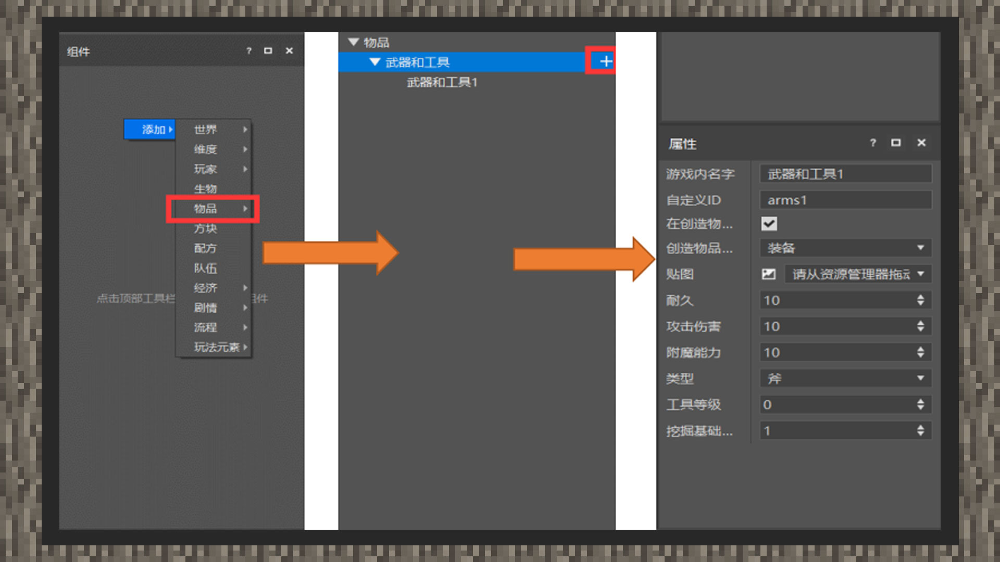

--- 
front: https://mc.res.netease.com/pc/zt/20201109161633/mc-dev/assets/img/1_1.3a2ff48f.jpg 
hard: Advanced 
time: 10 minutes 
--- 
# Basic weapons and tools 
#### Author: Realm 

In the current Chinese version, swords, pickaxes, hoes, axes, and shovels are included in the custom item content range. Therefore, in addition to supporting all the features of custom items, they also have tool-related functions and are special custom items. This chapter will teach developers how to use MCSTUDIO to customize weapons and tool props. 

 

1) Enter the logic editor, right-click the "Component" panel on the left, and select Add, Items, Weapons, and Tools in turn. 

2) Click the "+" under the panel to add multiple equipment. 

3) Click on the sub-items under weapons and tools, and the property panel in the lower right corner of the interface will show the content options of custom tools. 

4) The name input port in the game provides the function of displaying the names of weapons and tools. 

Custom ID is the unique name of the item, which must be in English. It will be used when using commands such as give and replaceitem in the game; 

Display in the creation item bar: Checked by default, the default option is generally used, and the item will be registered in the creation backpack. If it is cancelled, it will not be displayed in the creation backpack; 

Textures: Import the textures into the textures/items folder in the resource manager by dragging and dropping, and then import them to the prompt entrance; 

Durability: The durability used by the item tool; 

Attack damage: Give the equipment attack damage value, which must be filled in with an integer; 

Enchantment ability: It is a game mechanism to add one or more spells to armor, tools, weapons and books. These spells can add or enhance the special abilities and effects of items. 

Type: Supports swords, pickaxes, hoes, axes, and shovels. The type determines the type of enchantment that can be enchanted.

Tool level: For pickaxes, it corresponds to the mining level, that is, when using a pickaxe to mine certain blocks, the mining level of the pickaxe is greater than or equal to the mining level of the block, and only then will the drop be generated. And this value is related to the repair material of the anvil. When the level is 0, the speed is 2, corresponding to the wooden board, otherwise it corresponds to the gold ingot; when the level is 1, it corresponds to the stone; when the level is 2, it corresponds to the iron ingot; when the level is 3, it corresponds to the diamond; when the level is greater than 3, it cannot be repaired with an anvil. 

For the original pickaxe, the wooden pickaxe and the gold pickaxe are 0, the stone pickaxe is 1, the iron pickaxe is 2, and the diamond pickaxe is 3; 

Mining tool basic speed: effective for the collection tool, indicating the basic speed when mining blocks;