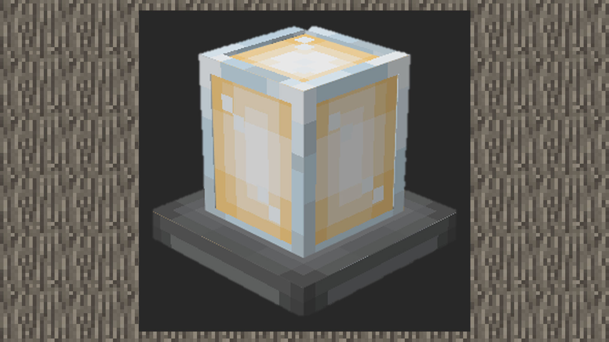
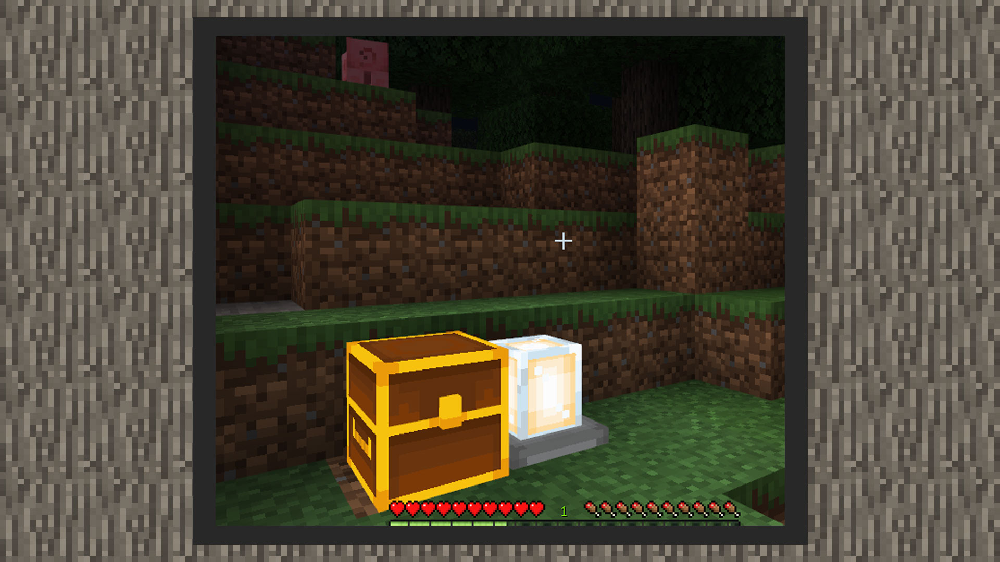

--- 
front: https://mc.res.netease.com/pc/zt/20201109161633/mc-dev/assets/img/4_1.fd4b17c4.jpg 
hard: Advanced 
time: 15 minutes 
--- 

# Simple tutorial ①: Make a glowing floor lamp 

#### Author: Realm 

#### Custom block behavior pack 

``` 
{ 
"format_version": "1.16.0", 
"minecraft:block": { 
"description": { 
"identifier": "design:lamp", 
"register_to_creative_menu": true 
}, 
"components": { 
"minecraft:block_light_absorption": 0, 
"netease:tier": { 
"digger": "pickaxe", 
"level": 0 
}, 
"netease:render_layer": { 
"value": "alpha" 
}, 
"minecraft:block_light_emission": 1.0, 
"minecraft:destroy_time": 2.0, 
"minecraft:map_color": "#ffffff" 
} 
} 
} 
``` 

1) 1.16.0 is the custom block content format of the current nether update, so we fill in 1.16.0 in format_version 

2) identifier is the name field of the custom block, which can be defined by the developer. register_to_creative_menu manages whether the block is registered in the creative backpack. 

3) The parameters under components will store the various functions of the block. 

- Set the transmittance to 0 to reduce the impact of ambient light. 

- Set the block to have a speed bonus when mined by a pickaxe of a wooden pickaxe or above.


-Since a texture with a transparent layer is used, the rendering material of the block is set to transparent. 

-Set the luminosity to 1.0, which means the strongest light. 

-Set the block breaking time to 2.0 

-Customize the color of the block displayed on the map, which can be defined by the developer. 

 

#### Custom block resource pack 

1) In resourcepack/blocks.json, add the name field and model resource name of the block. The name comes from the name field in the model file in resourcepack/models/netease_block/. Set the sound effects of walking on the block and destroying the block to glass sound effects. 

```
{
  "format_version": [
    1,
    1,
    0
  ],
  "design:lamp": {
    "netease_model": "design:lamp",
	"sound": "glass"
  }
}
{
    "format_version": "1.13.0",
    "netease:block_geometry": {
        "bones": [
          …
        ],
        "description": {
            "identifier": "design:lamp",
            "textures": [
                "design:lamp"
            ],
            "use_ao": false
        }
    }
}
```


#### Actual game effect

