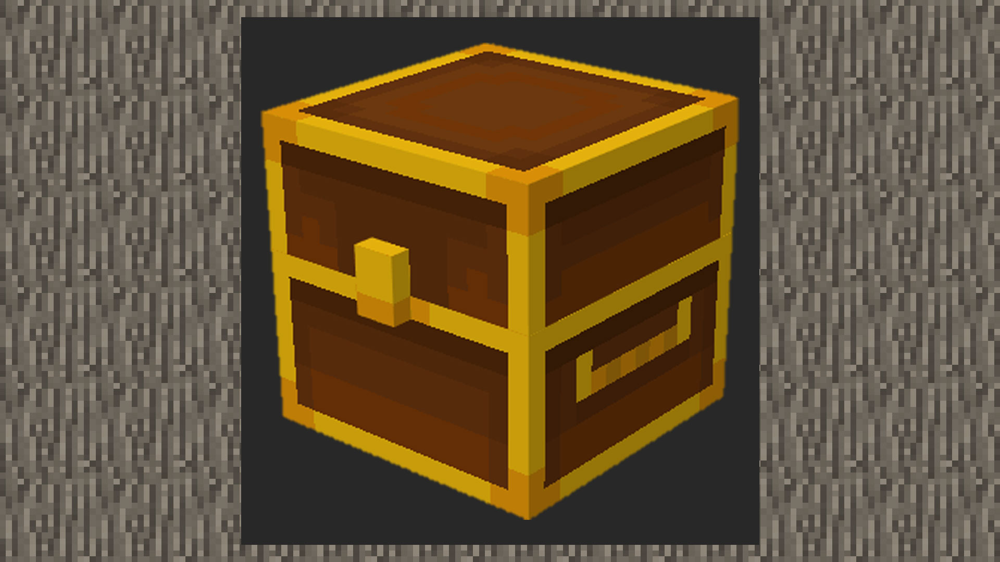

--- 
front: https://mc.res.netease.com/pc/zt/20201109161633/mc-dev/assets/img/5_1.ca4249e1.jpg 
hard: Advanced 
time: 15 minutes 
--- 
# Simple tutorial ②: Make a treasure box 
#### Author: Realm 

Download the treasure box sample package: Download [sample package](https://g79.gdl.netease.com/guidedemo-case9.zip). 

#### Custom block behavior package

```
{
    "format_version": "1.16.0",
    "minecraft:block": {
        "description": {
            "identifier": "design:treasure_chest",
            "register_to_creative_menu": true
        },
        "components": {
            "minecraft:block_light_absorption": 0,
            "netease:tier": {
                "digger": "pickaxe",
				"level": 0
            },
			"netease:face_directional": {
				"type": "direction"
			},
            "minecraft:block_light_emission": 0.0,
            "minecraft:destroy_time": 2.0,
            "minecraft:loot": "loot_tables/design_treasure_chest.json",
            "minecraft:map_color": "#ffffff" 
} 
} 
} 
``` 

1) 1.16.0 is the custom block content format of the current Nether Update, so we fill in 1.16.0 in format_version 

2) identifier is the name field of the custom block, which can be defined by the developer. register_to_creative_menu is to manage whether the block is registered in the creative backpack. 


3) The parameters under components will store the various functions of the block. 

- Set the transparency to 0 to reduce the impact of ambient light. 

- Set the block to have a speed bonus when it is mined by a pickaxe of a wooden pickaxe or higher level. 

- Set the block to be a four-sided block, because we hope that when the player places it, the front side will always face the player. 

- Set the luminosity to 0, that is, no light, and this component can also be omitted. 

- Set the block breaking time to 2.0 

- Customize a loot table and set the path to the loot table. A combination will be placed in the loot table, and a set of gold ingots will drop when the treasure chest is destroyed. 

- Customize the color of the block displayed on the map, which can be defined by the developer himself. 

 

#### Custom Block Resource Pack 

1) In resourcepack/blocks.json, add the name field and model resource name of the block. The name comes from the name field in the model file in resourcepack/models/netease_block/. Set the sound effects of walking on the block and destroying the block to the wood sound effect. 

```
{
  "format_version": [
    1,
    1,
    0
  ],
  "design:treasure_chest": {
    "netease_model": "design:treasure_chest",
	"sound": "wood"
  }
}
{
    "format_version": "1.13.0",
    "netease:block_geometry": {
        "bones": [
            …
        ],
        "description": {
            "identifier": "design:treasure_chest",
            "textures": [
                "design:treasure_chest"
            ],
            "use_ao": false
        }
    }

} 
``` 

#### Actual game effect 

