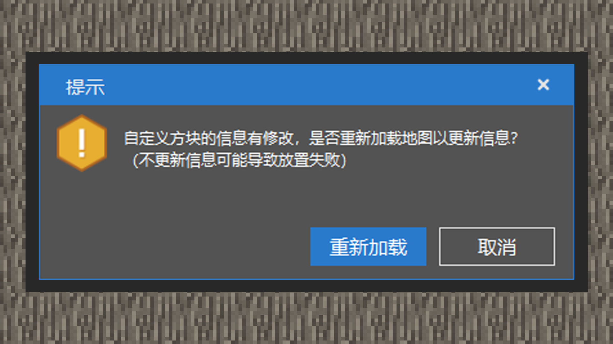
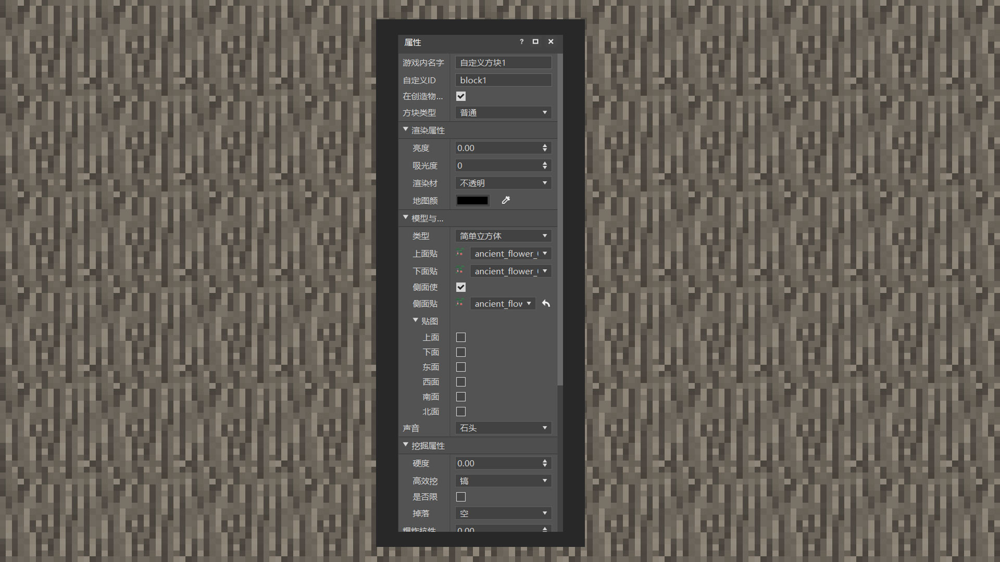

--- 
front: https://mc.res.netease.com/pc/zt/20201109161633/mc-dev/assets/img/1_1.43173d4d.jpg 
hard: Advanced 
time: 15 minutes 
--- 
# Understanding Custom Blocks 
#### Author: Realm 
Blocks are the basic units of elements in Minecraft. From the surface, biomes, and vegetation to workbenches, machines, and campfires, all are interpreted in the form of blocks. Custom blocks provide developers with a more convenient way to customize content and gameplay. Admittedly, the current custom block content only provides some functions, and not all the details of the original blocks can be achieved through custom blocks. Please look forward to the next update, and the Chinese version and Bedrock Edition teams will provide more diverse solutions! This chapter will explain what custom blocks can do now. 

#### Custom Block Components 

Currently, custom blocks support the original block component function provided by Bedrock Edition 1.16.10 and the additional block component function provided by the Chinese version. We can use a text editor or MCSTUDIO to make them. 

#### MCSTUDIO 

 

1) Enter the level editor, right-click the component panel, and create a block component. You can add multiple custom blocks using the "+" sign on the right. Then click the unlock button on the right, left-click on the editor page to place the custom block, and press ESC to exit the placement mode. Note: Whenever the developer modifies the custom block information, the world must be reloaded according to the prompt pop-up window for the changed information to take effect. 

 

2) The current editor supports the following component content for custom blocks: 

#### In-game name: 

Modify the name of the block item displayed in the inventory. 

#### Custom block ID: 

It is the unique name of the block in the game, and must only contain English and underscores. In order to avoid ID conflicts with other modules and original blocks, we should use the module name + underscore + block name as the safest naming method. 

 

#### Display in the creative inventory: 

Checking the option will register the block to the construction column, that is, the creative inventory under the building block page. 

#### Block type: 

Currently, there are three types of options: normal, portal, and monster spawner. 

#### Rendering properties: 

The four component functions under the rendering properties are absorbance (which can be understood as transmittance, the larger the value, the less transparent it is), brightness (which can be understood as luminescence, the value is between 0.0 and 1.0, the larger the value, the greater the luminescence at night), rendering material (determined by the block map texture, if the map has a transparent layer, select the transparent material, if there is a semi-transparent layer, select the semi-transparent material, otherwise select the opaque material), map color (the color of the block displayed on the map). 

 

#### Models and Textures: 

There are two types of models. One is a simple cube, which is a block model that occupies one grid high, one grid wide, and one grid long in the world. By default, no block model needs to be specified. The other is a custom block model, which requires the developer to provide a custom block model file. When selecting a simple cube, if you check the option to use the same texture for the upper and side surfaces, the developer only needs to provide the top, side, and bottom texture files stored in the blocks folder under the textures folder in the resource manager. If you uncheck it, you can specify the top, bottom, left, right, front, and back surfaces of the block, a total of 6 textures. Texture random texture will help the block to randomly rotate the texture of the set side after it is placed in the game. The blocks that use this function in the original world include leaves, soil, grass blocks, etc. Random rotation will bring better visual effects to players under appropriate conditions, and it is not easy to cause aesthetic fatigue. 

#### Sound: 

Refers to the sound effects of blocks, including the sound effects when creatures step on them and when they are destroyed. Block sound effects belong to the hard-coded category. Currently, it is not possible to customize block sound effects, so we must use the original block sound effects. 

#### Mining properties: 

Hardness determines the destruction time of blocks. The greater the hardness, the longer it takes to mine the blocks. The efficient mining tools can be set to the original pickaxe, hoe, axe, and shovel. At the same time, these four types of custom item tools are supported. The limited tool level drop will affect whether the block will drop. It will add a tool level condition. Only when the tool level is higher than the tool level, the block drops will be dropped after mining. The drop can point to the drop table established in the component panel. Whether it is solid or not will affect whether the block will suffocate creatures, and when using custom block models, some ugly shadows will be cancelled. It is considered as an obstacle option when finding the path. When checked, the creature will jump on it as an obstacle and move around. If it is not checked, it will be treated as an air block and move regardless of its existence. 

#### Shape: 

The orientation determines whether the block is a four-sided or six-sided block. If it is a four-sided block, the orientation of the block will change according to the four different angles (east, west, south, and north) placed by the player. If it is a six-sided block, the top and bottom sides will be added. 

The entity collision box will detect whether the entity's volume overlaps with the block's volume. Generally, the entity will be blocked outside the block's collision box. If the entity collision box overlaps with the entity, it may cause suffocation damage! 

The ray collision box will detect whether the player's line of sight overlaps with the block's volume. For example, the ray collision box of most blocks is a grid, so when the line of sight moves into the grid, the block can be dug out! 

#### Block Entity: 

When turned on, it allows custom blocks to save complex data structures.