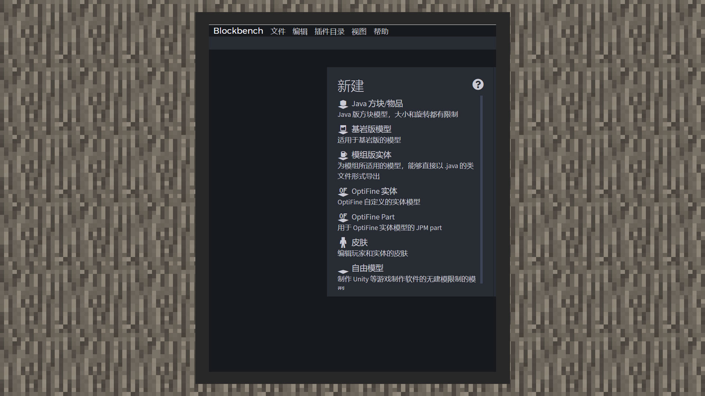
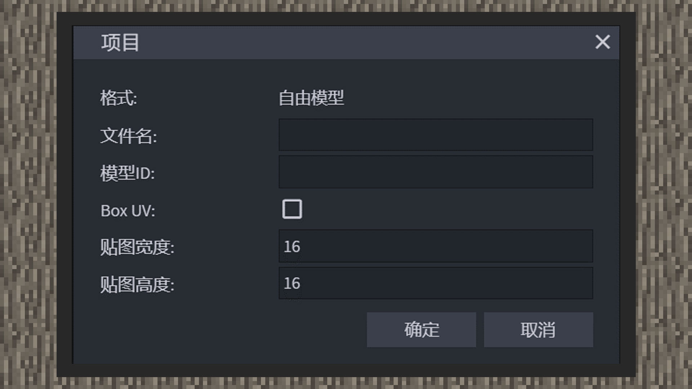

--- 
front: https://mc.res.netease.com/pc/zt/20201109161633/mc-dev/assets/img/2_1.54b5ffe9.jpg 
hard: Advanced 
time: 10 minutes 
--- 
# Making a special model for blocks 
#### Author: Realm 

Before making a block model, you must first create a new project. However, it must be informed in advance that some key pairs in the Chinese version of the block model file are slightly different from the original model file. Developers can compare them in the Chinese version of the developer documentation. In order to facilitate developers, the Huahua team developed a converter through the free model format of Blockbench. We can directly convert the free model project file into a custom block model file through the resource management panel under the special effects editor of McStudio, which is very convenient. 

#### Project selection in BlockBench 

 

1) Open Blockbench and select Free Model from the New column. 

 

2) After specifying the file name and model ID in the project, uncheck BoxUV and change the texture width to 16x16. 

3) After entering the project, you can see the coordinate system and grid, and the N direction is the north direction. It should be noted that from the example image, you can see the red and blue lines, and their intersection is the upper left corner of the block. Therefore, the block model needs to start from here and stretch to the lower right corner to build the material, rather than building it within the grid range. Although this will conflict with normal modeling thinking, developers can also choose to build the block model in the center of the grid first, and then move it to the lower right corner. Similarly, like modeling custom biological models, the grid length and width are 16 grids, and 16 grids represent one grid in the world. 

4) Each cube will be wrapped by a skeleton in the end. This is the basic concept of building a Minecraft model, which is no different from a custom creature model. However, since custom block models do not currently support animation, all bone anchor points need to be set at the coordinates 0, 0, 0. Otherwise, when rotating the block skeleton, you may encounter a situation where the preview effect deviates from the actual effect in the game! At the same time, the cubes and bones in the block model do not support the expansion function. When encountering the problem of overlapping cube faces, you can only solve it by moving the cube or squeezing/enlarging the cube size! 

#### Block Model Texture Specifications 

 

Different from the UV unfolding method of the creature model, we recommend that developers cancel the Box UV of the creature model when modeling custom blocks, and instead use the method of setting each block face east, west, south, north, top, and bottom, and set the texture format size to 16x16. If a texture canvas with a resolution of 16x16 cannot meet the developer's requirements for model details, a new 16x16 texture can be created in the project. Such modeling restrictions are intended to guide developers to actively optimize the resource consumption of block models. After all, players' hardware resources are limited.