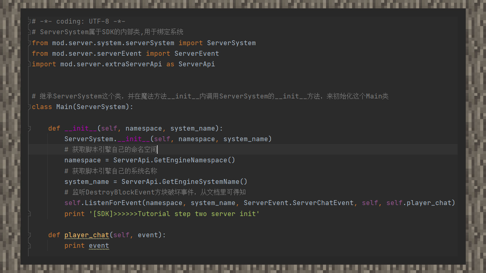

--- 
front: https://mc.res.netease.com/pc/zt/20201109161633/mc-dev/assets/img/2_1.b074023e.jpg 
hard: Advanced 
time: 15 minutes 
--- 
# MOD Step 1: Listening to Events 
#### Author: Realm 
①Create a new TutorialStepThree directory in the sample directory and imitate the writing method of StepTwo. 

 

②Under the _ init _ function, assign the script engine's namespace and system name to two variables, use ListenForEvent to listen to player chat events, and specify a callback function. The function of the callback function is that whenever the player types a chat content, this callback function will be called and the relevant code inside will be executed. According to the information in the document, it will finally return a dictionary containing 6 parameters. Therefore, when defining the callback function, in addition to ensuring that the first parameter is the object itself, you need to add an additional parameter. For ease of understanding, we name the second parameter event. Then, under the function body, we print this event and see the final effect in the game. 

