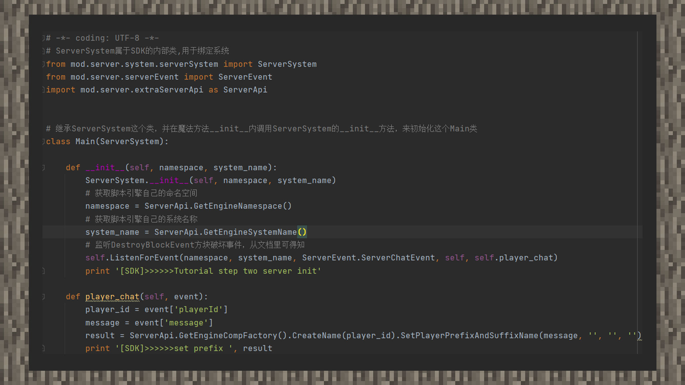

--- 
front: https://mc.res.netease.com/pc/zt/20201109161633/mc-dev/assets/img/3_1.795ccf68.jpg 
hard: Advanced 
time: 15 minutes 
--- 
# MOD Step 2: Create Components 
#### Author: Realm 

① Before creating a component, let's confirm the function to be implemented. Since our execution environment is when the player is chatting, we can assume a goal. We hope to obtain the information input by the player's chat and turn it into the prefix of the player's name. 

 

② By obtaining the syntax of the data in the dictionary, assign the player ID and the chat content to two variables: "player_id" and "message". Among them, "player_id" is the player's unique ID in the world, which can also be understood as an identity. Usually when creating a component, if we want to let a player perform a certain operation through the MODSDK interface, we need to pass in the player ID when creating the component. 

③According to the archive, there is an interface on the server to set the player's prefix name and suffix name. We create this interface and need to pass in four parameters according to the code prompt, namely prefix, prefix color, suffix, and suffix color. Pass "message" to the first parameter position and leave "empty string" in the other three positions. 

④Finally, pass the execution result returned after the interface is executed to the "result" variable, and print the result on the console to see the final effect in the game. Since the host player will not see his own name, the developer can use the double-open client to see it from the tenant's perspective!