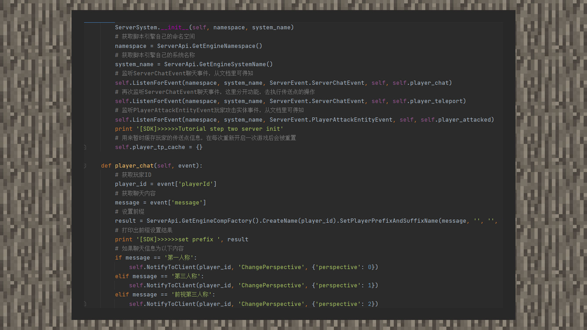
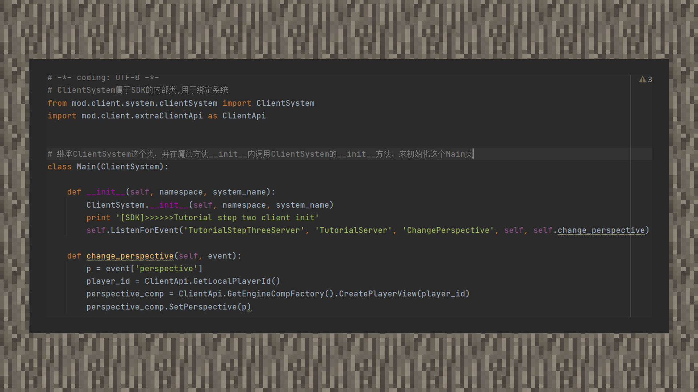

--- 
front: https://mc.res.netease.com/pc/zt/20201109161633/mc-dev/assets/img/4_1.ca250d44.jpg 
hard: Advanced 
time: 20 minutes 
--- 
# MOD Step 3: Communication between Server and Client 

#### Author: Realm 

①Since the server and client belong to two different containers, the corresponding supported interfaces are also different. Developers often ask how to use the client method on the server, or use the server method on the client, but this is actually not feasible, because both containers have their own tracks. In order to allow cooperation between the tracks, communication is required. 

②Communication is to let the server or client package the data needed by the other party with Python's basic data types. The server passes it through NotifyToClient and BroadcastToAllClient, and the client passes it through NotifyToServer. Among them, BroadcastToAllClient is broadcast to all player clients, NotifyToClient is sent to a specified client player, and NotifyToServer is sent to the server. 

 

③ Remember that when listening to events, you need to pass in the namespace and system name in the first and second parameters? And when registering the system, we have already named the client system and the server system, so receiving custom events on one end on the other end is to use the name written when registering the system in modMain.py. 

 

④ In the example, we add code to the chat event, use conditional statements to judge the chat information, and let the player change his personal perspective after it is transmitted to the client. 

