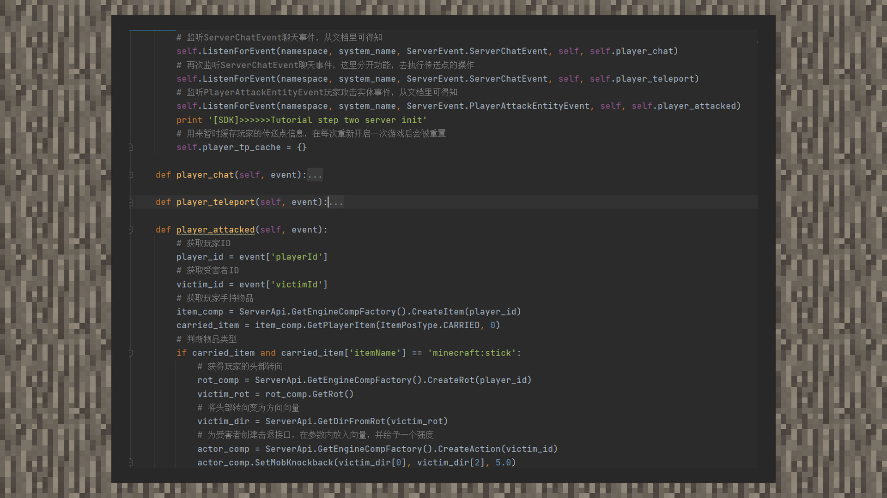

--- 
front: https://mc.res.netease.com/pc/zt/20201109161633/mc-dev/assets/img/6_1.3bed48ba.jpg 
hard: Advanced 
time: 20 minutes 
--- 
# Simple tutorial ①: Knockback stick 
#### Author: Boundary 

Download the knockback stick sample package: [Download the sample package](https://g79.gdl.netease.com/guidedemo-case10.zip). 

① When we see some competitive MC mini-games or some tricky and funny modules, we often see a gameplay that gives a wooden stick a super high knockback effect. Let's replicate it now! 

② According to the document, there is a player attack entity event in the script engine. First, we listen to this event and get the ID of the damaged entity. Determine whether the player's handheld item is a stick, and if so, execute the following logic. 

 

③ We get the player's head turn and convert the head turn into a direction vector. Finally, create an Action component to give the victim entity an instantaneous knockback effect. Enter the game and check the effect! 

