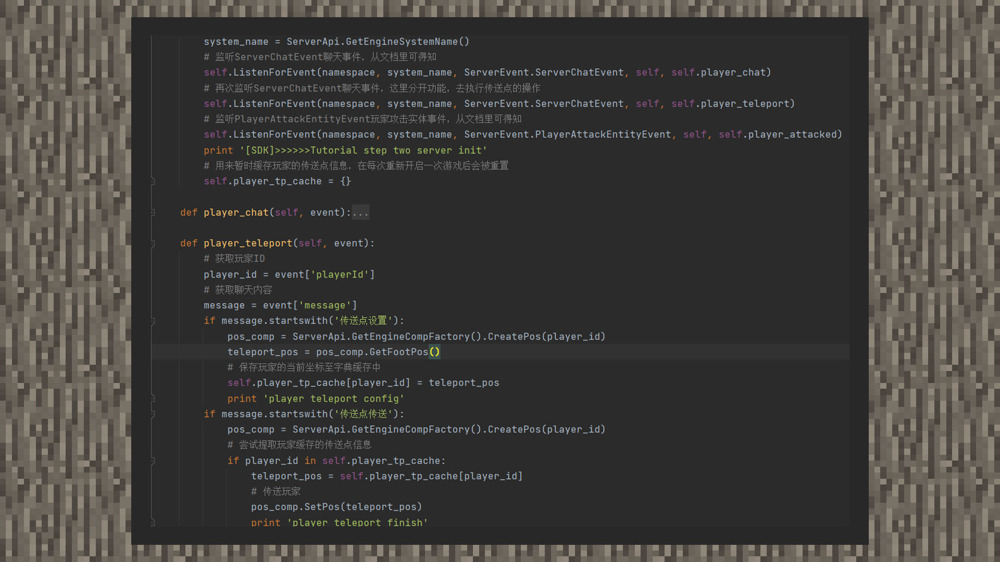

--- 
front: https://mc.res.netease.com/pc/zt/20201109161633/mc-dev/assets/img/7_1.2616ac65.jpg 
hard: Advanced 
time: 15 minutes 
--- 
# Simple tutorial ②: Teleport 
#### Author: Realm 

Teleport sample package download: Download [sample package](https://g79.gdl.netease.com/guidedemo-case10.zip). 

① My world map is vast, and the module provides players with the function of teleportation points, which can facilitate players to move quickly within the map. 

 

② Download the sample package and import it into the game in MCStudio. Enter "teleport point setting" in the chat window to set the current coordinates as the teleport point. Enter "teleport point teleport" in the chat window to teleport yourself back no matter how far you go. 

③ Since the Chinese version does not currently support custom commands, we simulate the command effect by monitoring the player's chat information and execute the logic of marking the teleport point, managing the teleport point, and teleporting to the teleport point. In the simple tutorial, we only provide a teleport point for the player, which is only valid in one game room. It will disappear after leaving the room, and the player will be teleported after the chat content is successfully matched. 

