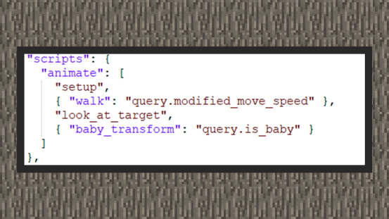

--- 
front: https://mc.res.netease.com/pc/zt/20201109161633/mc-dev/assets/img/1_1.b3d4b5ee.png 
hard: Advanced 
time: 20 minutes 
--- 
# Behavior and animation combination 
#### Author: Realm 

We hope that creatures will change their actions due to certain behaviors, and this change is more exposed to players. For example, we hope that creatures will perform attack animations when attacking, and we hope that they will perform swimming animations when moving on the water. In Bedrock Edition, Molang syntax can be used with animation controllers to make rich animation combinations. Molang language is a simple expression language unique to Bedrock Edition. It is mainly used to calculate and obtain attribute values in the game system. Because it is designed at a relatively low level, its advantages in language optimization are far greater than script engines. Most of the properties that can be obtained from the game serve custom entities, custom items, and custom blocks. These properties are returned by query functions. They are like interfaces on MODSDK. According to the objects served by different query functions, the properties they carry can be returned. For example, if I want to know whether a sheep is a baby, I can read the query.is_baby function in molang to get whether the sheep is a baby. More query function tables can be found on the Minecraft wiki! 

#### Behavior and animation examples ① 

 

① When the sheep is a baby, its head looks particularly large, larger than that of an adult sheep. This is because the sheep creature has registered an animation that enlarges the head part. The query.is_baby function is used to determine whether the sheep is a baby. From the sheep creature definition file, we can see that the name of the animation resource that enlarges the sheep's head is baby_transform, and the playback condition of baby_transform is that query.is_baby must be 1. The document tells us that this function will only return 1 true or 0 false. In Molang, Boolean values are replaced by numbers. If it is not 0, it is true, and if it is 0, it is false. Therefore, {animation: molang syntax} tells the game that when a sheep is a baby, the animation of enlarging the head will play. The molang syntax here is abbreviated as "query.is_baby", which is equivalent to true if query.is_baby is not 0. 

#### Behavior and animation example ② 

 

① When the pig moves, the walk animation is used, which is registered in the pig definition file. Also using molang syntax, according to the document, we can know that query.modified_move_speed will return a unitized value between 0 and 1 according to the speed of the creature. If the speed is slowly walking out, it will return 1. If some component behaviors use speed adjustment key pairs, it may not just meet 1, but because it is greater than 0, in the above figure, every time the pig moves, it will return true, and the walk animation will play.