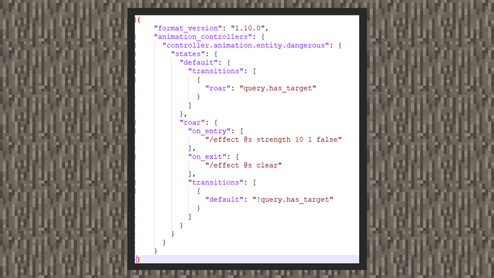
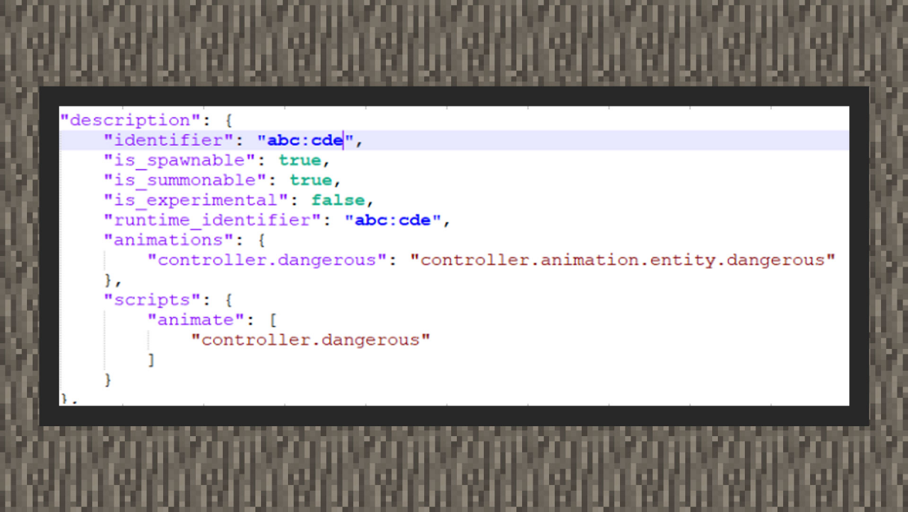

--- 
front: https://mc.res.netease.com/pc/zt/20201109161633/mc-dev/assets/img/2_1.5731dfa4.png 
hard: Advanced 
time: 20 minutes 
--- 
# Controller and Mob Events 

#### Author: Realm 

In the previous chapter, we mentioned that the animation controller is stored in the resource pack because it is used to control the state switching of the animation. But in fact, there can also be animation controllers on the behavior pack, and the folders where they are stored and the writing methods of most structures have not changed much. But what is it used for? In fact, many developers have hoped to be able to execute events in the behavior pack after obtaining the state of the entity, or to execute a certain instruction directly from the entity. Since all these contents must be run on the server, the Bedrock Edition team has also opened another animation controller for developers on the behavior pack to execute a set of instructions or trigger a certain event of the creature according to the change of the creature's state. 

Since the original entities do not use this function, its format and use only exist in the document, so it is difficult to find reference objects. The following two uses are sorted out to guide developers. 

#### How to write a behavior pack controller 

 

① Create a folder called animation_controllers in the root directory of the behavior pack, and all controller files will be placed here. 

② According to the above picture, it can be seen that similar to the resource pack, in addition to the animations animation collection that can be placed in each state, there are two new collections, one is "on_entry" and the other is "on_exit", which will execute the contents after entering the state and before leaving the state. The content can be filled in with a set of instructions, or the format of "@s event name" to execute a behavior event of an entity using the animation controller. 

③ In the above picture, we give a 10-second level 1 strong status effect to the creature when it finds the target, and clear all the status effects on the creature when it loses the target.

 

④ In the biological behavior file, register the animation controller and continue to execute the controller under scripts/animate. Similarly, before executing the controller, you can also use Molang conditions to determine whether the controller needs to be executed.