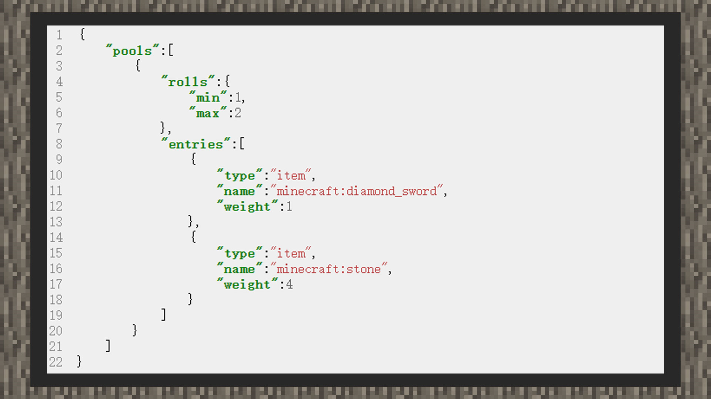

--- 
front: https://mc.res.netease.com/pc/zt/20201109161633/mc-dev/assets/img/6_1.b9815060.jpg 
hard: Advanced 
time: 10 minutes 
--- 
# Simple tutorial ②: Customize multiple screening of the same reward pool 

#### Author: Realm 

 

1) Create a loot configuration file in the loot_tables folder in the main directory of the behavior pack. 

2) Write according to the content format 

``` 
{ 
"pools": [ 
{ 
"rolls": { 
"min":1, 
"max":2 
}, 
"entries": [] 
} 
] 
} 
``` 

Since we want to filter the same loot pool multiple times, but in a random interval, fill in 1 for the minimum number of filters and 2 for the maximum number of filters, and the final number of filters will be between 1 and 2. 

3) Insert loot content 

``` 
{ 
"pools":[ 
{ 
"rolls":{ 
"min":1,

"max":2 
}, 
"entries":[ 
{ 
"type":"item", 
"name":"minecraft:diamond_sword", 
"weight":1 
}, 
{ 
"type":"item", 
"name":"minecraft:stone", 
"weight":4 
} 
] 
} 
] 
} 
``` 

Drop two types of loot, set the item names to minecraft:diamond_sword and minecraft:stone. At the same time, the weight of the more expensive diamond sword is set to 1, and the ordinary stone is set to 4. In this way, the probability of a single draw of loot, the probability of a diamond sword is 1/ (1 + 4) * 100% = 25%.