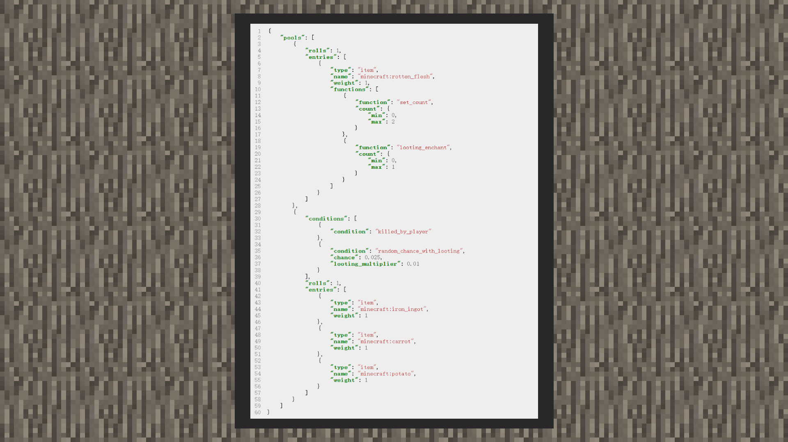

--- 
front: https://mc.res.netease.com/pc/zt/20201109161633/mc-dev/assets/img/2_1.eeeb242d.jpg 
hard: Advanced 
time: 15 minutes 
--- 
# Loot pool 

#### Author: Realm 

Let's take the original zombie's loot pool as an example. It is different from the loot configuration of other creatures in that there are two combinations in the loot pool. 

 

#### rolls 

Rolls can be understood as the number of times the dice are rolled. It accepts an integer value and a random interval containing the minimum and maximum number of times. Therefore, when the number is equal to 1, the loot can be filtered once from the loot entrance. If it is greater than 1, multiple loot can be filtered. When written as an interval object, a value between the minimum and maximum times will be taken to filter the number of loot. 

#### type 

There are three parameters for type. Item means the loot is an item, empty means the loot is empty, and loot_table will point the loot to other loot configuration files. 

When type is item, you can specify the item name through name, the format is namespace: identifier. Weight means weight. 

When type is loot_tables, you can specify the loot file path through name, the path name usually starts with loot_tables. Weight means weight. 

When there are multiple loot at the entrance, the higher the weight, the easier it is to get it. name is invalid when the type is empty. 

You can still open a loot pool in each loot. When the loot configuration table is triggered by the game, a loot will be selected from the top loot pool in turn. Then, if there is another loot pool in the loot, it will continue to select. This method is very useful when the player needs to generate a certain item and another item. 

If there are more than two filter combinations in the loot pool, all will be executed according to the number of rolls before adding conditions. If conditions are added to the filter combination, the loot can only be filtered after the conditions are met. 

### Additional content: 
The Chinese version of Minecraft has added the player's luck attribute since version 2.1, so the loot table also supports the two fields of quality and bonus_rolls, as shown in the figure below. 
>This part of the content is not in the loot table of the original zombies, and the developer needs to configure the loot table to implement it 

 

luck: Luck attribute, similar to the luck value in Java version, is a player attribute. It can be used with the quality and bonus_rolls fields of the loot table to change the number of rolls in the loot pool and the weight of each item, ultimately achieving the effect that the higher the luck value, the richer and more valuable the dropped items. 

quality: Increase the weight of this item with the luck attribute. The value can only be an integer and can be negative. The calculation formula is as follows 

weight = weight + luck*quality 

bonus_rolls: Increase the number of loot rolls with the luck attribute. The value can be a floating point number or a negative number, which is equivalent to adding an additional number of draws based on the number of rolls. The calculation formula is as follows: 

Final throws = rolls + luck * bonus_rolls (round down, if the final throws ≤ 0, no drop) 

> Note 1: The lucky attribute is limited to the loot table (drop table) of creatures killed by the player and fishing. It does not support naturally generated containers (boxes), drops from broken blocks, and the loot table of piglins' barter. 

> Note 2: The loot from fishing can also be affected by the enchantment effect of the Sea's Favor, but this does not increase the player's luck attribute 

> Note 3: The additional amount of the plunder enchantment effect will increase exponentially due to the final throws. For example: if the final throws affected by the luck value are 3, the additional amount of the plunder enchantment effect will be 3. For each additional level of enchantment, 3 additional items will be obtained, so please avoid setting the bonus_rolls value too large. 
