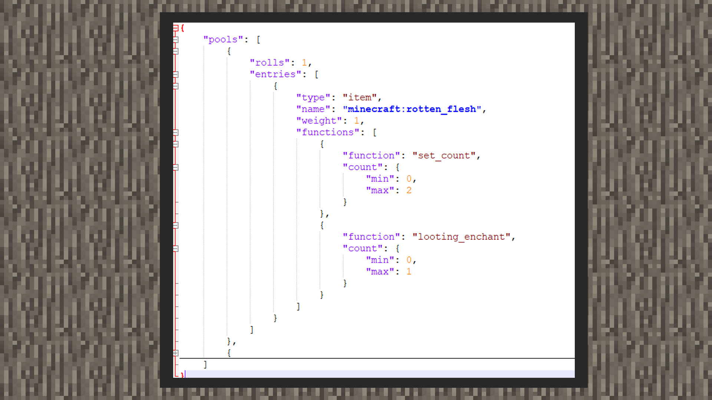

--- 
front: https://mc.res.netease.com/pc/zt/20201109161633/mc-dev/assets/img/3_1.ea877fdd.jpg 
hard: Advanced 
time: 20 minutes 
--- 
# Loot function 
#### Author: Realm 
 
The loot function can give loot more powerful abilities. Taking the normal loot dropped by zombies as an example, two functions are defined in functions: set_count and looting_enchant. The former is to set the number of rotten flesh dropped, and the latter is the additional number given by the looting enchantment. min is the minimum value, and max is the maximum value. The number will be randomly generated within this range. 


In addition, the original version has many functions to choose from. 


#### Related to enchantments: 

enchant_with_levels: enchantments are given by enchantment levels. You can set a fixed value or a random range for the enchantment level. 

```json 
{ 
"function": "enchant_with_levels", //Function name 
"treasure": false, //If true, give rare enchantments 
"levels": 1 //Enchantment level 
} 
``` 

```json 
{ 
"function": "enchant_with_levels", //Function name 
"treasure": false, //If true, give rare enchantments 
"levels": {"min":1, "max": 2}//Enchantment level 
} 
``` 

enchant_randomly: Random enchantment. 


```json 
{ 
"function": "enchant_randomly", //Function name 
"treasure": false, //If true, grant rare enchantments 
} 
``` 

enchant_random_gear: Grants random armor enchantments. 

```json 
{ 
"function": "enchant_random_gear", //Function name 
"chance": 0 //Probability, 0.0~1.0 range, 1.0=100% 
} 
``` 

specific_enchants: Specified enchantments and levels (levels can exceed the upper limit of the original version, but only the highest level of the original version will be displayed in the game). 

```json 
{ 
"function": "specific_enchants", 
"enchants": [ 
{ 
"id": "aqua_affinity", 
"level": 1 
} 
] 
} 
``` 

#### Related to items: 

set_data://Specify item added value, such as wool added value 15 is black wool. 

```json 
{ 
"function": "set_data", 
"data": 15 
} 
``` 

set_damage: Specify the item's percentage durability, 1=100% of the remaining durability, 0 means no remaining durability, the value is between 0.0 and 1.0.


```json 
{ 
"function": "set_damage", 
"damage": 1 
} 
``` 

set_data_from_color_index: Set the corresponding additional value according to the minecraft:color behavior. The original creatures that use the minecraft:color behavior include sheep, so they will drop corresponding wool according to the wool color of sheep. 

```json 
{ 
"function": "set_data_from_color_index" 
} 
``` 

random_aux_value: Give a random additional value to a non-block item. 

```json 
{ 
"function": "random_aux_value", 
"values": { 
"min": 2, 
"max": 9 
} 
} 
``` 

set_book_contents: Give a written book title, author, and book content. 

```json
{
  "function": "set_book_contents",
  "title": "1",
  "author": "1",
  "pages": [
    "1111",
    "2222"
  ]
}
```

fill_container: Will drop or give a custom loot table to a chest block, dispenser block, or hopper block. 

```json 
{ 
"function": "fill_container", 
"loot_table": "loot_tables/table.json" 
} 
``` 

furnace_smelt: Will drop a recipe result of an item with a furnace recipe, such as beef turning into roast beef; the conditions currently only have on_fire and on_ground. 

```json 
{ 
"function": "furnace_smelt", 
"conditions": [ 
{ 
"condition": "entity_properties", 
"entity": "this", 
"properties": { 
"on_fire": true 
} 
} 
] 
} 
``` 

set_banner_details: Sets the details of the banner. 

```json 
{ 
"function": "set_banner_details", 
"conditions": [ 
{ 
"condition": "entity_properties", 
"type": 1 
} 
] 
} 
``` 

exploration_map: Set the map to explorer map, where the destination value is the parameter of the original /locate command, including "monument", "mansion", "village", "stronghold", "temple", "ruins", "shipwreck", "pillageroutpost", "buriedtreasure", "mineshaft", "endcity", "fortress", "ruinedportal", "bastionremnant". 

```json 
{

"function": "exploration_map", 
"destination": "monument" 
} 
``` 

random_block_state: Randomly select a block state value, when the set item is a block item and contains this value, such as "coral_color", "flower_type", "sapling_type", for more blockstate, please refer to the wiki: [https://minecraft.gamepedia.com/Block_states](https://minecraft.gamepedia.com/Block_states). 

```json 
{ 
"function": "random_block_state", 
"values": { 
"min": 1, 
"max": 1 
} 
} 
``` 

set_lore: Set item affixes. 

```json 
{ 
"function": "set_lore", 
"lore": [ "111" ] 
} 
``` 

set_name: Set the item name. 

```json 
{ 
"function": "set_name", 
"name": "design" 
} 
``` 

set_actor_id: Set the creature ID of the creature egg item, and the creature egg of this creature will be dropped. 

```json 
{ 
"function": "set_actor_id", 
"id": "minecraft:zombie" 
}

``` 

