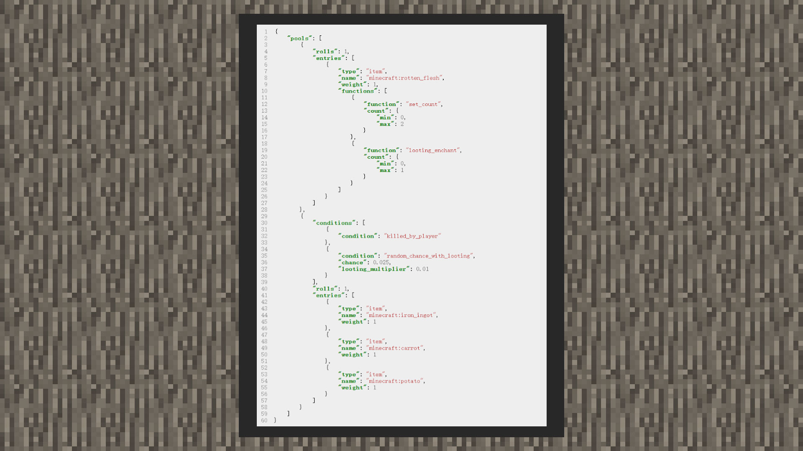

--- 
front: https://mc.res.netease.com/pc/zt/20201109161633/mc-dev/assets/img/3_1.ea877fdd.jpg 
hard: Advanced 
time: 20 minutes 
--- 
# Loot Conditions 
#### Author: Realm 

 

When developers want to filter combinations that must meet conditions before loot drops, they can use the loot condition function. 

```json 
{ 
"conditions": [ 
{ 
"condition": "has_mark_variant", //When the value of minecraft:mark_variant of the creature is what, the condition passes and can be filtered 
"value": 1 
}, 
{ 
"condition": "entity_properties", //When the creature is defeated by fire or falling 
"value": { 
"on_ground": false, 
"on_fire": false 
} 
}, 
{ 
"condition": "killed_by_player", //When the creature is defeated by the player 
}, 
{ 
"condition": "killed_by_player_or_pets", //When the creature is defeated by the player or the player's pet 
}, 
{ 
"condition": "random_chance_with_looting", //When the random value is satisfied, and the looting enchantment will increase the random probability, the value range is 0.0~1.0 
"chance": 0.0, 
"looting_multiplier": 0.0 
}, 
{ 
"condition": "random_difficulty_chance", //When the difficulty is one of the following difficulties, the larger the value, the easier it is to be screened, the value range is 0.0~1.0 
"default_chance": 0, //If the game difficulty is not set, this paragraph takes effect 
"peaceful": 0, //If the game difficulty is peaceful difficulty 
"easy": 0, //If the game difficulty is easy difficulty

"normal": 0, //If the game difficulty is normal difficulty 
"hard": 0 //If the game difficulty is hard difficulty 
}, 
{ 
"condition": "random_regional_difficulty_chance", //When the maximum regional difficulty random chance meets the specified value, the value range is 0.0~1.0 
"max_chance": 0.0 
} 
] 
} 
``` 

