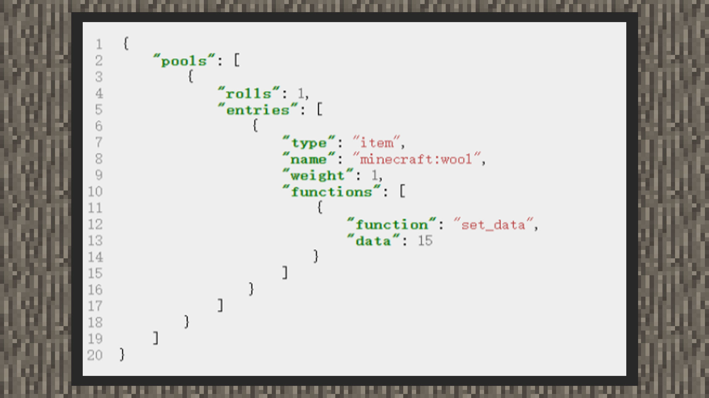

--- 
front: https://mc.res.netease.com/pc/zt/20201109161633/mc-dev/assets/img/4_1.af85ce66.jpg 
hard: Advanced 
time: 10 minutes 
--- 
# Simple tutorial ①: Customize the wool drop color 

#### Author: Realm 

 

1) Create a loot configuration file in the loot_tables folder in the main directory of the behavior pack. 

2) Write according to the content format 

``` 
{ 
"pools": [ 
{ 
"rolls": 1, 
"entries": [] 
} 
] 
} 
``` 

Since only one color of wool is dropped, the number of screenings can be written as 1 

3) Insert loot content 

``` 
{ 
"pools": [ 
{ 
"rolls": 1, 
"entries": [ 
{“type”: "item", "name": "minecraft:wool","function": [{"function": "set_data","data":15}]} 
] 
}

] 
} 
``` 

Set the loot type to item, set the item name to minecraft:wool, and finally add the loot function, setting the item value to 15. This will create a black wool when the loot appears.