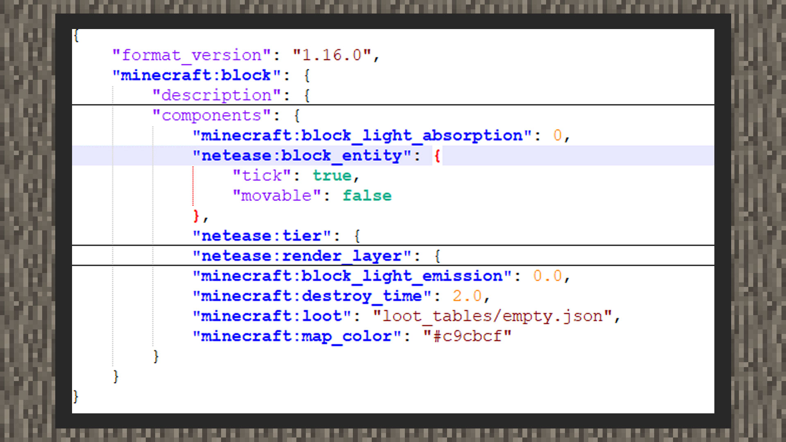

--- 
front: https://mc.res.netease.com/pc/zt/20201109161633/mc-dev/assets/img/1_1.be3fdadc.jpg 
hard: Advanced 
time: 15 minutes 
--- 
# Custom Block Entity 
#### Author: Realm 

Custom block entity is a block type that can store complex data structures. The concept different from block state is that block state stores more of a single attribute. Take the Bedrock Edition anvil as an example. It has a block state: "damaged" to represent the degree of damage of the anvil. It accepts four values: broken, slightly_damaged, undamaged, and very_damaged. Block entities can store more complex data content, such as a box block that stores an item data. Therefore, the block entity is the content of the block, and the block state is more like a property of the block. Note: The custom block entity function is only available for the Chinese version, so developers cannot use the same format to customize block entities on the international version. 


#### How to customize block entities 

 

``` 
{ 
"format_version": "1.16.0", 
"minecraft:block": { 
"description": { 
}, 
"components": { 
"netease:block_entity": { 
"tick": true, 
"movable": false 
} 
} 
} 
} 
``` 

Under the components of the custom block, the developer adds a "netease:block_entity" component with two key pairs. When "tick" is set to true, when the player enters the tick range of the block, the block will send 20 ServerBlockEntityTickEvent events per second. When set to false, it will not send events to the script layer. 

"movable" is used to set whether the custom block entity can be moved by a piston. Due to the settings of Bedrock Edition, all original block entities can be moved by pistons, and this function is also provided for custom block entities. 

#### tick and no tick 

When you need the block to save data but do not need to update the data in the block in real time, you can choose to set tick to false. 


For example: When a player right-clicks a custom block entity, a random loot will drop every 20 clicks. The block entity here saves data only to record the number of times the player clicks on itself, so tick can be set to false. 


When tick needs to be set to true, the custom block entity often needs to continuously update its own data. For example, when a custom furnace block has fuel in it and is burning something, the block entity itself needs to maintain a continuously updated burning item time, so the tick of the block entity can be set to true. 

