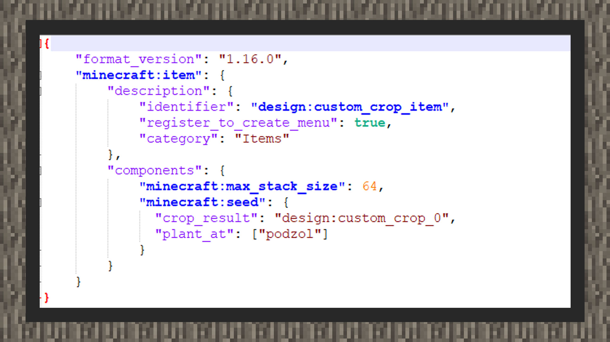
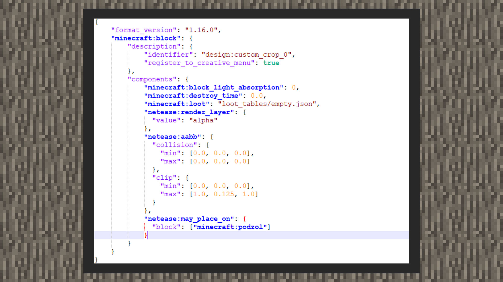
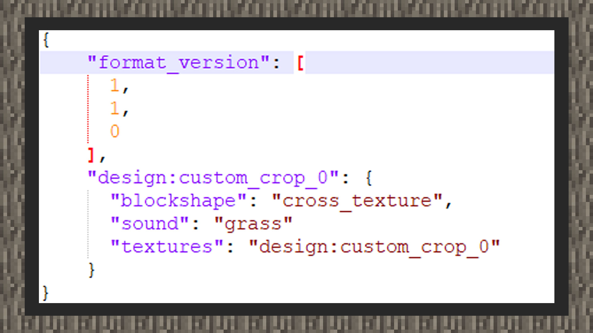
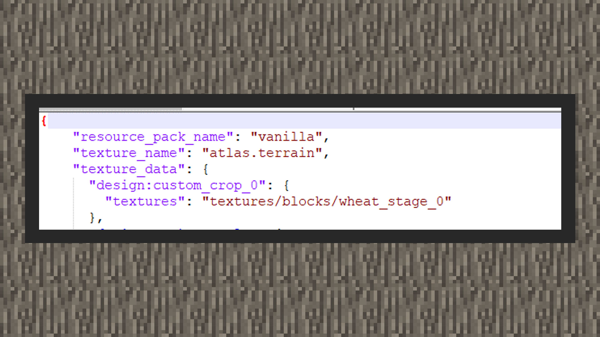
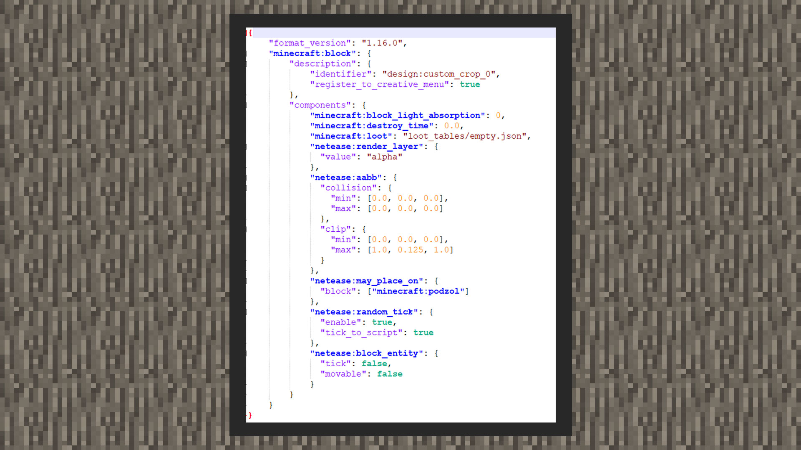
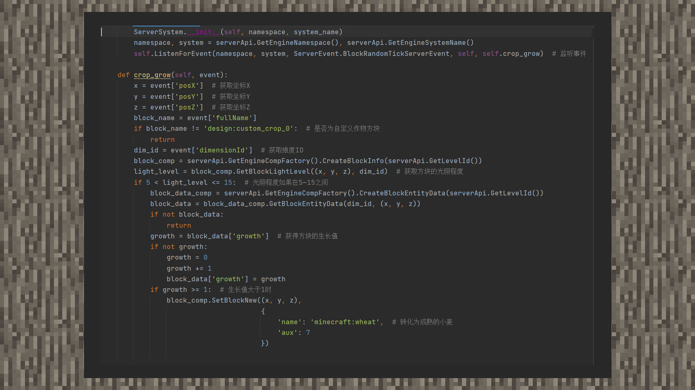

--- 
front: https://mc.res.netease.com/pc/zt/20201109161633/mc-dev/assets/img/2_1.8a46d947.jpg 
hard: Advanced 
time: 25 minutes 
--- 
# Custom Crops 

#### Author: Boundary 

In Minecraft, planting a crop requires a seed. Therefore, from a development perspective, custom crops require a seed prop and a custom block. There are two common methods for implementing custom crops. One can be implemented through pure components, and the other requires MODSDK. This chapter will provide developers with these two ideas to implement their own custom crops. 

#### Preparation before starting 

#### Custom Seed 

 

Customize a seed prop and set its maximum stacking number to 64. Added "minecraft:seed" component, which has two key pairs, "crop_result" points to the planted block, here named "design:custom_crop_0", which will be used as the name field for immature custom crop blocks. "plant_at" points to the block that can be planted, here it is set to only plant on ash soil. 

```
{
	"format_version": "1.16.0",
	"minecraft:item": {
		"description": {
			"identifier": "design:custom_crop_item",
			"register_to_create_menu": true,
			"category": "Items"
        },
		"components": {
			"minecraft:max_stack_size": 64,
			"minecraft:seed": {
			  "crop_result": "design:custom_crop_0",
			  "plant_at": ["podzol"]
			}
		}
	}
}
```

#### Customized crop blocks




```
{
    "format_version": "1.16.0",
    "minecraft:block": {
        "description": {
            "identifier": "design:custom_crop_0",
            "register_to_creative_menu": true
        },
        "components": {
            "minecraft:block_light_absorption": 0,
            "minecraft:destroy_time": 0.0,
            "minecraft:loot": "loot_tables/empty.json",
            "netease:render_layer": {
              "value": "alpha"
            },
            "netease:aabb": {
              "collision": {
                "min": [0.0, 0.0, 0.0],
                "max": [0.0, 0.0, 0.0] 
}, 
"clip": { 
"min": [0.0, 0.0, 0.0], 
"max": [1.0, 0.125, 1.0] 
} 
}, 
"netease:may_place_on": { 
"block": ["minecraft:podzol"] 
} 
} 
} 
} 
``` 

Customize the behavior of immature crop blocks. Set their transparency to 0 with "minecraft:block_light_absorption" so that the block does not cast ugly shadows in the world. Use netease:aabb to adapt the collision box and raycast collision box to the image of the actual block. Use netease:render_layer to set the block material to a transparent material. Use "minecraft:destroy_time" to set its destruction time to 0.0, and use "minecraft:loot" to point the drops to the empty loot table of the original version, that is, no drops are dropped. Use "netease:may_place_on" to set the block to grow only on ash soil, otherwise it will self-destruct. 

 

Customize the material of the immature crop block, and set the sound effect of its destruction to the sound effect of grass, which is consistent with the sound effect of the original crop block being destroyed. Set its block shape to "cross_texture", so that the block will present a cross shape like the original crop block, which is suitable for developers who have no special requirements for the block model.


```
{
    "format_version": [
      1,
      1,
      0
    ],
	"design:custom_crop_0": {
	  "blockshape": "cross_texture",
	  "sound": "grass",
	  "textures": "design:custom_crop_0"
	}
}
```





```
{
    "resource_pack_name": "vanilla",
    "texture_name": "atlas.terrain",
    "texture_data": {
	  "design:custom_crop_0": {
		"textures": "textures/blocks/wheat_stage_0"
	  } } 
} 
``` 

Finally, in the textures/terrain_texture.json file (create a new one if it doesn't exist), set the resource key and resource path of the crop. 

 

Add the "netease:transform" component to the custom block, place the condition of the block in "condition", brightness controls the lighting conditions under which the block grows, random_tick_count is the number of random ticks required for transformation, surrounding is the surrounding blocks required to prevent transformation, and radius is the radius of the block. Result is the result block after the block is transformed. 

``` 
{

    "format_version":"1.16.0",
    "minecraft:block":{
        "description":{
            "identifier":"design:custom_crop_0",
            "register_to_creative_menu":true
        },
        "components":{
            "minecraft:block_light_absorption":0,
            "minecraft:destroy_time":0,
            "minecraft:loot":"loot_tables/empty.json",
            "netease:render_layer":{
                "value":"alpha"
            },
            "netease:aabb":{
                "collision":{
                    "min":[0,0,0],
                    "max":[0,0,0]
                },
                "clip":{
                    "min":[0,0,0],
                    "max":[1,0.125,1]
                } }, 
"netease:may_place_on":{ 
"block":[ 
"minecraft:podzol" 
] 
}, 
"netease:transform":{ 
"conditions":{ 
"brightness":{ // Light conditions that must be met for crops to grow 
"max":15, 
"min":9 
}, 
"random_tick_count":{ // Number of random ticks required for transformation 
"value":2 
}, 
"surrouding":{ // Surrounding blocks required for transformation 
"value":"minecraft:podzol", 
"radius":1 // Radius 
} 
}, 
"result":"minecraft:wheat" // Which block to transform into 
} 
} 
} 
} 
``` 


#### Script to implement custom blocks





```
{
    "format_version": "1.16.0",
    "minecraft:block": {
        "description": {
            "identifier": "design:custom_crop_0",
            "register_to_creative_menu": true
        },
        "components": {
            "minecraft:block_light_absorption": 0,
            "minecraft:destroy_time": 0.0,
            "minecraft:loot": "loot_tables/empty.json",
            "netease:render_layer": {
              "value": "alpha"
            },
            "netease:aabb": {
              "collision": {
                "min": [0.0, 0.0, 0.0],
                "max": [0.0, 0.0, 0.0]
              },
              "clip": {
                "min": [0.0, 0.0, 0.0],
                "max": [1.0, 0.125, 1.0]
              }
            },
			"netease:may_place_on": {
              "block": ["minecraft:podzol"]
			},
			"netease:random_tick": {
			  "enable": true,
			  "tick_to_script": true
			},
			"netease:block_entity": {
			  "tick": false,
			  "movable": false
			}
        }
    }
}
```


Add the "netease:random_tick" component to the custom block, where enable is whether to enable the random_tick random time, and tick_to_script is whether to pass the BlockRandomTickServerEvent event to the script layer when the random time is triggered. After starting the random time component, the block will send events to the script layer at each random interval. In order to achieve a more realistic effect, we add the block entity component, which can be used to save the block state and simulate a growth value. 

 

In the example diagram, we listen to BlockRandomTickServerEvent to determine whether to transform to the next stage of custom crops. The judgment conditions are not limited to the lighting, tick number and surrounding environment described in netease:transform. At the same time, we can also use the blockEntityData component to store data. Finally, if the condition is met, the custom crop block will be converted into mature wheat. Of course, it can also be replaced with developer-defined crops. 

