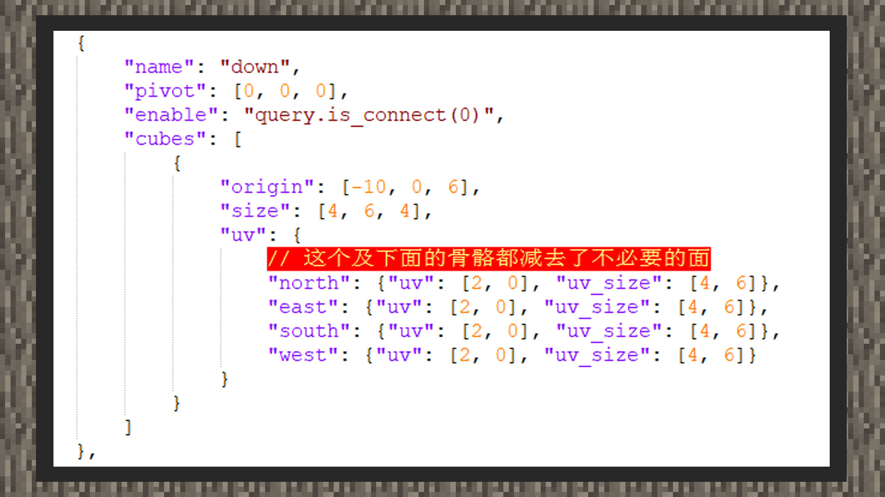

--- 
front: https://mc.res.netease.com/pc/zt/20201109161633/mc-dev/assets/img/3_1.f808b90b.jpg 
hard: Advanced 
time: 15 minutes 
--- 
# Custom Pipeline Block 
#### Author: Realm 
Pipeline blocks are material transfer blocks of some well-known modules and often appear in front of players. The Chinese version currently supports the creation of block models that display corresponding connection parts based on the faces that touch other blocks. Note: The custom connection function is special for the Chinese version, so developers cannot add this function to custom blocks in the international version in the same format. 

#### Definition on resources 

 

Open the pipeline block model in the bbmodel folder in the attachment, and you can see the block skeleton connecting the 6 faces and the internal block position. 

Root is the central bone of the pipe. When there are no connectable blocks on all four sides, only the root bone should be displayed. When there is a connectable block on the south side of the block, the root and south bones should be displayed, and the same applies to the others. 

After sorting out the idea of making the model, it should also be noted that in order to let the game know which side of the model to display when the interface is connected to the corresponding block, it is also necessary to configure it on the final model file. 

 

As shown in the figure above, we need to open the key pair "enable" at the same level as the bone name, and the value is molang syntax: query.is_connect (contact surface). The contact surface is the fixed value of the block orientation. "down" is the bone below the pipe. At the same time, we add "enable": "query.is_connect(0)" at the same level of its bones, that is, the block carried by the bone is displayed only when there is a connectable block below. 

#### Functional definition 

 

Add the "netease:connection" component to the custom block, and place the connected blocks in "blocks". Only when connected to these blocks, the model will show the connected part. 

At the same time, the custom block model will carry a part of the shadow, and the value of "netease:solid" needs to be set to false to turn off the shadow. 

Since the block has a smaller volume than the basic block, we need to make the block's ray detection and collision volume fit its real model. 

First, change the collision volume and clip ray detection volume in the aabb component to array form, so that the block can have multiple volumes. 

The actual volume of each bone is obtained through the world coordinates of the blockbench and the block position and volume. It is necessary to add the enable key pair to help the game control the display of each connection part.