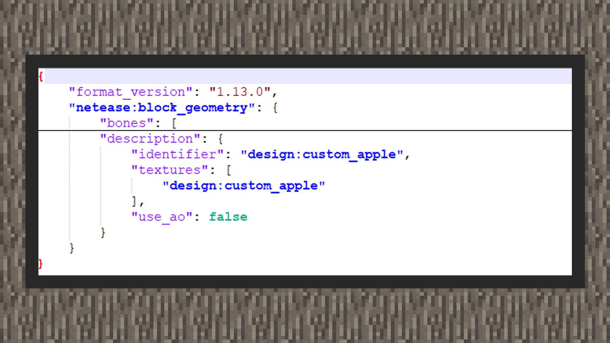
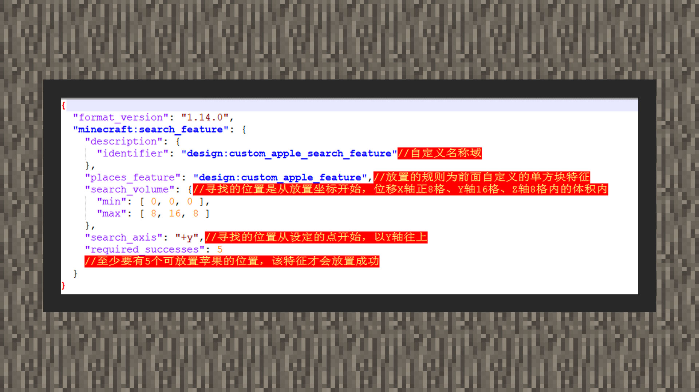
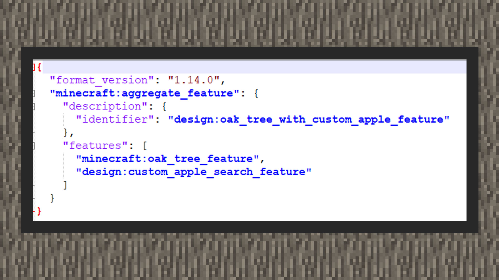

--- 
front: https://mc.res.netease.com/pc/zt/20201109161633/mc-dev/assets/img/4_10.f2c5d857.jpg 
hard: Advanced 
time: 35 minutes 
--- 
# Simple tutorial ①: Make a tree with fruits 
#### Author: Boundary 

Download the sample package for mounting apples: Download [sample package](https://g79.gdl.netease.com/guidedemo-case13.zip) . 

#### Add apple block 

 

#### The implementation code logic is as follows: 

 

``` 
{ 
"format_version": "1.16.0", 
"minecraft:block": { 
"description": { 
"identifier": "design:custom_apple", 
"register_to_creative_menu": true 
}, 
"components": { 
"minecraft:block_light_absorption": 0, 
"minecraft:destroy_time": 1.0, 
"netease:render_layer": { 
"value": "alpha" 
}, 
"netease:aabb": { 
"collision": { 
"min": [0.3125, 0.375, 0.3125],
                "max": [0.6875, 1.0, 0.6875]
              },
              "clip": {
                "min": [0.3125, 0.375, 0.3125],
                "max": [0.6875, 1.0, 0.6875]

} 
}, 
"minecraft:loot": "loot_tables/custom_apple.json", 
"netease:solid": { 
"value": false 
}, 
"netease:pathable": { 
"value": true 
} 
} 
} 
} 
``` 

1) First, we set the block's transmittance to 0, that is, write the minecraft:block_light_absorption value to 0. This is because the apple block uses a custom model, and the day and night light in the game will cover the model with shadows. We hope that the block will be less affected by the shadow, so we set the value to 0. Developers can also make fine adjustments between 0 and 15 according to their actual situation. This is the acceptable value range of the transmittance component. 

2) Then use netease:render_layer to set the block material to a transparent material to allow the block model to use a texture with a transparent layer. 

3) Then in netease:aabb, set the collision volume and ray detection to match the real appearance of the apple block. In the component, each point corresponds to 16 grids in the blockbench modeling space, that is, each 0.0625 length corresponds to one grid space in the blockbench. 

4) Then set the block to a non-solid block, because we want to avoid the situation where the player occasionally suffocates and loses health due to overlapping collision boxes when they come into contact with the apple block. 

5) Then point the block to the custom apple loot table, so that the player will drop the apple item after digging the apple block. 

6) Finally, set the block to ignore the creature and continue to follow its own path. 


#### Add an apple loot table 

 

1) Add a loot pool, set the number of filters to 1, and set the loot entry to only the apple item. 

```
{
	"pools": [
		{
			"rolls": 1,
			"entries": [
				{
					"type": "item",
                    "name": "minecraft:apple"
				}
			]
		}

] 
} 
``` 

#### Add apple block resource file 

 

``` 
{ 
"format_version": "1.13.0", 
"netease:block_geometry": { 
"bones": [ 
], 
"description": { 
"identifier": "design:custom_apple", 
"textures": [ 
"design:custom_apple" 
], 
"use_ao": false 
} 
} 
} 
``` 

 

``` 
{ 
"format_version": [ 
1, 
1, 
0 
], 
"design:custom_apple": { 
"netease_model": "design:custom_apple", 
      "sound": "wood"
    }
}
```


1) Use MCSTUDIO to export the apple block project file and obtain the json model file 

2) Put the model into the texture package/models/netease_block folder 

3) Put the texture into the texture package/textures/blocks folder 

4) Create a new terrain_texture.json file and include the resource key and path 

5) Write the resource key into the model file and turn off the ambient light mask ("use_ao": false) 

6) Configure the model and destruction sound effect of the apple block in the texture package/blocks.json 


#### Production features 

To realize the natural placement of apple blocks in the game, there are three dimensions in total. Single block features, search features, and sum features are used respectively. Among them, single block features are responsible for setting the rules for placing apple blocks, search features help apple blocks find the placement position, and sum features will be used as the last packaged part by the feature rules. For more details, please see below: 

#### Single Block Features 

1) First, create a new feature named custom_apple_feature.json in the netease_features folder in the root directory of the behavior pack. The feature type is single block feature. The basic format is as follows: 

``` 
{ 
    "format_version":"1.14.0", 
    "minecraft:single_block_feature":{ 
        "description":{ 
            "identifier":"The identifier of the feature, in the format of namespace:identifier, where the identifier after the namespace must also match the file name"" 
        }, 
        "places_block":"Block", 
        "enforce_placement_rules":fals e, 
        "enforce_survivability_rules":false, 
        "may_place_on":[ 
            "block" 
        ], 
        "may_replace":[ 
            "block" 
        ] 
    } 
} 
``` 

2) Next, we need to hope that the single block feature will place a custom apple block. There are two ways to write it, namely only specifying the block type and specifying the block type plus the block state. Since the custom apple block does not have any block state, you can use places_block: "design:custom_apple". In the future, if developers want to place some blocks with block states, such as the original blocks. You can refer to the following example of placing mature wheat: 

```

"places_block": { 
"name": "minecraft:wheat", 
"states": { 
"growth": 7 
} 
} 
``` 

3) After that, in order to ensure that one of the conditions for placing the apple block is that the block to be replaced can only be an air block, we put minecraft:air in the may_replace_on attribute set. From common sense, only when the placement rule satisfies the rule that only air blocks can be replaced in the single block feature when placing the apple block, the apple block can be placed successfully. Otherwise, if any block is replaced, the player will notice a very uncomfortable visual effect in the game. For example, the apple block occupies the position of the leaf and replaces the leaf with itself. 

4) Next, in order to realize that the fruit can be mounted under the leaves. We need to add the may_attach_to attribute field and inform the single block feature that the fruit will be mounted under the leaves, that is, the top of the block will be attached to the original leaf block, that is, under the leaf block. The auto_rotate field is used to determine whether to automatically rotate the block to meet the proximity rule. Here we fill in false. In the sample tutorial, we single out oak leaves and birch leaves as examples. 

5) Finally, there are enforce_placement_rules and enforce_survivability_rules fields. The former will trigger the block to self-check whether it defines the behavior of the block placed on the edge of the block, and the latter will trigger the block to self-check whether it defines the behavior of the block on which the block can survive. Since the custom block function currently has no survival condition behavior, we set this enforce_survivability_rules field to false and enforce_placement_rules to true. 

 

``` 
{ 
"format_version": "1.14.0", 
"minecraft:single_block_feature": { 
"description": { 
"identifier": "design:custom_apple_feature"//Feature name domain 
}, 
"places_block": { 
"name": "design:custom_apple",//Block name domain 
"states": {} 
}, 
"enforce_placement_rules": true,//Whether to place features according to placement rules, here should be written as true 
"enforce_survivability_rules": false, 
"may_attach_to": { 
"auto_rotate": false, 
"min_sides_must_attach": 1, 
"top": [ 
{ 
"name": "minecraft:leaves",// The block must be attached to the oak leaves to generate 
"states": { 
"old_leaf_type": "oak" 
} 
}, 
{ 
"name": "minecraft:leaves", // The block must be attached to the birch leaves to generate 
"states": { 
"old_leaf_type": "birch" 
} 
} 
]

}, 
"may_replace": [//Only replace with apple blocks in the position with air 
"minecraft:air" 
] 
} 
} 
``` 

#### Search feature 

 

1) First, create a new feature of custom_apple_search_feature.json in the netease_features folder in the root directory of the behavior pack. The feature type is search feature. The basic format is as follows: 

``` 
{ 
"format_version":"1.14.0", 
"minecraft:search_feature": { 
"description": { 
"identifier": "The identifier of the feature, in the format of namespace:identifier, where the identifier after the namespace must also match the file name"" 
}, 
"places_feature": "feature identifier", 
"search_volume": { 
"min": [ -3, -3, -3 ], 
"max": [ 3, 3, 3 ] 
}, 
"search_axis": "-y", 
"required_successes": 3 
} 
``` 

2) Then we mount the feature placed under the search feature as the single block feature of apple set earlier. 

3) Next, we will adjust the placement coordinate range that the search feature will look for, which requires the use of the search_volume object in min and max. Min represents the starting point of the lower left corner, and max represents the maximum point of the upper right corner. The space pulled out in this way is a square. We hope that after the original version number feature is combined and packaged with the sum feature, the search feature will retrieve the previous tree feature and put it down. From its feature placement point, it will offset in the space from the minimum point to the maximum point to find out whether there are leaves in the space, and it must meet the conditions of the previous single block feature, including that the apple block can only replace the air block, and the single block feature must be placed at the coordinate point under the leaf. In this way, the effect of sub-feature linkage is opened. 

4) Next, we will start the search position from this space, with the minimum point [0, 0, 0], That is, starting from the coordinate point where the feature is placed, search for leaves from the Y axis upward, 8 squares from the X axis, 16 squares from the Y axis, and 8 squares from the Z axis. Of course, in the search_axis field, it is not only allowed to search from the Y axis upward, but also from other directions, including -x, +x, -y, +y, -z, +z. 

5) Finally, the required_successes field is used to specify how many coordinates are required to find suitable places for apple blocks before the entire feature is placed correctly. If the coordinates found at the end do not meet the required number, the entire feature will fail to be placed. In many cases, this is reasonable, because some trees may be close to some protruding landforms, and the number of leaves is not enough to hang so many apples, or the size of the trees placed in the total feature is small and cannot carry the minimum number of apple blocks required. But this also makes the environment more diverse and different. 

``` 
{ 
"format_version": "1.14.0",

"minecraft:search_feature": { 
"description": { 
"identifier": "design:custom_apple_search_feature"//Custom name domain 
}, 
"places_feature": "design:custom_apple_feature",//The placement rule is the single block feature customized above 
"search_volume": {//The location to search is the volume within 8 grids on the X axis, 16 grids on the Y axis, and 8 grids on the Z axis starting from the placement coordinate 
"min": [ 0, 0, 0 ], 
"max": [ 8, 16, 8 ] 
}, 
"search_axis": "+y",//The location to search starts from the set point and moves up on the Y axis 
"required_successes": 5 
//There must be at least 5 locations where apples can be placed for this feature to be successfully placed 
} 
} 
``` 

 

#### Aggregate Features 

1) Create a feature named oak_tree_with_custom_apple_feature.json in the folder /netease_features under the root directory of the behavior pack. The feature type is aggregate features. Its basic format is as follows: 

``` 
{ 
"format_version": "1.14.0", 
"minecraft:aggregate_feature": { 
"description": { 
"identifier": "The identifier of the feature, in the format of namespace:identifier, where the identifier after the namespace must also match the file name" 
}, 
"features": [ 
"Feature 1", 
"Feature 2" 
] 
} 
} 
``` 

2) Here we put the written search features and the original oak tree features in it. It should be noted that the order of the features written in features does not represent the order in which they are finally placed. Therefore, sometimes you may try to place the tree feature first and then try to place the apple, and sometimes it is the other way around. Therefore, not all oaks placed by this feature will have apples attached to them, because trying to place the apple retrieval feature first will most likely result in the failure of the retrieval feature placement, because the tree feature may not have been placed in time, and the coordinate point where it is placed may be bare at this time. But this is also in line with common sense, after all, not all trees in the wild are hung with fruit. If developers want to make trees that must be hung with fruit, you can look forward to the content about queue features in subsequent tutorial updates. 

``` 
{ 
"format_version": "1.14.0", 
"minecraft:aggregate_feature": { 
"description": {

"identifier": "design:oak_tree_with_custom_apple_feature" 
}, 
"features": [ 
"minecraft:oak_tree_feature", 
"design:custom_apple_search_feature" 
] 
} 
} 
``` 

#### Feature rules 

 

1) First, create a feature rule named overworld_apple_oak_tree_feature.json in the folder /netease_feature_rules under the root directory of the behavior pack. 

2) Then we need to set the biome conditions for feature placement. Through the conditions object, we want all biomes in the overworld to be able to grow oak with apple blocks. But don't worry, this will allow us to see it in ocean and ice biomes, because the original oak feature will carry the rules of what blocks oak can grow on, so apple trees will not be seen in strange biomes. Each main world biome will carry the overworld tag, so as long as it is determined whether it carries the overworld tag, it can be placed in the entire main world dimension. 

3) Finally, in the distribution rule distribution, write the number 1 in iterations, that is, try to place it once in each block. When placing in the block, we hope that the feature follows the rule of determining the X and Z axes first, and then determining the Y axis. We hope that the X and Z coordinates are taken from the starting coordinates of the block, and randomly offset from one of the points in the range of 0~16 grids. When the Y axis is determined at the X and Z axis points, this point is the highest non-solid block Y axis coordinate point. Ensure that the tree will be placed on the ground, rather than in the ground or under the ground. 

```
{
  "format_version": "1.14.0",
  "minecraft:feature_rules": {
    "description": {
      "identifier": "design:overworld_apple_oak_tree_feature",
      "places_feature": "design:oak_tree_with_custom_apple_feature"
    },
    "conditions": {
      "placement_pass": "surface_pass",
      "minecraft:biome_filter": [
        {
          "test": "has_biome_tag",
          "operator": "==",
          "value": "overworld"
        }
      ]
    },
    "distribution": {
      "iterations": 1,
      "x": {
        "distribution": "uniform",
        "extent": [ 0, 16 ]
      },

"y": "query.heightmap(variable.worldx, variable.worldz)", 
"z": { 
"distribution": "uniform", 
"extent": [ 0, 16 ] 
} 
} 
} 
} 
``` 

#### The effect is as follows: 

 

