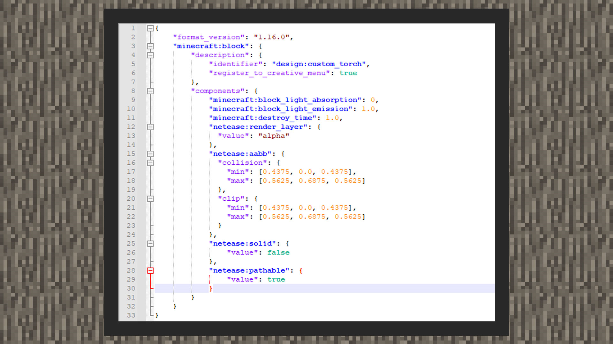
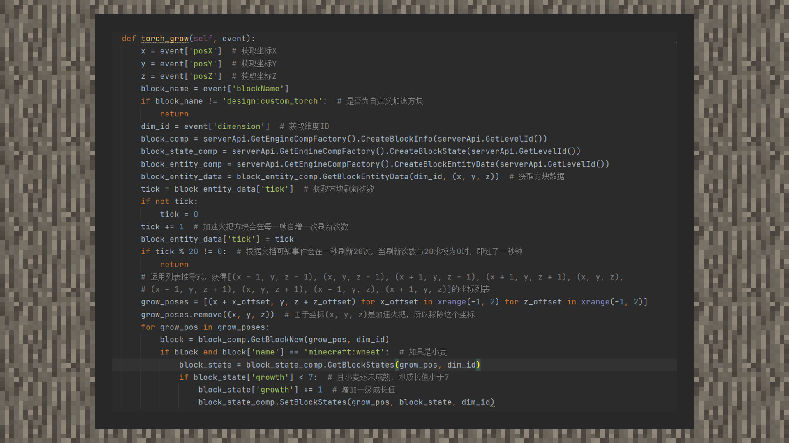
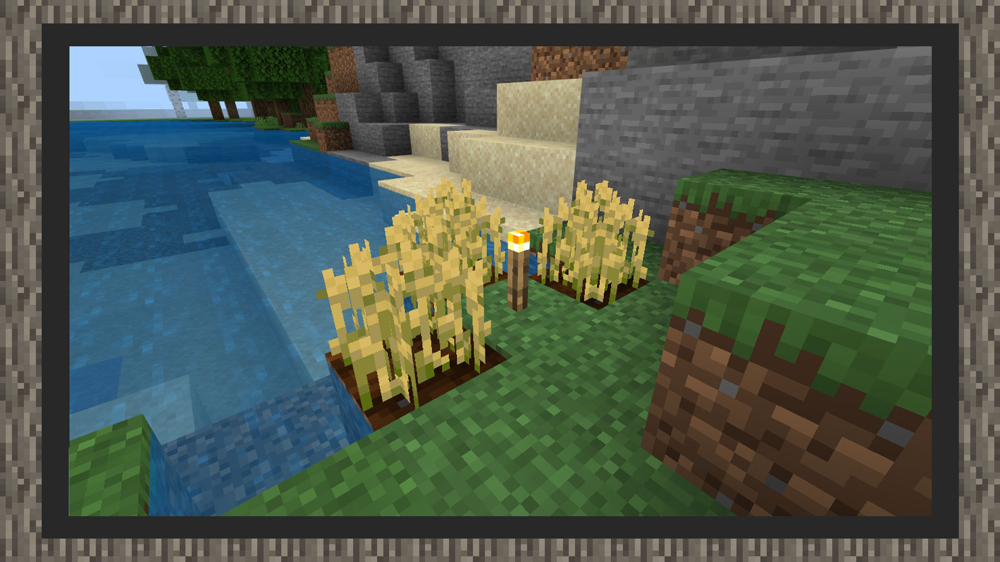

--- 
front: https://mc.res.netease.com/pc/zt/20201109161633/mc-dev/assets/img/5_5.d0bc082b.jpg 
hard: Advanced 
time: 25 minutes 
--- 
# Simple tutorial ②: Make a torch block that accelerates crop growth 

#### Author: Realm 

Download the accelerated torch sample package: Download [sample package](https://g79.gdl.netease.com/guidedemo-case13.zip) . 

#### Torch block diagram: 

 

#### Add torch block behavior pack 

 

``` 
{ 
"format_version": "1.16.0", 
"minecraft:block": { 
"description": { 
"identifier": "design:custom_torch", 
"register_to_creative_menu": true 
}, 
"components": { 
"minecraft:block_light_absorption": 0, 
"minecraft:block_light_emission": 1.0, 
"minecraft:destroy_time": 1.0, 
"netease:render_layer": { 
"value": "alpha" 
}, 
"netease:aabb": { 
"collision": {
                "min": [0.4375, 0.0, 0.4375],
                "max": [0.5625, 0.6875, 0.5625]
              },
              "clip": {

"min": [0.4375, 0.0, 0.4375], 
"max": [0.5625, 0.6875, 0.5625] 
} 
}, 
"netease:solid": { 
"value": false 
}, 
"netease:pathable": { 
"value": true 
}, 
"netease:block_entity": { 
"tick": true, 
"movable": false 
} 
} 
} 
} 
``` 

1) First, we set the block's transmittance to 0, that is, write the minecraft:block_light_absorption value to 0. This is because the torch block uses a custom model, and the day and night lighting in the game will cover the model with shadows. We hope that the block will be less affected by the shadow, so we set the value to 0. Developers can also make fine adjustments between 0 and 15 according to their actual situation, which is the acceptable value range of the transmittance component. 

2) Then use the minecraft:block_light_emission component to adjust the luminescence level to 1.0, so that the torch will produce a luminous effect in the game. Developers can also make fine adjustments between 0.0 and 1.0 according to their actual situation, which is the acceptable value range of the luminescence component. 

2) Then use netease:render_layer to set the block material to a transparent material to allow the block model to use a texture with a transparent layer. 

3) Then in netease:aabb, match the collision volume and ray detection to the real appearance of the torch block. In the component, each point corresponds to 16 grids in the blockbench modeling space, that is, each 0.0625 length corresponds to one grid space in the blockbench. 

4) Then set the block to a non-solid block, because we want to avoid the situation where the player occasionally suffocates and loses health due to overlapping collision boxes when the player contacts the apple block. 

5) Next, we use a small trick of customizing the block, that is, not setting the block's drops. Then in the game, the block will drop the block item itself by default. 

6) Finally, set the block to ignore it and continue to follow its own path. 

#### Add torch block material pack 

1) Use MCSTUDIO to export the torch block project file and obtain the json model file 

2) Point the texture resource of the model file to the original torch texture "torch_on" and turn off the ambient light mask ("use_ao": false) 

3) Configure the torch block model and destruction sound effect in the texture pack/blocks.json 


#### Script to implement custom blocks 


``` 
{ 
"format_version": "1.16.0", 
"minecraft:block": { 
"description": { 
"identifier": "design:custom_torch", 
"register_to_creative_menu": true 
}, 
"components": { 
"netease:block_entity": { 
"tick": true, 
"movable": false 
} 
} 
} 
} 
``` 

Add the "netease:block_entity" component to the custom block, set tick to true and movable to false. The speed-up torch block will send 20 events to the script layer every second, that is, the interval between each event is 1 / 20 = 0.05 seconds. 

 

In the example diagram, we listen to ServerBlockEntityTickEvent to determine whether wheat can be grown to the next level. The judgment condition is whether the wheat is mature. Note that in this acceleration torch example, it only has an effect on wheat seeds, and has no effect on other seeds. 

``` 
def torch_grow(self, event): 
x = event['posX'] # Get coordinate X 
y = event['posY'] # Get coordinate Y 
z = event['posZ'] # Get coordinate Z 
block_name = event['blockName'] 
if block_name != 'design:custom_torch': # Is it a custom acceleration block 
return 
dim_id = event['dimension'] # Get dimension ID 
block_comp = serverApi.GetEngineCompFactory().CreateBlockInfo(serverApi.GetLevelId()) 
block_state_comp = serverApi.GetEngineCompFactory().CreateBlockState(serverApi.GetLevelId()) 
block_entity_comp = serverApi.GetEngineCompFactory().CreateBlockEntityData(serverApi.GetLevelId()) 
block_entity_data = block_entity_comp.GetBlockEntityData(dim_id, (x, y, z)) # Get block data 
tick = block_entity_data['tick'] # Get block refresh count 
if not tick: 
tick = 0 
tick += 1 # The acceleration torch block will increase the refresh count once per frame 
block_entity_data['tick'] = tick 
if tick % 20 != 0: # According to the document, the event will refresh 20 times in one second. When the refresh count modulo 20 is 0, one second has passed.

return 
# Use list derivation to get the coordinate list of [(x - 1, y, z - 1), (x, y, z - 1), (x + 1, y, z - 1), (x + 1, y, z + 1), (x, y, z), 
# (x - 1, y, z + 1), (x, y, z + 1), (x - 1, y, z), (x + 1, y, z)] 
grow_poses = [(x + x_offset, y, z + z_offset) for x_offset in xrange(-1, 2) for z_offset in xrange(-1, 2)] 
grow_poses.remove((x, y, z)) # Since the coordinate (x, y, z) is the acceleration torch, remove this coordinate 
for grow_pos in grow_poses: 
block = block_comp.GetBlockNew(grow_pos, dim_id) 
if block and block['name'] == 'minecraft:wheat': # If it is wheat 
block_state = block_state_comp.GetBlockStates(grow_pos, dim_id) 
if block_state['growth'] < 7: # And the wheat is not yet mature, that is, the growth value is less than 7 
block_state['growth'] += 1 # Increase the growth value by one level 
block_state_comp.SetBlockStates(grow_pos, block_state, dim_id) 
``` 

#### The final effect is as follows: 

