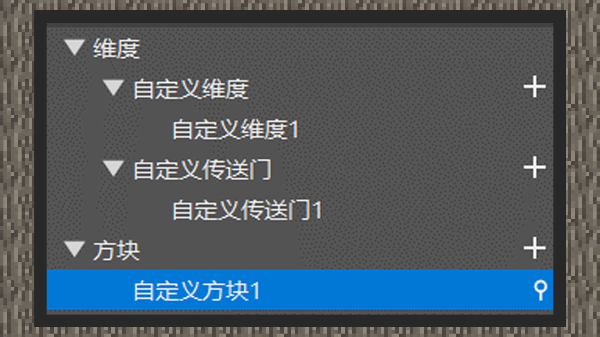

--- 
front: https://mc.res.netease.com/pc/zt/20201109161633/mc-dev/assets/img/2_1.c8367cf7.jpg 
hard: Advanced 
time: 10 minutes 
--- 
# Custom Dimension 

#### Author: Realm 

When the custom dimension was first launched, the Flower Group only opened the dimensional worlds with IDs 3 to 20. These 17 worlds do not require developers to create new files to generate them. They only need to configure the corresponding transmission logic to go there. Faced with a large number of developers, this scale is far from enough to meet all the components. Therefore, in the subsequent updates, we need to use the add-on package to add a new dimension ID so that the game can open the entrance to that dimension. Here, using the level editor of mcstudio can quickly help junior developers create new files and eliminate the difficulties in understanding at the beginning. Let's take a look. 

 

In the level editor, right-click the component area, point the pointer to the dimension, and create a custom dimension component, a custom portal component, and a block component. 

① Click the sub-option of the dimension, and you can see that the dimension ID can be customized on the property panel in the lower right corner. The value range of the dimension ID is 0~int's maximum value [usually 2147483647]. Every time a new dimension component is created, a random dimension ID will be filled in by default, and you don't have to modify it. 

② Click the "+" sign of the block component, create at least two custom blocks, and set the block type to portal. Set one of the custom blocks as the destination portal block and set the dimension ID to the ID of the new dimension. Set the other custom block as the return portal block and set the dimension ID to the ID of the main world, which is 0. 

③ In the custom portal component, change the portal type to a two-way portal, and set the portal block to the outgoing portal block and the reverse portal block to the return portal block. It should be noted that the border blocks of the current portal do not support custom ordinary blocks, and only original blocks can be used. 

④ Click Save in the upper right corner and run to test.