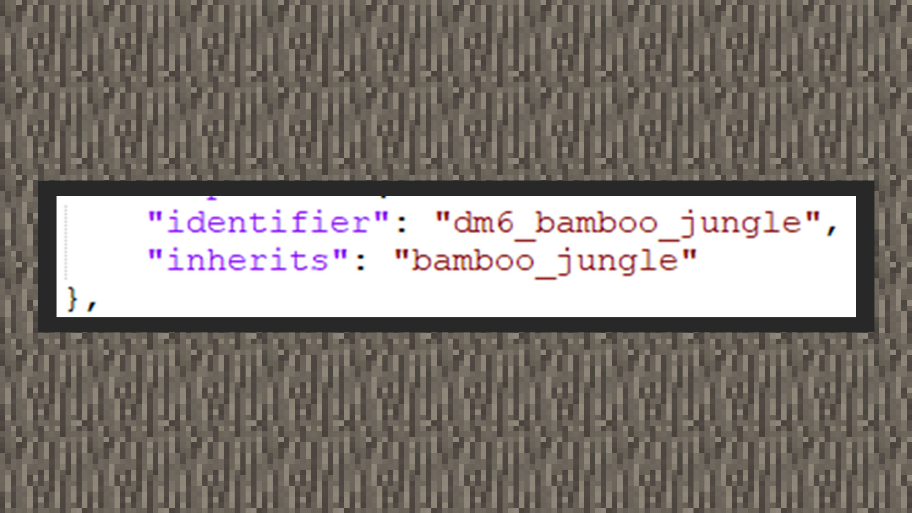
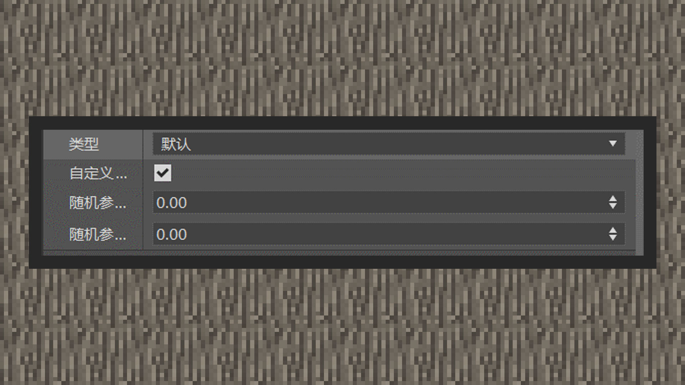

--- 
front: https://mc.res.netease.com/pc/zt/20201109161633/mc-dev/assets/img/3_1.3b916957.jpg 
hard: Advanced 
time: 25 minutes 
--- 
# Custom Biomes 

#### Author: Realm 

Add-ons allow custom biome communities. In the Chinese version, you can use a specific directory structure to customize the biomes of a dimension. When customizing biomes, you must use inheritance, that is, each biome has a corresponding vanilla biome. Although new biomes cannot be added, these dimensions can still be made unique by changing the surface height, adjusting the climate, and redistributing the rarity of biomes. For example, radically changing a biome with new tree types or block building structures, adding new custom mineral blocks to caves, etc. The knowledge points to be mastered about biomes are as follows: 

① Biome inheritance 

② Biome height 

③ Biome climate 

④ Biome surface structure 

⑤ Shielding original biome features 

⑥ Customized biological generation 

#### Biome inheritance 

 

 

Customized biomes must inherit an original biome. When inheriting, if the component settings of the original biome are not overwritten, the settings of the original biome will be used by default. The file content of the original biome can be found in the modpc client root directory /data/definitions/biomes. 

In MCSTUDIO, selecting the option to inherit a biome will inherit an original biome. 

In text-level editing, you need to add an inherts key pair at the same level as the identifier key pair, and the value content is an original biome name. 

#### Biome height 

 

The height setting of the biome can only be customized for the overworld. In other words, the height setting must be given to the biome existing in the main world to behave correctly. For example, the height setting of the nether biome is controlled by a dedicated nether biome generator. Since the Chinese version cannot currently customize the nether biome, it will not be repeated here. Since the End is a void environment, this component behavior does not have an effect on the End. 

 

The biome height can be set to the preset height and the height of the noise parameter. Under normal circumstances, using the preset height can reduce the difficulty of learning and quickly shape the height of the custom biome. When using the noise parameter, you need to pay attention to the following points: 

The noise parameter noise_params is a two-dimensional array, and the first value represents the average height of the biome. The formula is: f (value) = (height -67) / 16. Therefore, setting this value to 1 will produce an average height of about 83, similar to the height of the hills in the hills biome. Setting this value to -2 will form a deep sea surface and be below sea level. The maximum average height of a biome can only reach a height of 128. Therefore, the first value of the noise parameter array will not have any effect above 3.8125. The second value of the array determines the height change. Negative values are usually very unstable and are not recommended. A value of 0 will make the terrain less variable, but not completely flat. A value of 0.125 will produce extremely smooth terrain, and above this value cliffs, bays and depressions will begin to form. Extreme biomes like taiga biomes start at 0.25. Setting more aggressive values will cause problems for players to survive and move in the biome. 

In the current level editor, height types and noise parameters can be mixed together, but in fact, only one of them can exist in the biome generation pipeline. Either use the height type or the noise parameter type. 

#### Biome Climate 

The biome climate component adjusts the climate of any Minecraft biome, including the End. Climate mainly consists of three parts, downfall, temperature, and snow_accumulation. Downfall ranges from 0.0 to 1.0. If it exceeds 1.0, it will be 1.0. It mainly affects precipitation and snowfall, which can be understood as precipitation or snowfall. Adjusting downfall will not be directly and obviously reflected in precipitation particles and snowfall particles. If you want to see its effect, you can observe the degree of snow block accumulation during snowfall, the speed of water collection in the crucible, and the time when fish appear during fishing. Temperature is the base temperature. The given base temperature does not mean that every place in the biome is this temperature. The temperature will also decrease as the biome height increases. The temperature formula is: T (actual temperature) = base temperature - ((height - 63) / 600). 63 is the height of the sea level in the world. In the original setting, the temperature is 0.15 when it is a freezing climate, that is, snow will form. Therefore, if we give a climate with a temperature of 0.2, the biome will accumulate snow at a temperature of 0.15, and the height is 93 blocks high. snow_accumulation is the accumulation of snow. 

In general, developers inherit the original biomes with the original temperature. If you need to customize these parameters, you need to modify the file level, which is not supported by the level editor yet. 

#### Biome surface 

The biome surface includes the surface block structure of the biome when it is generated. You can customize the shallow blocks, middle blocks, deep blocks, underwater blocks, and underwater height of the biome. 

#### Shield original features 

Since the custom biome inherits the original biome, birch trees in the forest, oak trees in the plains, and acacia trees in the savannah will all appear in the new biome. In order to shield these original features, you need to use a specific component behavior to shield them. 

Open the text content of the specified custom biome and add "minecraft:ignore_automatic_features" under components. 

However, some features cannot be removed using this component behavior, such as villages, desert temples, and forest mansions.

#### Custom creature generation 

As mentioned in the previous chapter, the conditions for creature generation in a biome are determined by the biome tag. Therefore, in a custom biome, the original biome tag will be included, which will cause some original creatures to appear in the new custom biome. If you want to block these creatures, you can use MODSDK to handle it. 

Adding a new tag to a new biome can allow custom creatures to spawn here. To achieve this effect, just add a new tag name to the biome tag list in the level editor. Or add "tag name": {} under components in the biome file.