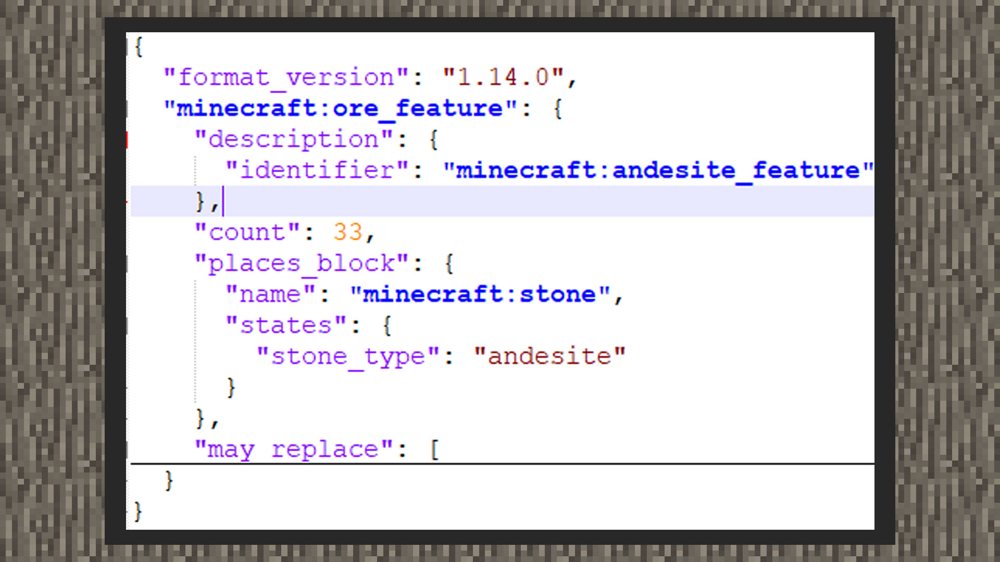
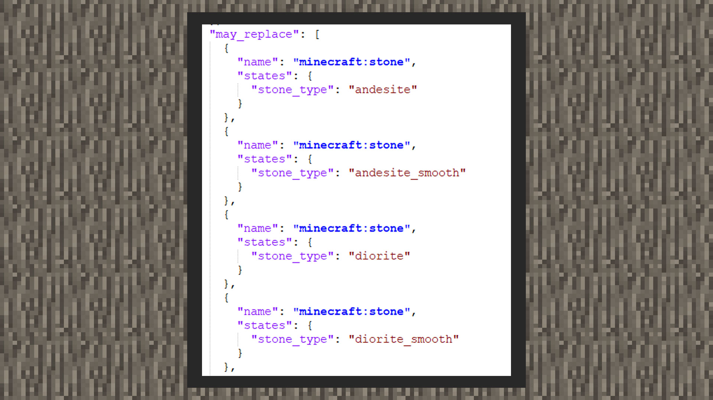
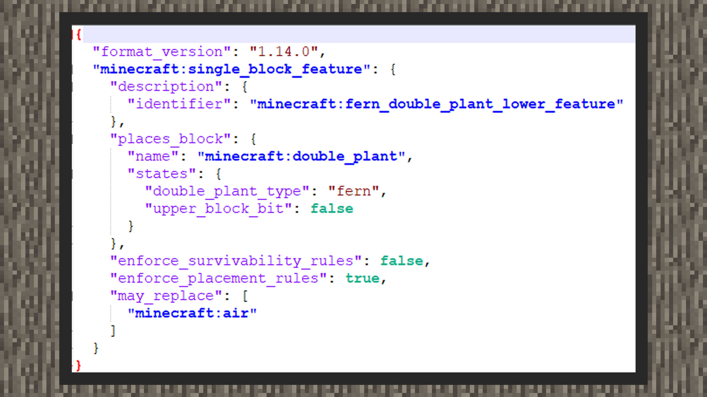
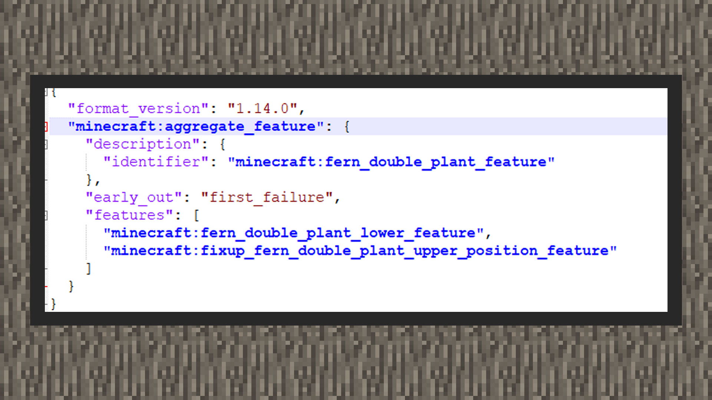
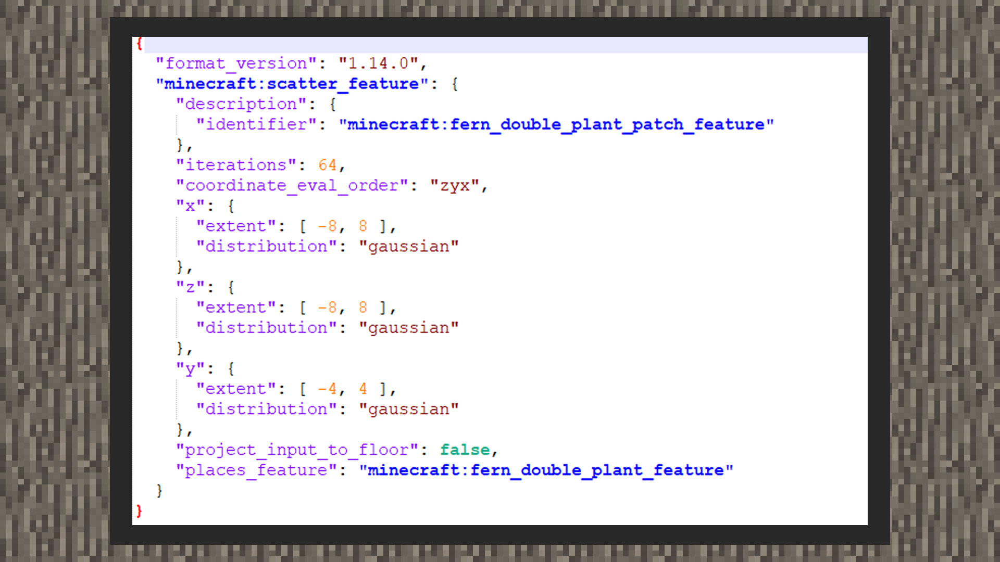

--- 
front: https://mc.res.netease.com/pc/zt/20201109161633/mc-dev/assets/img/3_5.08de570e.jpg 
hard: Advanced 
time: 35 minutes 
--- 
# Custom Features 

#### Author: Realm 

There will be some natural vegetation, minerals, and buildings in the biome, and they all use feature functions. In the level editor, currently only the Chinese version of the building template feature is supported. In order to let developers understand more feature placement combinations, the following features are suitable for understanding and mastering: 

① Mineral Features 

② Scatter Features 

③ Sum Features 

④ Single Block Features 

⑤ Building Template Features 

If you want to know more about the original features and writing methods, you can open the modpc root directory/definitions/features to view. 

#### Mineral Features 

Mineral features are used to replace blocks under the surface with mineral blocks. It is a relatively easy feature to master, and the writing format is not complicated. 

 

①Identifier is the unique name domain of the feature, with the format of namespace:identifier as the basis. And the identifier must be the same as the file name, otherwise an assertion error will be tested under the modpc client and the client will be forced to close. 

②count is the number of placements. 

③places_block receives a block content. If the block does not need to specify the block data, such as the color of wool, it can be directly replaced with "places_blocks": "block name". Otherwise, it is necessary to query the block data and write it according to the format of the example in the above figure. 

 

④may_replace receives a set of block contents, that is, the block type that will be replaced by the mineral block. 

#### Single Block Features 

Single Block Features are used to place a block and determine what block it replaces when placed. 

 

①identifier is the unique name field of the feature, with the format of namespace:identifier as the basis. And identifier must be the same as the file name, otherwise an assertion error will be tested under the modpc client and the client will be forced to close. 

②places_block receives a block content. If the block does not need to specify the block data, such as the color of wool, it can be directly replaced by "places_blocks": "block name". Otherwise, it is necessary to query the block data and write it according to the format of the example above. 

③enforce_survivablility_rules will force the feature to comply with the blocks that the block can survive when placed, such as grass blocks cannot survive on sand, so when this key pair is set to true, the grass block feature will not be placed on sand. 

④enforce_placement_rules will enforce the rules of block placement when using features. 

⑤may_replace receives a set of block contents, that is, the block type that will be replaced by this block. 

#### Total features 

The total feature is used to place a set of features, that is, the features included in features will be placed in a random order. 

 

① identifier is the unique name domain of the feature, which is based on the format of namespace:identifier. And identifier must be the same as the file name, otherwise an assertion error will be tested under the modpc client and the client will be forced to close. 

②early_out means early exit, there are two types of first_success and first_failure, that is, if the first feature placed succeeds or fails, the feature placement ends. 

③features receives a set of features, which will share a location for placing features. That is, if the sum feature is placed at the world coordinate (63,63,63), the placement of features in the set will start from here. 

Tips: In the above picture, two features are placed in the set, namely the upper and lower parts of the original fern block, because blocks over two squares in my world are composed of two types of blocks. Therefore, in the example writing method, the upper part of the original fern block must have the lower part of the block to be placed. Therefore, if the upper part of the fern block feature is placed at the beginning, the rule of failure in the first placement will be triggered and exit early. 

#### Scattered features 

The scattered features are used to offset another feature again and adjust the number of placements. 

 

①identifier is the unique name domain of the feature, with the format of namespace:identifier as the basis. And the identifier must be the same as the file name, otherwise an assertion error will be tested under the modpc client and the client will be forced to close. 

① iterations is the number of placements. Therefore, if a scatter feature with an additional number of placements defined is used in the feature rule, the final number of placements is: the number of placements of the feature rule x the number of placements of the scatter feature. 

③ coordinate_eval_order is the order in which the placement coordinates are found. The coordinate system has three axes: x, y, and z. Therefore, there are combinations such as xzy, xyz, yxz, yzx, zxy, and zyx. 

④x is the x coefficient offset when the feature rule is placed. If random distribution is not used, "x": integer value can be used to give the number of grids offset. 

⑤y is the y coefficient offset when the feature rule is placed. If random distribution is not used, "y": integer value can be used to give the number of grids offset. 

⑥z is the z coefficient offset when the feature rule is placed. If random distribution is not used, "z": integer value can be used to give the number of grids offset. 

⑦places_feature is the placement feature 

Tips: In the above picture, the original version repackages the two-grid fern feature with the scatter feature and then places it with the feature rule. This is because the scatter feature can re-place the feature. If the developer wants to place a flower or a bunch of blocks together, they can first use the scatter feature to gather the blocks together in an xz range of 0 to 8, for example. After being placed by the feature rule, you can see that they are concentrated in an area. 

#### Building template feature 

The building template feature is used to place a block structure exported by the structure block or the map editor. It is suitable for placing some building templates with molding value. The building template feature can directly use the map editor to cut, package and export the building view in the map. Finally, use the custom feature component under the dimension category to drag the structure file from the resource manager into the property panel.