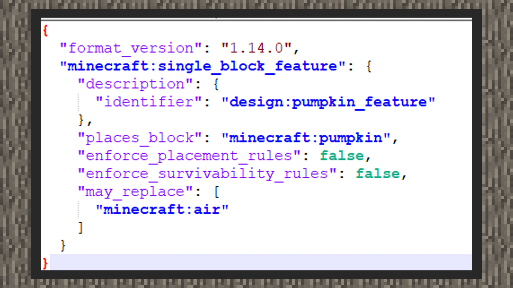

--- 
front: https://mc.res.netease.com/pc/zt/20201109161633/mc-dev/assets/img/4_1.f29b0af7.jpg 
hard: Advanced 
time: 15 minutes 
--- 
# Simple tutorial ① Features placed above the water surface 

#### Author: Realm 

① The sea level of the original world is 63 blocks or below on the Y axis, so when placing some custom block plants into the world, we don't want it to appear on the water surface. Here we use single block combination and feature rules to show how to place a feature above the water surface. 

 

② Create a single block feature and set the type of the placed block to pumpkin. 

 

③Create a new feature rule, allowing features to be placed in the entire biome. The height must be above 64 grids but not including 64 grids. Otherwise, the feature will be placed below 0 grids, i.e. in the void. A ternary operator is used here, which can be simply understood as the condition ? If satisfied, execute here : If not satisfied, execute here.