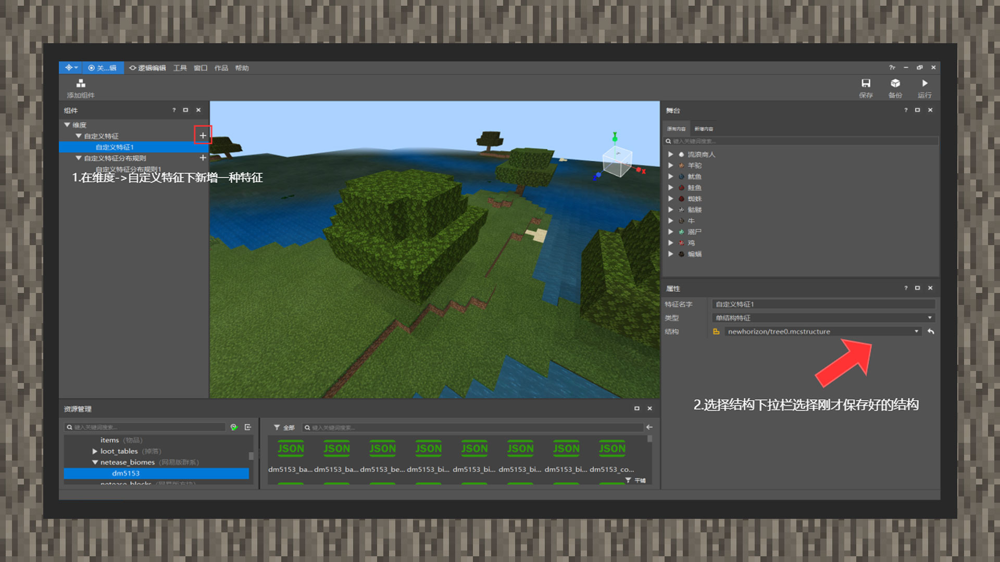

--- 
front: https://mc.res.netease.com/pc/zt/20201109161633/mc-dev/assets/img/5_1.c8a98ae5.jpg 
hard: Advanced 
time: 15 minutes 
--- 
# Simple tutorial ② Template feature for placing tree buildings 

#### Author: Realm 

 

① Enter the map editor, randomly select a tree to select, click Save Structure to save, remember to check Remove Air Blocks. 

 

② Create a new custom feature component, open the structure drop-down bar, and select the structure just saved 

 

③ Create a new custom feature distribution component, point the feature to the previously created feature, and the other properties remain unchanged by default.