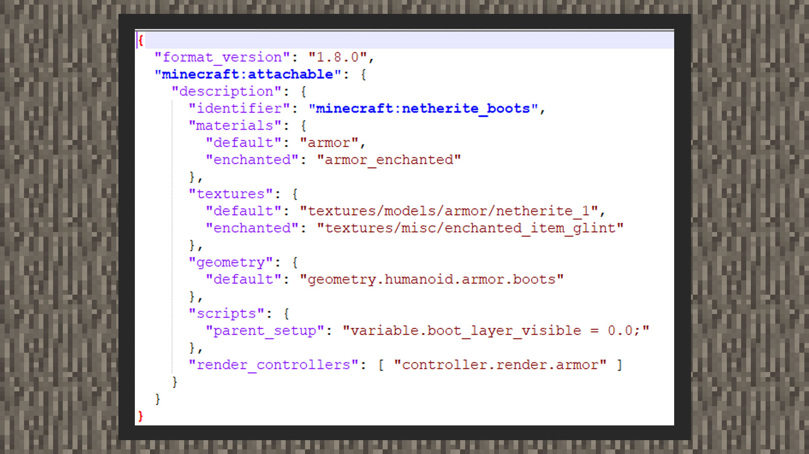

--- 
front: https://mc.res.netease.com/pc/zt/20201109161633/mc-dev/assets/img/3_1.f375f404.jpg 
hard: Advanced 
time: 15 minutes 
--- 
# Custom 3D armor model 

#### Author: Realm 

Currently, the Chinese version supports custom armor models, just like the international version. At the same time, after the armor is enchanted, the model will also show the enchanted streamer effect. Here we will teach you how to interpret the data format of the armor resource package content. At the end of this chapter, an armor model will be provided to the developer, and you can try to import it yourself. 

#### Data format analysis 

 

① Custom armor definition files need to be placed in the attachables folder under the resource package. 

②format_version has two formats, 1.8.0 and 1.10.0, which theoretically support particles and animations. However, due to hard coding, the model cannot be bound to a locator, and the armor model only supports block rotation, not bone rotation, so using particles and animations on armor resources may produce incorrect results. 

③identifier is the corresponding item ID. When using custom armor, the identifier and the corresponding item need to be set to the same ID. 

③parent_setup in scripts is used to display and hide the 3D skin package officially launched in the official store. If the player is equipped with a 3D headdress skin, the head armor with parent_setup defined will not be displayed. 

④In the other four items, except for the default keys of geometry and textures pointing to custom armor maps and model resources, the others can remain unchanged.