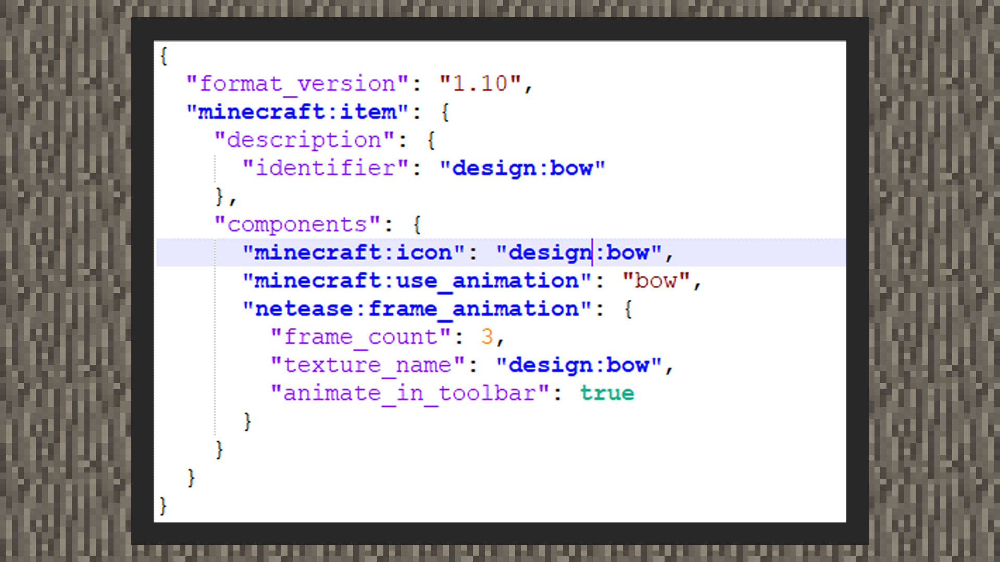
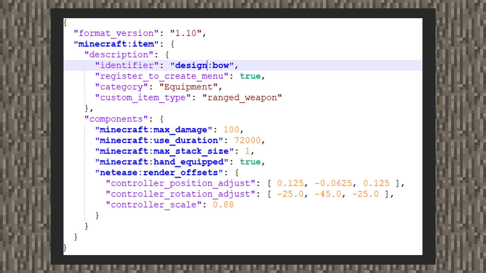
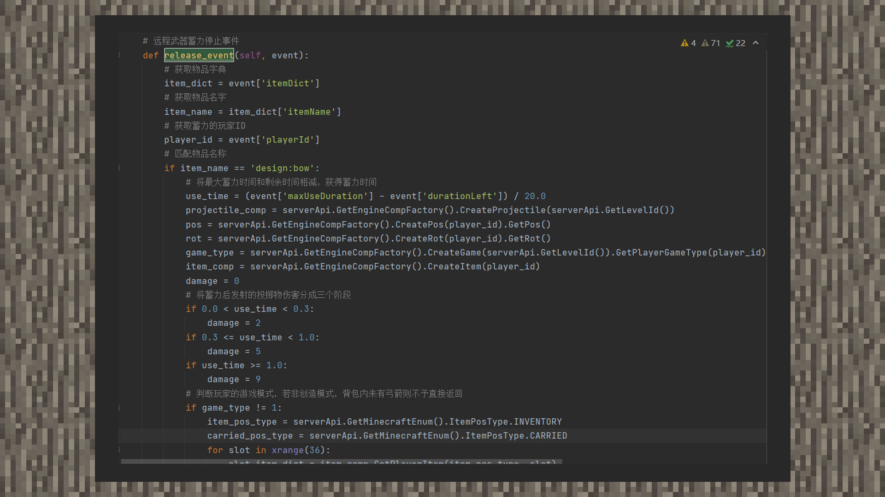
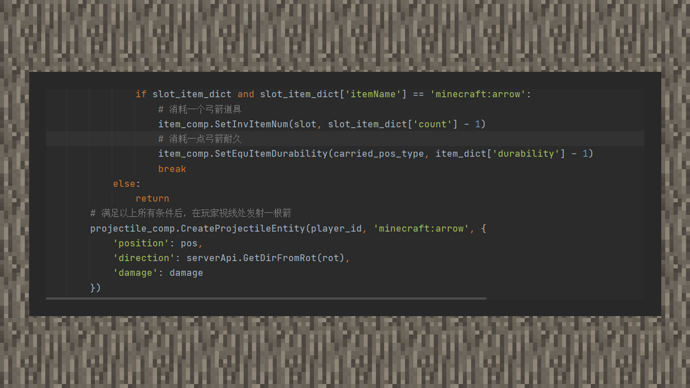

--- 
front: https://mc.res.netease.com/pc/zt/20201109161633/mc-dev/assets/img/1_1.48802b15.jpg 
hard: Advanced 
time: 30 minutes 
--- 
# Custom Ranged Weapons 

#### Author: Realm 

Currently, the Chinese version of Minecraft supports custom ranged weapons based on bows. Using add-on packs, you can add new bow props and bow holding positions and stretching animations. The functional logic of using a bow will rely on MODSDK. We will disassemble these two parts separately. 

#### Texture Pack Configuration 

 

① The name of the custom bow must end with bow after the symbol ":", so that when you add the bow animation component behavior to the item next, the animation will play normally. 

② minecraft:icon will point to a texture resource short name path, which will be defined by the developer in item_texture.json in the textures folder. 

③ minecraft:use_animation will make an animation for the item when the player uses it. Here we add the value of bow so that when the player stretches the bow, it will move slowly by default and the perspective will be reduced. 

④ netease:frame_animation has three key pairs. Frame_count refers to how many sequence images will be played when the bow is stretched. In the original bow, a total of three textures will be played when the player stretches the bow to the bottom. 

#### Behavior Pack Configuration 

 

① custom_item_type must be set to ranged_weapon 

② minecraft:max_damage is used to set the maximum durability of the bow. 

③minecraft:use_duration is used to set the use time of the bow's stretchable charge. We need to set the time long enough to avoid the problem of repeated charge within a period of time. 

④minecraft:max_stack_size is used to set the number of bow stacks. Bows belong to the category of weapons and equipment, so it is recommended that only one can be stacked in one column. 

⑤minecraft:hand_equipped is used to make the rendering image of the custom bow in the third person consistent with the original bow. 

⑥netease:render_offsets is used to set the first-person hand-held position of the custom bow, where controller_position_adjust is used to control the position, controller_rotation_adjust is used to control the angle, and controller_scale is used to control the size. 

#### Launching projectiles function 

 

①Monitoring ItemReleaseUsingServerEvent event 

②According to the charging time, the developer decides to divide the arrow damage according to the length of time to simulate the dynamic damage effect of the original bow when it is fired. 

 

③Judge the player's game mode. If it is creative mode, the arrow can be fired without consuming the bow's durability and the number of arrows. If it is not creative mode, it will search for arrow props in the backpack. If there are arrow props, it will consume and deduct a little bow durability. Otherwise, it will return directly without executing the logic of firing arrows.