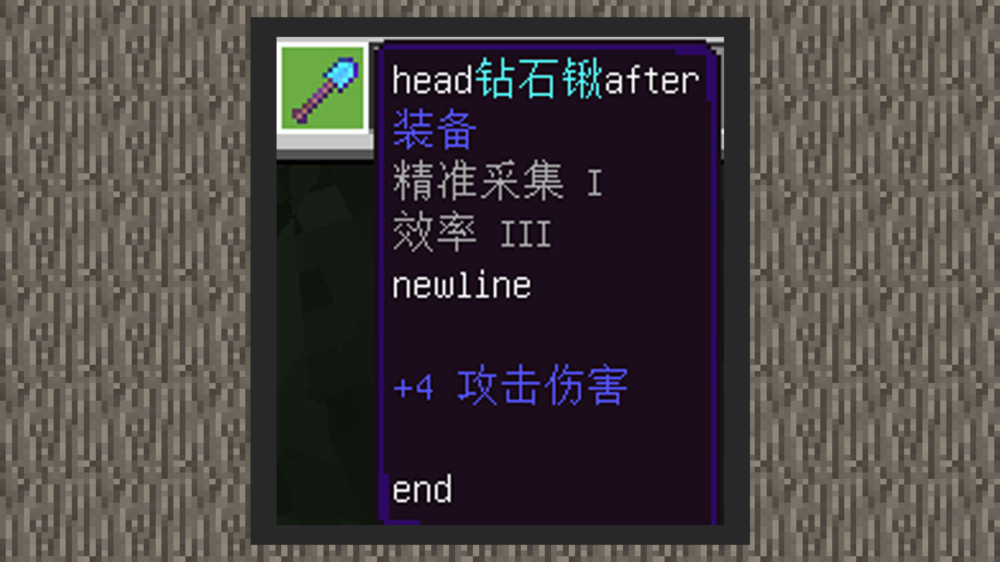

--- 
front: https://mc.res.netease.com/pc/zt/20201109161633/mc-dev/assets/img/2_2.044dfe8c.jpg 
hard: Advanced 
time: 20 minutes 
--- 
# Custom weapon entries 


#### Author: Realm 


Items contain affixes. When players click on items, the affixes will contain some information about the items, such as weapon enchantments, damage, etc. Due to current interface limitations, whether it is the interface that comes with the add-on package or the interface that comes with the Chinese version of MODSDK, it is impossible to register custom affixes on props from the beginning, such as props selected from the creation backpack. The following will teach you how to customize weapon affixes first. 


#### Adding affixes using the loot function 

 

Using the set_lore function of the loot table, you can write affixes into weapon items. However, the newly added affixes will not overwrite the original affixes. 

The loot table can be used with component behaviors, villager trading, etc. 

#### Effect diagram: 

 

#### Adding affixes using MODSDK 

The item information dictionary contains a pair of customTips data, which will contain the item affix information changed using the interface. 

Use the Generate Item or ChangePlayerItemTipsAndExtraId interface to change the item affix information. When the affix is changed, the original affix is directly overwritten. This is obviously different from the affix addition function of the loot table. 

At the same time, customTips supports custom formats, including four built-in formats: 

[%name%: item name] 

[%category%: item type] 

[%enchanting%: enchantment attribute] 

[%attack_damage%: attack damage] 


The built-in format can be freely combined with the custom text, and the order can be disrupted. If the custom format text of the item does not exist, it will not be displayed. 

The string with the built-in format uses the original display format, with no line break before the item name, one line break before the item type and enchantment attribute, and two line breaks before the attack damage. 

For example: 

``` 
head%name%after%category%%enchanting%/nnewline%attack_damage%/n/nend 
``` 


#### The effect is as follows: 

