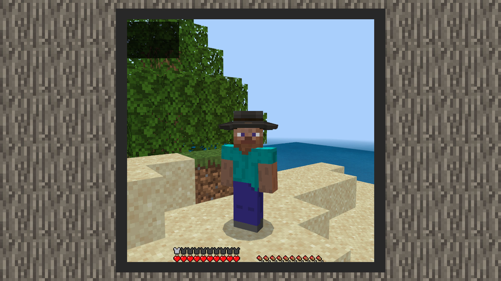

--- 
front: https://mc.res.netease.com/pc/zt/20201109161633/mc-dev/assets/img/4_4.554e8eb8.jpg 
hard: Advanced 
time: 15 minutes 
--- 
# Simple tutorial ① Add a hat equipment 

#### Author: Realm 

Download the fisherman hat sample package: Download [sample package](https://g79.gdl.netease.com/guidedemo-case15.zip). 

#### Register item 

 

#### Add model 

 

#### Define behavior 

 

#### The effect is as follows: 

 

