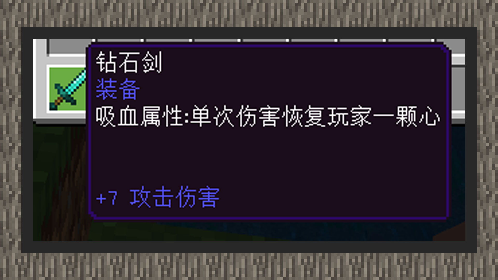

--- 
front: https://mc.res.netease.com/pc/zt/20201109161633/mc-dev/assets/img/5_2.4fbaff36.jpg 
hard: Advanced 
time: 20 minutes 
--- 
# Simple tutorial ② Increase the blood-sucking attribute of the weapon 

#### Author: Realm 

Download the blood-sucking sword sample package: Download [sample package](https://g79.gdl.netease.com/guidedemo-case15.zip). 

#### Code logic 

 

① Listen to ServerChatEvent and PlayerAttackEntityEvent, and get the diamond sword with the blood-sucking affix by entering the chat message "blood-sucking sword". 

②In the event callback function of the player attacking the entity, get the handheld item and match the affix information, then get the player's health value through the attr component and set the new health value. 

#### The effect diagram is as follows: 

