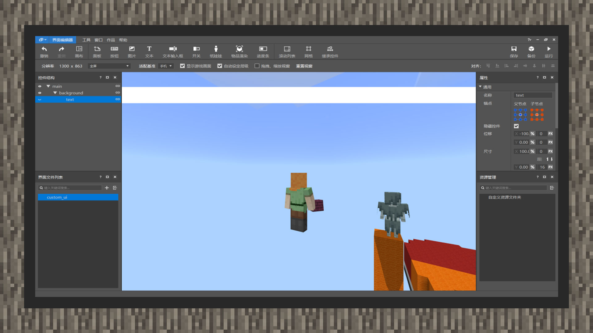

--- 
front: https://mc.res.netease.com/pc/zt/20201109161633/mc-dev/assets/img/5_1.e36f376b.jpg 
hard: Advanced 
time: 25 minutes 
--- 
# Simple tutorial ①: Make a scrolling bullet screen 

#### Author: Realm 

#### Design UI part: 

① Create a new image control under the main node, name it background, change the image resource type to native, and point to textures/ui/white_background.png. Open the original nine-square grid and fill in 1px in the "upper" position so that the texture can be freely stretched to match the size of the control. Next, change the image length from a fixed size to a percentage size, set it to 100%, and set the width size to a fixed size of 16px. 

 

②Set the anchor point of the background node to the center and offset 15px downward. 

③Under the background node, create a new text control named text, set the anchor point to the center, set the length to 100% of the percentage, and set the width to a fixed size of 16px. Set the text color to black, the font size to 8, add a line spacing of 6 to align the text to the center, and set the text alignment to right. 

 

④Set the text node offset to a percentage of 100% to the left, that is, -100%. In this way, the text will exceed the screen display area and top the left side of the screen. 

⑤Open the ui source file, customize the background control, add an alpha key pair to it, and the value is the transparency value. 1.0 represents opaque and 0.0 represents fully transparent. Here it is set to 0.9. At the same time, add a color key pair to overlay the image with color. Here it is set to "color": [0.3647, 0.3647, 0.3647], which is the result of dividing the gray RGB value 92, 92, 92 by 255. This will turn the white background gray with transparency. It will look better. 

#### Script code part: 

 

Rewrite the Create method and Update method of the UI class. When the UI is updated every game moment, the Update method will be called. We update the position of the text node in it and move it from the left to the right. The Create method will be called after the UI is created. Here we set the text content.