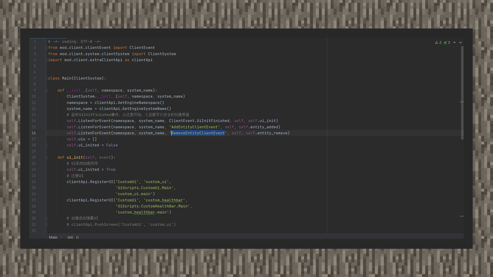
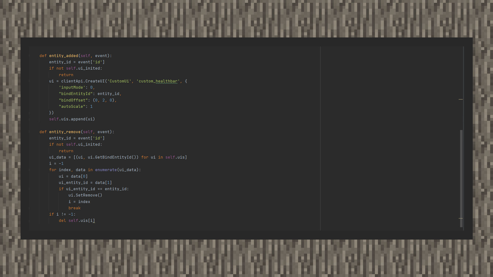
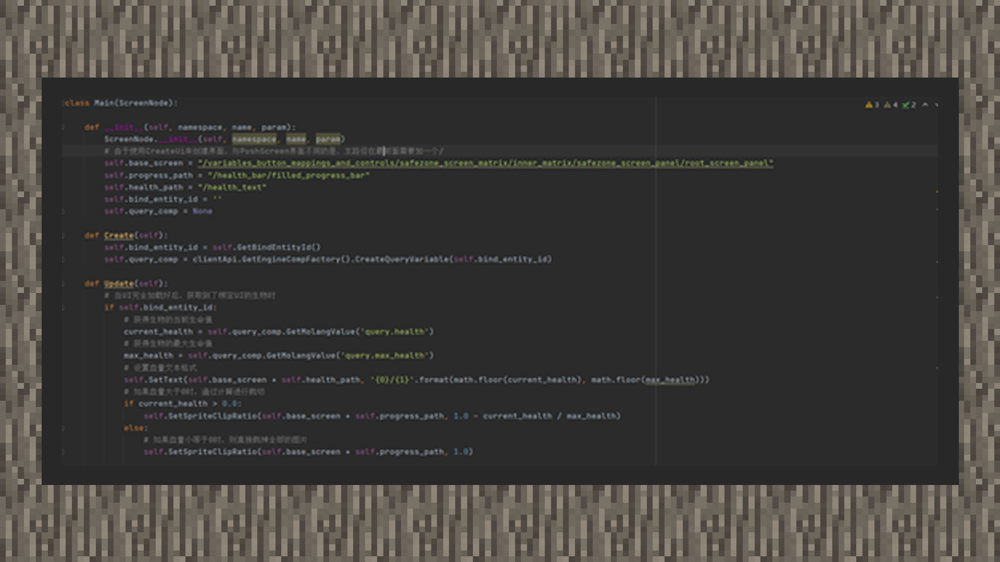

--- 
front: https://mc.res.netease.com/pc/zt/20201109161633/mc-dev/assets/img/6_1.67d4a73b.jpg 
hard: Advanced 
time: 30 minutes 
--- 
# Simple tutorial ② Make a simple creature health bar 

#### Author: Realm 

Download the creature health bar sample package: Download [sample package](https://g79.gdl.netease.com/guidedemo-case16.zip) . 

#### Design UI part: 

① Create a progress bar control under the main node and name it health_bar. Set the anchor point to center, set the length to 80 pixels, and the width to 10 pixels. 

② Create a text control under the main node and name it health_text. Set the anchor point to the center, and set the length and width to be equal to health_bar, and set the font size to 8 and the line spacing to 3. 

#### Script code part: 

 

Rewrite the Create method and Update method of the UI class. When the UI is updated every game moment, the Update method will be called. We use a little trick in it. From the query function table, we can see that query.health will return the health value of the creature, and query.max_health will return the maximum health value of the creature. In the usual processing, the health of the creature needs to be obtained through the server, and the GetMolangValue interface can be used to obtain the health information of the creature on the client. Here we update the health value and the clipping degree of the progress bar. 

 

 

On the client system, we add an instance variable in the UiInitFinish event to ensure that from then on, the UI can be bound to other entities in the AddEntityClientEvent event. Remove the UI in RemoveEntityClientEvent.