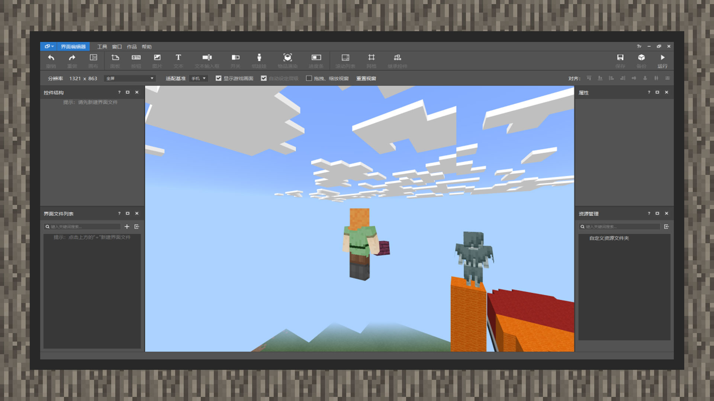
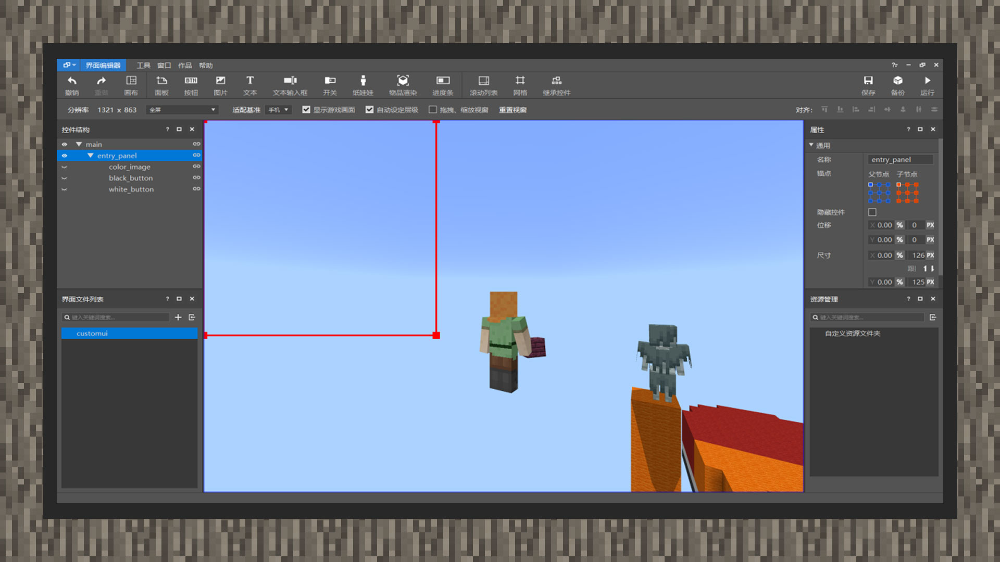
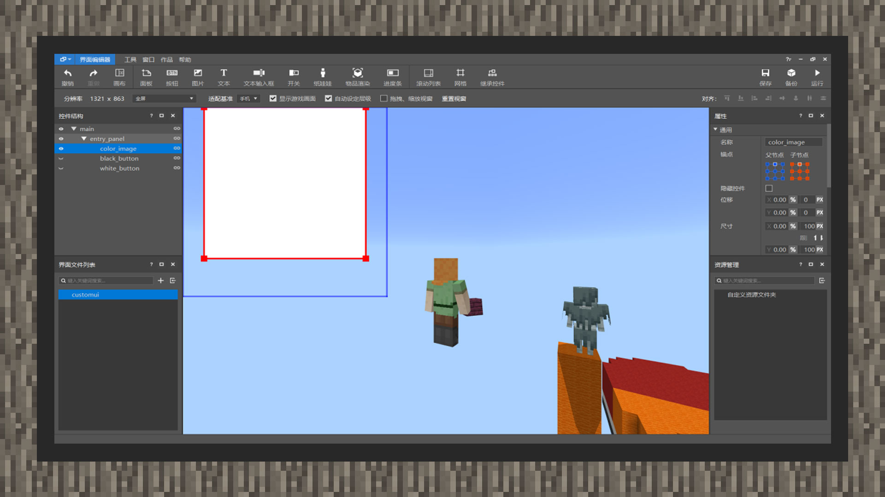
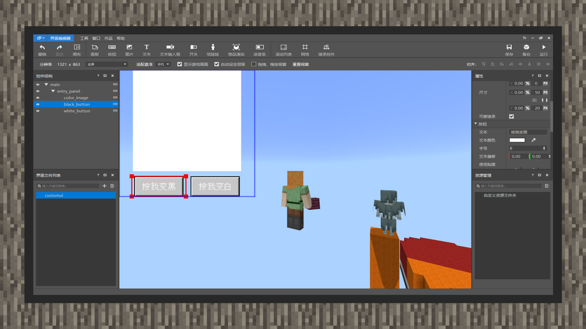

--- 
front: https://mc.res.netease.com/pc/zt/20201109161633/mc-dev/assets/img/2_1.00b439ab.jpg 
hard: Advanced 
time: 20 minutes 
--- 
# Use UI Editor to Draw Basic Interface 
#### Author: Realm 

① After entering the project, select UI Editor from the Editor option in the upper left corner. 

 

② The UI content will be put into a JSON file in the ui folder of the resource pack. Therefore, we click the "+" sign on the right side of the interface file list in the lower left corner to create a new interface file named custom_ui 

 

③After the interface file is created, a main canvas named main will be automatically added to the control structure in the upper left corner. This name can be changed at will. When you use MODSDK to declare the canvas entry of the interface in the future, just fill it in correctly. In order to unify the recognition, we will strictly name each control in the following content, rather than using nodes as a proxy, so that developers can read better. 

④Under the main node, create a new panel control and change its name to entry_panel, that is, the entry panel. 

⑤Set the entry_panel node to 125px long and 125px wide, click the anchor point in the properties, and set the anchor point to the upper left corner. It will automatically align to the upper left corner without dragging to align. 

⑥Mount an image control under the entry panel node, and we will name it color_image. Pull down and set the texture to native. Tap the native button entrance, and a computer resource manager will pop up. It will automatically locate the textures folder under the original resource folder. We select the ui folder and find the white_background.png texture and select it. 

⑦ Pull down the color_image node attribute to the lowest level, find the image adaptation option, select the original type for the nine-square grid type, and write 0 pixels as 1 pixel in any of the four columns of top, bottom, left, and right. In this way, the texture resource will match the node size and tile the entire control. 

 

⑧ Pull the image node to 100px long and 100px wide, and align the parent node and child node of the anchor point to the middle and upper part. 

⑨ Under the entry_panel node, create a new button named black_button and set the size to 50px long and 20px wide. At this time, the text in the button will exceed the size of the button and will not be fully displayed. Under the black_button node properties, set the font size to 8. And set the text to: Press me black. 

 

⑩In the control structure panel, right-click the black_button node and copy it once. Then select the entry_panel node and paste it in. And change the name of the new button control to white_button. Set the text to: Press me white. 

⑪ Align the anchor points of the black_button and white_button nodes to the middle and lower part, and separate the two buttons in parallel. When using MODSDK to create the interface later, we will learn how to bind buttons and use code to change the white map back and forth between black and white.