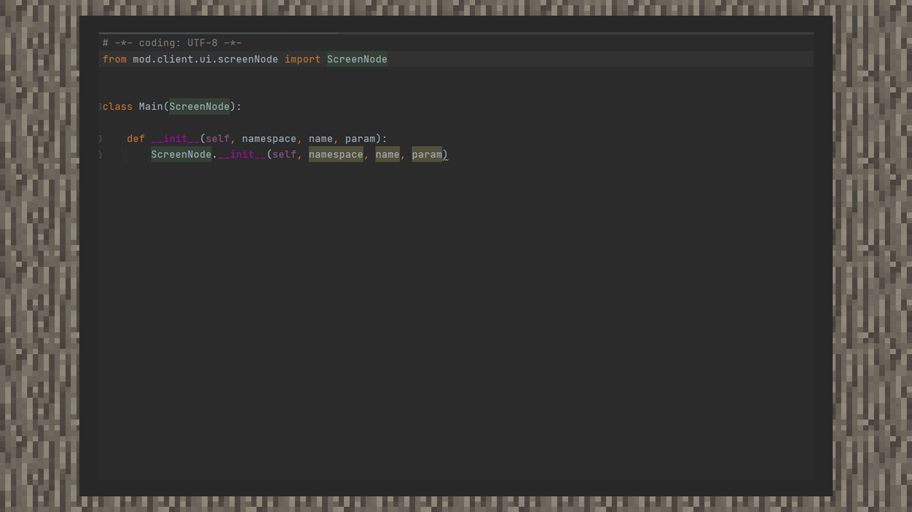

--- 
front: https://mc.res.netease.com/pc/zt/20201109161633/mc-dev/assets/img/3_1.7d892d10.jpg 
hard: Advanced 
time: 15 minutes 
--- 
# Pop-up interface in the game 

#### Author: Realm 

① Switch back to the level editor, select the behavior pack in the resource manager panel, and right-click to open the folder where the behavior pack is located. Create a new script folder project in the folder. 　 

② Since the UI interface runs on the client and the interface function only needs to call the client interface, we only register one client system. 

③ Create a new CustomUi.py file and import the ScreenNode class. Add a Main class and inherit ScreenNode. 

 

④ Listen to the UiInitFinished event and use the registered UI interface in the callback function. The UI must be registered before it can be created. The first parameter is the namespace, the second parameter is the UI name, and the third parameter is the ui node path. The format of the ui node path is similar to the registration system, that is, "script folder.CustomUi.Main". The fourth is the ui json file entry, that is, "custom_ui.main". 

 

⑤ Use the client's PushScreen interface. The first parameter is the UI namespace, and the second parameter is the UI name, which correspond to the first two parameters of the registered UI. After entering the game, check the effect.