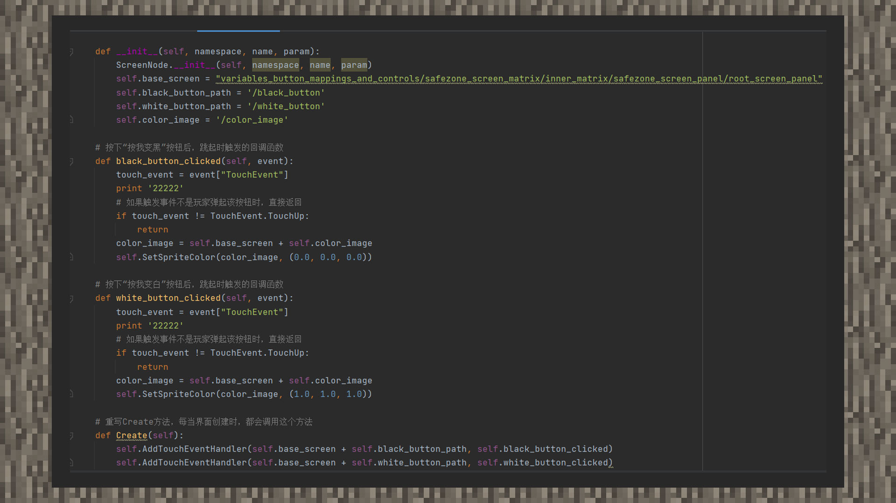

--- 
front: https://mc.res.netease.com/pc/zt/20201109161633/mc-dev/assets/img/4_1.2374ef65.jpg 
hard: advanced 
time: 20 minutes 
--- 
# Bind interface controls and scripts 
#### Author: Realm 

① Create four instance variables under __ init __, corresponding to the main node path that appears after inheriting the basic canvas, the color_image path under the main node path, the black_button path under the main node path, and the white_button path under the main node path. 

② Rewrite the Create method of the Main class and use the AddTouchEventHandler interface to add callbacks for two buttons. The first parameter is the path and the second is the callback function name. 

 

③In the callback function, set the color_image image to black or white, where the rgb value of white is 255, 255, 255, which is 0.0, 0.0, 0.0 after dividing by 255. The rgb value of black is 0, 0, 0, which is 1.0, 1.0, 1.0 after dividing by 255.