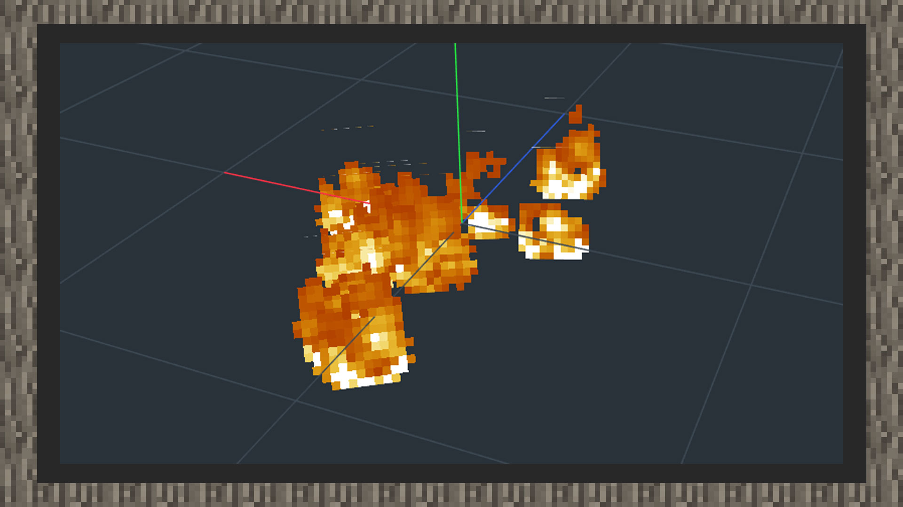

--- 
front: https://mc.res.netease.com/pc/zt/20201109161633/mc-dev/assets/img/10_1.423727d2.jpg 
hard: Advanced 
time: 20 minutes 
--- 
# Simple tutorial 

### Author: Realm 

### Simple tutorial ①: Making flame spreading particles 

1) First open the snowstorm editor and define a particle name domain. The format is similar to that of items, blocks, creatures, etc., with namespace: name as the format. 

2) Select the original flame sequence frame map for Texture. The path is located in textures/flame_atlas.png of the original texture package. Set UV MODE to animate, map size to 16x512, uv start to 0x0, uv size to 16x16, uv step to 0x16, FPS to 32, and check stretch to lifetime. 

3) Open the Rate emission frequency panel, which is equivalent to the particle emission frequency of the special effects editor of MCSTUDIO, select Steady mode, set the emission rate to 10, and the maximum value to 20. 

4) Set the loop mode to once (play only once) in Emitter Lifetime, and the other settings remain unchanged. 

5) The emitter shape setting remains unchanged. 

6) Set the size (particle size) in Apperance to an appropriate size, set the orientation to lookat xyz, and set the material to transparent material (alpha). 

7) Set the speed to 1.0 in Motion. 

#### The effect is as follows: 

 

#### Simple tutorial ②: Making lava dripping particles 

1) First open the snowstorm editor and define a particle name domain. The format is similar to that of items, blocks, creatures, etc., with namespace: name as the format. 

2) Select the original particle collection texture for Texture. The path is located in textures/particle/particles.png of the original texture package. Set UV MODE to static, the texture size to 128x128, uv start to 8x56, and uv size to 8x8. 

3) Open the Rate emission frequency panel, which is equivalent to the particle emission frequency of the special effects editor of MCSTUDIO. Select Steady mode and set the emission rate to 10, with a maximum value of 20. 

4) Set the loop mode to once (play only once) in Emitter Lifetime, and keep the other settings unchanged. 

5) Use the default point shape for emitter shape, and offset the emitter on the Y axis to a position of 4 grids. 

6) Set the size in Apperance to 0.15x0.3, stretch the particle map, set the orientation to lookat xyz, and set the material to transparent. 

7) Set the acceleration of the y-axis in Motion to -3 to make the particles fly downward. 

8) Open the collision panel and check expire on contact to make the particles disappear after contacting the ground. 

#### The effect is as follows: 

